# Pandas

## 1. 판다스 소개 
- 대부분의 데이터는 시계열과 표로 나타낼 수 있다.
    - 시계열 series
    - 표 table
- 판다스 패키지는 시리즈와 데이터프레임 클래스를 제공한다.

## 2. 시리즈
- `시리즈 클래스 Series Class` : 넘파이의 1차원 배열과 비슷하다. 각각의 데이터를 의미하는 인덱스(Index)를 붙일 수 있다. 데이터 자체는 값(value)이라고 부른다.
    - Series = Value + Index
    
### 2-1. 시리즈 생성하기
- 데이터를 리스트나 1차원 배열 형식으로 Series 클래스 생성자에 넣어준다.
    - **인덱스의 길이가 데이터의 길이와 같아야 한다.** 
    - **인덱스 라벨 : 문자열, 날짜, 시간, 정수 등 가능**
    - 인덱스의 값은 라벨(label)이라고 부르기도 한다.     

#### 리스트에 값을 넣고 클래스 생성자에 넣는다.
- pd.Series([value, value, value], index=["label", "label", "label"])

```python
s = pd.Series([9904312, 3448737, 2890451, 2466052],
              index=["서울", "부산", "인천", "대구"])
s

>>> print

서울    9904312
부산    3448737
인천    2890451
대구    2466052
dtype: int64
```
#### 인덱스를 지정하지 않으면 0부터 시작하는 정수값이 입력된다.

```python
pd.Series(range(10, 14))

>>> print

0    10
1    11
2    12
3    13
dtype: int64
```

#### 인덱스와 값에 접근
- index, values 속성 사용

```python
s.index

>>> print

Index(['서울', '부산', '인천', '대구'], dtype='object')

s.values

>>> print

array([9904312, 3448737, 2890451, 2466052], dtype=int64)
```

#### 이름 붙이기
- name 속성을 사용
    - 컬럼명과 같다.
- **index에도 이름을 붙일 수 있다.**
    - index.name

```python
s.name = "인구"
s

>>> print

서울    9904312
부산    3448737
인천    2890451
대구    2466052
Name: 인구, dtype: int64

s.index.name = "도시"
s

>>> print

도시
서울    9904312
부산    3448737
인천    2890451
대구    2466052
Name: 인구, dtype: int64
```

### 2-2. 시리즈의 연산
- 시리즈도 넘파이와 같이 벡터화 연산이 가능하다. 
    - 벡터화 : 열벡터 처럼 인식하여 벡터의 모든 데이터에 연산을 적용하여 계산
    - 시리즈의 값(value)에만 적용된다. 인덱스는 연산 불가

```python
s / 1000000

>>> print

도시
서울    9.904312
부산    3.448737
인천    2.890451
대구    2.466052
Name: 인구, dtype: float64
```

### 2-3. 시리즈 인덱싱
- 시리즈의 인덱싱은 넘파이 배열의 방법과 같으며 추가로 인덱스 라벨을 사용해서 인덱싱 할 수도 있다.
    - 배열 인덱싱이나 인덱스 라벨을 이용한 슬라이싱(slicing)도 가능

```python
s["서울"], s["부산"], s["인천"], s["대구"]

>>> print

(9904312, 3448737, 2890451, 2466052)

s[0], s[1], s[2], s[3]

>>> print

(9904312, 3448737, 2890451, 2466052)
```

#### 배열 인덱싱
- 부분적인 값을 가지는 **시리즈 자료형을 반환**한다.
- 자료의 순서를 바꾸거나 특정한 자료만 선택할 수 있다.
    - 같은 인덱스나 값을 선택할 수 있음

```python
s[[0, 1, 3]]

>>> print

도시
서울    9904312
부산    3448737
대구    2466052
Name: 인구, dtype: int64

s[["서울", "대구", "부산"]]

>>> print

도시
서울    9904312
대구    2466052
부산    3448737
Name: 인구, dtype: int64
```

- 불리언 값을 사용하여 데이터롤 조회할 수 있다.

```python
s[(250e4 < s) & (s < 500e4)]

>>> print

도시
부산    3448737
인천    2890451
Name: 인구, dtype: int64
```

- 숫자 규칙 : e는 소수점의 위치

```python
250e4, 500e4

>>> print

(2500000.0, 5000000.0)
```
#### 슬라이싱
- 부분적인 시리즈 반환
- **문자열 라벨을 사용하면 숫자 인덱싱과 달리 콜론 뒤의 값도 결과에 포함된다.**

```python
s[1:3]

>>> print

도시
부산    3448737
인천    2890451
Name: 인구, dtype: int64
```

- 인덱스의 라벨을 사용하여 슬라이싱 할 수 있다.

```python
s["부산":"대구"]

>>> print

도시
부산    3448737
인천    2890451
대구    2466052
Name: 인구, dtype: int64
```

#### 라벨이 영문인 경우
- 라벨이 영문이면 라벨값을 속성값 처럼 사용하여 값을 불러올 수 있다.
    - 라벨이 한글이어도 속성값 처럼 쓸 수 있다.

```python
s_1 = pd.Series(range(3), index=["a", "b", "c"])
s_1

>>> print

a    0
b    1
c    2
dtype: int64

s_1.a

>>> print

0
```

### 2-4. 시리즈와 딕셔너리 자료형
- 시리즈 객체는 라벨값으로 인덱싱이 가능하다.
    - **라벨 값을 키로 갖는 딕셔너리 자료형**과 같다.
- 딕셔너리 자료형의 연산들 가능
    - in
    - items 매서드와 for를 통해 key, value 값에 접근 할 수 있다.

```python
"서울" in s

>>> print

True

"대전" in s

>>> print

False
```

- for문에 items() 메서드 사용

```python
for k, v in s.items() :
    print("%s = %d" % (k, v))

>>> print

서울 = 9904312
부산 = 3448737
인천 = 2890451
대구 = 2466052
```

#### 딕셔너리 객체를 사용한 시리즈 생성
- 딕셔너리 객체로 시리즈를 만들 수도 있다.
    - **딕셔너리 자체가 순서를 갖지 않으므로 딕셔너리 객체로 시리즈를 만들면 시리즈도 순서를 갖지 않는다.**
    - index를 지정해 주면 된다.
    - index 지정 안하면 딕셔너리의 key 값이 인덱스로 설정된다.

```python
s_2 = pd.Series({"서울":8877665, "부산":8764820, "인천":9987617, "대전":7926372})
s_2

>>> print

서울    8877665
부산    8764820
인천    9987617
대전    7926372
dtype: int64
```

### 2-5. 인덱스 기반 연산
- 시리즈와 시리즈의 연산
- 같은 인덱스가 있는 경우에만 연산을 하고 없으면 NaN을 반환한다.
    - **NaN 값이 반환되면서 자료형이 float64로 바뀐다.**
    - notnull 메서드를 사용하면 자료형을 바꿀 수 있다.

#### 시리즈 객체 통으로 연산하면 nan 반환된다.

```python
ds = s - s_2
ds

>>> print

대구          NaN
대전          NaN
부산    3361101.0
서울    9804440.0
인천    2825019.0
dtype: float64
```

#### 시리즈에서 values를 지정하여 연산하면 nan 반환안된다.
- 같은 인덱스가 없으면 빼는 쪽에서 값을 그대로 가져온다.

```python
s.values - s_2.values

>>> print

array([9816676, 3348865, 2846925, 2400620], dtype=int64)
```

- 결측데이터 확인

```python
ds.notnull()

>>> print

대구    False
대전    False
부산     True
서울     True
인천     True
dtype: bool
```

- 불리언 값을 인덱스로 사용하여 데이터 조회

```python
ds[ds.notnull()]

>>> print

부산    3361101.0
서울    9804440.0
인천    2825019.0
dtype: float64
```

### 2-6. 데이터의 갱신, 추가, 삭제
- 갱신 update

```python
rs["부산"] = 1.63
rs

>>> print

부산       1.630000
서울    9817.005767
인천    4317.488385
dtype: float64
```
- 추가 add

```python
rs["대구"] = 1.41
rs

>>> print

부산       1.630000
서울    9817.005767
인천    4317.488385
대구       1.410000
```
- 삭제 delete

```python
del rs["서울"]

rs

>>> print

부산       1.630000
인천    4317.488385
대구       1.410000
dtype: float64
```

- 인덱스 라벨이 한글이어도 데이터 조회 가능

```python
rs.인천

>>> print

4317.488384888128
```

### 2-5. 연습문제
- 임의로 두개의 시리즈를 만든다. 
- 문자열 인덱스를 갖는다.
- 공통적이지 않은 라벨이 있어야 한다.
- 두 시리즈로 사칙연산을 한다.

```python
s1 = pd.Series([111, 222, 333, 444], index=["a0", "b0", "c0", "d0"])
s2 = pd.Series([102, 203, 304, 405], index=["a0", "b0", "d0", "e0"])

plus = s1 + s2
plus = plus[plus.notnull()]
plus

>>> print

a0    213.0
b0    425.0
d0    748.0
dtype: float64

minus = s1 - s2
minus = minus[minus.notnull()]
minus

>>> print

a0      9.0
b0     19.0
d0    140.0
dtype: float64

divide = s1 / s2
divide = divide[divide.notnull()]
divide

>>> print

a0    1.088235
b0    1.093596
d0    1.460526
dtype: float64

multi = s1 * s2
multi = multi[multi.notnull()]
multi

>>> print

a0     11322.0
b0     45066.0
d0    134976.0
dtype: float64
```

## 3. 데이터프레임 클래스
- Series : 1차원 배열에 행방향으로 인덱스를 붙인 것과 같다. row index
- DataFrame : 2차원 행렬 데이터에 인덱스를 붙인 것과 같다. row, column
    - row index : 행 데이터의 이름
    - column index : 열 인덱스
    - **공통 인덱스를 가지는 열 시리즈를 딕셔너리로 묶어놓은 것이라고 할 수 있다.**

## 4. 데이터프레임 생성
- 데이터프레임을 만드는 방법은 매우 다양하다. 그중에서 간단한 방법
    - 하나의 열이 되는 데이터를 리스트나 일차원 배열을 준비한다.
    - 이 각각의 열에 대한 이름(라벨)을 키로 가지는 딕셔너리를 만든다.
    - 이 데이터를 **DataFrame 클래스 생성자**에 넣는다.
    - 동시에 열방향 인덱스는 columns 인수로, 행방향 인덱스는 index 인수로 지정한다.

```python
data = {
    "2015" : [9904312, 3448737, 2890451, 2466052],
    "2010" : [9631482, 3393191, 2632035, 2431774],
    "2005" : [9762546, 3512547, 2517680, 2456016],
    "2000" : [9853972, 3655437, 2466338, 2473990],
    "지역" : ["수도권", "경상권", "수도권", "경상권"],
    "2010-2015 증가율" : [0.0283, 0.0163, 0.0982, 0.0141]
}

columns = ["지역", "2015", "2010", "2005", "2000", "2010-2015 증가율"]
index = ["서울", "부산", "인천", "대구"]
df = pd.DataFrame(data, index=index, columns=columns)
df
```

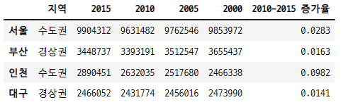

- 데이터 프레임 값

```python
df.values

>>> print

array([['수도권', 9904312, 9631482, 9762546, 9853972, 0.0283],
       ['경상권', 3448737, 3393191, 3512547, 3655437, 0.0163],
       ['수도권', 2890451, 2632035, 2517680, 2466338, 0.0982],
       ['경상권', 2466052, 2431774, 2456016, 2473990, 0.0141]], dtype=object)
```

- 데이터 프레임 열 라벨

```python
df.columns

>>> print

Index(['지역', '2015', '2010', '2005', '2000', '2010-2015 증가율'], dtype='object')
```

- 데이터 프레임 행 라벨

```python
df.index

>>> print

Index(['서울', '부산', '인천', '대구'], dtype='object')
```
- 행 인덱스와 열 인덱스의 이름 설정하기

```python
df.index.name = "도시"
df.columns.name = "특성"
df
```
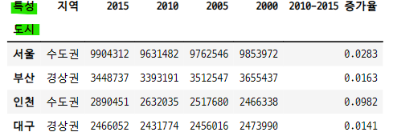

### 4-1. 데이터프레임의 전치연산
- 데이터프레임은 전치(transpose)와 넘파이 2차원 배열이 갖는 대부분의 속성과 메서드를 지원한다.

```python
df.T
```
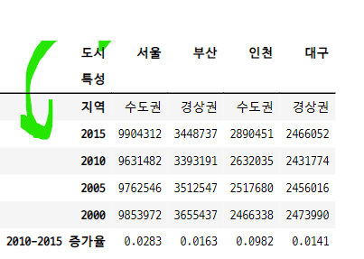

## 5. 열 데이터의 갱신, 추가, 삭제
- 데이터프레임은 열시리즈의 딕셔너리로 볼 수 있다.
- 따라서 열 단위로 데이터를 갱신, 추가, 삭제 할 수 있다.

```python
df["2010-2015 증가율"]

>>> print

도시
서울    0.0283
부산    0.0163
인천    0.0982
대구    0.0141
Name: 2010-2015 증가율, dtype: float64

df["2010-2015 증가율"] = df["2010-2015 증가율"] * 100
df
```
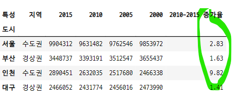

### 5-1. 열 추가

```python
df["2005-2010 증가율"] = ((df["2010"] - df["2005"]) / df["2005"] * 100).round(2)
df
```
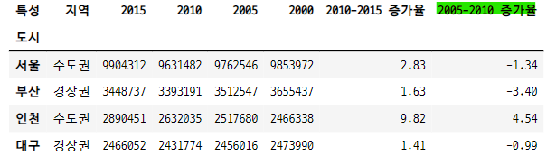

### 5-2. 열 삭제

```python
del df["2010-2015 증가율"]

df
```
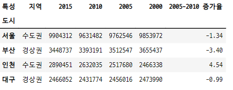

## 6. 인덱싱

### 6-1. 열 인덱싱
- 데이터프레임은 딕셔너리 : 열의 라벨을 키로, 열의 시리즈를 값으로 가지는 딕셔너리와 같다.
- **데이터프레임의 인덱싱 : 열 라벨 column label 을 키값으로 생각한다.**
- 인덱스로 라벨값을 하나만 넣으면 시리즈가 나오고 라벨의 베열이나 리스트를 넣어주면 부분적인 데이터프레임이 반환된다.
- 데이터프레임의 열 인덱스가 문자열 라벨이면 정수 인덱스를 열 인덱싱에 사용할 수 없다.
- 이런 경우 정수 인덱스는 행 인덱싱에 사용할 수 있다.
- 정수 인덱스를 넣으면 keyerror가 뜬다.

#### series 가 반환된다.

```python
df["지역"]

>>> print

도시
서울    수도권
부산    경상권
인천    수도권
대구    경상권
Name: 지역, dtype: object
```

#### 데이터프레임 자료형 유지
- 원소가 하나인 리스트를 써서 인덱싱

```python
df[["2010"]]
```
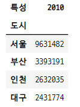

- 이중 리스트와 단일 리스트 인 경우의 데이터 타입 비교

```python
type(df[["2010"]])

>>> print

pandas.core.frame.DataFrame

type(df["2010"])

>>> print

pandas.core.series.Series
```

- **리스트에 넣은 값은 행 라벨이 아닌 열 라벨로 인식된다.**

### 6-2. 행 인덱싱
- 행 단위 인덱싱은 항상 슬라이싱을 써야 한다.
- 인덱스 값이 문자 라벨인 경우 라벨 슬라이싱도 가능하다.

```python
df[:1]
```
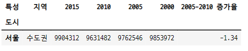

```python
df[1:3]
```
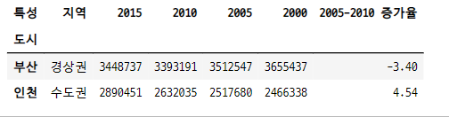

- 리스트에 행 라벨을 넣고 인덱싱 기호를 쓰면 행 인덱싱이 가능하다.

```python
df["서울":"인천"]
```
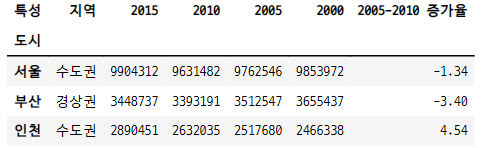

### 6-3. 개별 데이터 인덱싱
- 열 라벨로 시리즈를 인덱싱하면 시리즈가 된다.
- 이 시리즈를 다시 행 라벨로 인덱싱하면 개별 데이터가 나온다.
- df[열 라벨][행] -> 개별 데이터 반환

```python
df["2015"]["서울"]

>>> python

9904312
```
#### 열 라벨 인덱싱 = 시리즈

```python
df["2010"]

>>> print

도시
서울    9631482
부산    3393191
인천    2632035
대구    2431774
Name: 2010, dtype: int64
```

#### 열 라벨 리스트 인덱싱 = 데이터 프레임

```python
df[["2010", "2015"]]
```
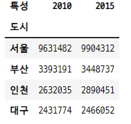

#### 열 라벨이 정수이면 정수 인덱싱도 가능

```python
df2[[0, 2]]
```
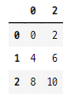

#### 정수 인덱싱 = 행 인덱싱 = 데이터프레임

```python
df[0:3]
```
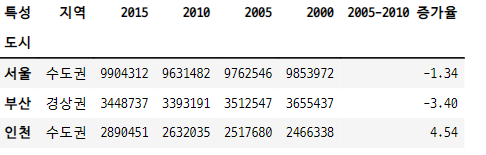

## 7. 연습문제
- 데이터 프레임 처리하기

```python
data = {
    "국어" : [80, 90, 70, 30],
    "영어" : [90, 70, 60, 40],
    "수학" : [90, 60, 80, 70]
}

columns = ["국어", "영어", "수학"]
index = ["춘향", "몽룡", "향단", "방자"]
df = pd.DataFrame(data, index=index, columns=columns)
df
```
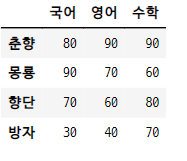

### 7-1. 모든 학생의 수학 점수를 시리즈로 나타내기
- 열 라벨 인덱싱 = 시리즈 반환

```python
df["수학"]

>>> python

춘향    90
몽룡    60
향단    80
방자    70
Name: 수학, dtype: int64
```
### 7-2. 모든 학생의 국어와 영어 점수를 데이터 프레임으로 나타낸다.
- 라벨 리스트 인덱싱 = 데이터 프레임 반환

```python
df[["국어", "영어"]]
```
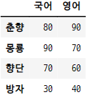

### 7-3. 모든 학생의 각 과목 평균 점수를 새로운 열로 추가한다.

```python
df["평균"] = ((df["국어"] + df["영어"] + df["수학"]) / 3).round(2)
df
```
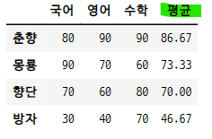

- agg함수를 사용하여 평균 계산

```python
df["평균"] = (df.agg(sum, axis=1) / 3).round(2)
```

### 7-4. 방자의 영어 점수를 80점으로 수정하고 평균 점수도 다시 계산한다.

```python
df["영어"]["방자"] = 80
df["평균"] = ((df["국어"] + df["영어"] + df["수학"]) / 3).round(2)
df
```
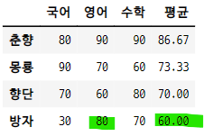

### 7-5. 춘향의 점수를 데이터프레임으로 나타낸다.
- 행 인덱싱 = 정수 슬라이싱 = 데이터 프레임

```python
df[:1]
```
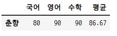

### 7-6. 향단의 점수를 시리즈로 나타낸다.
- for 문을 사용한 방법

```python
data = []

for col in df.columns :
    data.append(df[col]["향단"])

hyang_dan = pd.Series(data, index=df.columns)
hyang_dan.index.name = "향단"
hyang_dan.name = "향단"
hyang_dan

>>> print

향단
국어    70.0
영어    60.0
수학    80.0
평균    70.0
Name: 향단, dtype: float64
```

- 슬라이싱한 데이터를 시리즈로 만들어 반환하는 방법

```python
hyang_dan_2 = pd.Series(list(df[2:3].values[0]), index=df.columns)
hyang_dan_2.index.name = "향단"
hyang_dan_2.name = "향단"
hyang_dan_2

>>> print

향단
국어    70.0
영어    60.0
수학    80.0
평균    70.0
Name: 향단, dtype: float64
```

- iloc 명령어를 사용하여 향단에 해당하는 인덱스 라벨을 조회하는 방법

```python
df.iloc[2]

>>> print

향단
국어    70.0
영어    60.0
수학    80.0
평균    70.0
Name: 향단, dtype: float64
```
