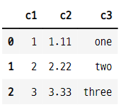

# 데이터 입출력
- pandas에서 지원하는 여러가지 데이터 파일 포맷. 이 포맷들로 데이터프레임을 만들 수 있다.
    - CSV 
    - Excel
    - HTML
    - JSon
    - HDF5
    - SAS
    - STATA
    - SQL

## 1. CSV
- `CSV comman separated value`
- 가장 단순하고 널리 사용되는 포맷
- 데이터 값이 **쉼표(comma)로 구분**되는 **텍스트 파일**이다.

### 1-1. %%writefile 명령
- 이 명령은 셀에 서술한 내용대로 텍스트 파일을 만들어 준다.

```python
%%writefile sample1.csv

c1, c2, c3
1, 1.11, one
2, 2.22, two
3, 3.33, three

>>> print

Writing sample1.csv
```
- 현재 디렉토리 확인 : writefile 명령으로 만든 파일이 만들어져 있다.

```python
!ls

>>> print

01_basic_series_dataframe.ipynb
02_data_input_output.ipynb
sample1.csv
Untitled.ipynb
```

### 1-2. CSV 파일 입력
- csv 파일로부터 데이터를 읽어서 데이터프레임을 만든다.
    - pandas.read_csv() 함수 사용
- csv 파일에 행 인덱스가 없으면 0부터 시작하는 정수가 index 라벨로 만들어진다.
- **csv 파일에 열 인덱스가 없으면 read_csv 함수의 names 인수로 설정 가능**

```python
pd.read_csv("sample1.csv")
```


#### 열 인덱스가 따로 없는 경우
- 첫 번째 행의 데이터가 열 인덱스가 된다.
- 새로운 파일 생성

```python
%%writefile sample2.csv

1, 1.11, one
2, 2.22, two
3, 3.33, three

>>> print

Writing sample2.csv
```
- 파일 임포트

```python
pd.read_csv("sample2.csv")
```


#### names 인수를 사용하여 열 인덱스 설정 가능

```python
pd.read_csv("sample2.csv", names=["c1", "c2", "c3"])
```


### 1-3. index_col
- 테이블 내의 특정한 열을 행 인덱스로 지정하는 방법
    - index_col 인수 사용
    - 열의 인덱스 부터 값까지 모두 행 인덱스가 된다.

- c2 열의 데이터를 행 인덱스로 설정

```python
pd.read_csv("sample1.csv", index_col=" c2")
```


### 1-4. 확장자가 csv가 아닌 파일 인 경우
- 구분자(separator)가 쉼표가 아니면 **sep 인수**를 써서 구분자를 지정해준다.
- 길이가 정해지지 않은 공백이 구분자인 경우
    - **\s+ 정규식(regular expression) 문자열**을 사용한다.

- txt 파일 생성

```python
%%writefile smaple3.txt

c1         c2         c3         c4
0.12345678 0.34567829 1.34756392 0.12345678
0.12345678 0.34567829 1.34756392 0.12345678
0.12345678 0.34567829 1.34756392 0.12345678

>>> print

Writing smaple3.txt
```

- txt 파일 임포트 : 구분자 지정 없는 경우

```python
pd.read_csv("smaple3.txt")
```


- txt 파일 임포트 : 구분자 지정을 한 경우

```python
pd.read_csv("smaple3.txt", sep="\s+")
```


### 1-5. skiprows 인수
- 파일에서 건너 뛰어야할 행이 있는 경우 사용

- 새로운 파일 생성

```python
%%writefile sample4.txt
파일 제목 : sample4.txt
데이터 포멧의 설명 :
c1,c2,c3
1,1.11,one
2,2.22,two
3,3.33,three

>>> print

Overwriting sample4.txt
```
- 파일에 형식에 맞지 않는 데이터 있는 경우 skiprows 인수를 사용해야 한다.
- skiprows 설정 안하면 에러난다.

```python
pd.read_csv("sample4.txt", skiprows=[0,1])
```


### 1-6. na_values 인수
- 특정한 값을 NaN 값으로 변환
- "누락" 데이터 있는 새로운 파일 생성

```python
%%writefile sample5.txt
x1,x2,x3
1,1.11,one
2,2.22,two
누락,3.33,three

>>> print

Overwriting sample5.txt
```
- na_values 인수를 사용하여 "누락"이라는 값을 NaN으로 대체해서 임포트 한다.

```python
pd.read_csv("sample5.txt", na_values=["누락"])
```


## 2. CSV 파일 출력
- 데이터프레임을 csv 파일로 저장, 출력하는 방법
    - to_csv("파일명", 인수) 매서드 사용


```python
df.to_csv("file1.csv")
```

### 2-1. 파일 내용 확인
- 윈도우에서는 !type 파일명
- 리눅스나 맥에서는 !cat 파일명

```python
!type file1.csv

>>> print

,c1,c2,c3
row1,1,4,7
row2,2,5,8
row3,3,6,9
```
### 2-2. 구분자 변경
- to_csv("파일명", sep="|") : 구분자를 지정하여 csv파일로 저장할 수 있다.

```python
df.to_csv("file2.csv", sep="|")

!type file2.csv

>>> python

|c1|c2|c3
row1|1|4|7
row2|2|5|8
row3|3|6|9
```
### 2-3. NaN 값 변경하기 : 실행이 안됨 확인 해볼 것
- 데이터프레임에 NaN, nan 값이 있을 경우 변경하여 csv 파일로 저장할 수 있다.
    - to_csv("파일명", na_rep="변경값")
- csv 파일을 불러올 때 nan 값을 변경하기
    - read_csv("파일명", na_values="변경값")

### 2-4. index, header 인수 지정하기
- index와 header 출력 여부 지정
    - to_csv("파일명", index=False, header=False) : 데이터프레임의 인덱스와 열을 제거하여 저장

```python
df.to_csv("file5.csv", index=False, header=False)

!type file5.csv

>>> print

1,4,7
누락,nan,8
3,6,9
```

- 행 인덱스와 열 인덱스가 삭제 되어 반환된다.

```python
pd.read_csv("file5.csv")
```


- 행 인덱스는 남기고 열 인덱스는 삭젝하여 저장하기

```python
df.to_csv("file6.csv", index=True, header=False)
pd.read_csv("file6.csv")
```


## 3. 인터넷 상의 CSV 파일 입력
- 웹상의 다양한 CSV 파일을 읽는 방법
    - read_csv(url)

```python
df = pd.read_csv("https://raw.githubusercontent.com/datascienceschool/docker_rpython/master/data/titanic.csv")
df
```


### 3-1. 행의 디스플레이 갯수 설정
- 행이 많은 데이터의 경우 일부부만 보여진다. 
- 보여지는 행의 갯수를 설정할 수 있다.
    - pd.set_option("display.max_rows", 정수) : 정수 만큼 보여진다.

```python
pd.set_option("display.max_rows", 5)
df
```


### 3-2. head, tail
- 데이터프레임의 앞과 뒤의 특정 갯수만 보여준다.
- 위에서 5개의 행만 불러오기

```python
df.head(5)
```


- 뒤에서 3개의 행만 불러오기

```python
df.tail(3)
```


### 3-3. 인터넷 상의 데이터 베이스 자료 입력
- 일부 인터넷 사이트의 자료를 pandas로 읽어들일 수 있는 기능
    - pandas_datareader 패키지의 DataReader 명령 사용
    - **pandas_datareader 패키지는 별도로 설치해야 한다.**
- 사이트 종류
    - FRED
    - Fama/French
    - World Bank
    - OECD
    - Eurostat
    - EDGAR Index
    - TSP Fund Data
    - Oanda currency historical rate
    - Nasdaq Trader Symbol Definition

### 3-4. 날짜 데이터 사용
- datetime 패키지 사용 또는 문자열을 바로 입력하여 사용

```python
import datetime
dt_start = datetime.datetime(2019, 1, 1)
dt_end = "2019, 6, 30"
dt_start

>>> print

datetime.datetime(2019, 1, 1, 0, 0)

dt_end

>>> print

'2019, 6, 30'
```

- 시작 날짜와 종료 날짜를 사용하여 GDP 데이터 로드

```python
import pandas_datareader as pdr

gdp = pdr.get_data_fred("GDP", dt_start, dt_end)
gdp.tail()
```


#### 데이터 코드에 여러가지의 리스트를 넣으면 여러개의 데이터를 받을 수 있다.
- fred 사이트에서 데이터를 가져온다.
- fred 사이트에서 필요한 데이터 목록을 여러개 불러 온다.

```python
inflation = pdr.get_data_fred(["CPIAUCSL", "CPILFESL"], dt_start, dt_end)
inflation.tail()
```


