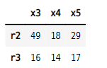

# 데이터 프레임 고급 인덱싱

## 1. 인덱싱
- `인덱싱 indexing` : 데이터 프레임에서 특정한 데이터만 골라내는 것
    - 라벨 : 열 인덱싱
    - 라벨 리스트 : 복수의 열 인덱싱
    - 인덱스데이터(정수) 슬라이스 : 행 인덱싱
- Pandas는 numpy 행렬과 같은 방식의 인덱싱도 가능하다.
    - **쉼표 사용 : 행 인덱스, 열 인덱스 : 2차원 인덱싱 지원**
    - 인덱서(indexer)
        - loc : 라벨값 기반의 2차원 인덱싱
        - iloc : 순서를 나타내는 정수 기반의 2차원 인덱싱

### 1-1. 데이터프레임 생성
- 키 리스트와 값 리스트를 zip으로 묶은 후 딕셔너리로 만들기
    - dict(zip(키리스트, 값리스트))
    - 키 리스트가 열 인덱스의 라벨이 된다.
- 값 리스트를 넘파이 배열로 만든 후 전치연산하여 변환한 후 데이터 프레임으로 만들기
    - 열 인덱스와 행 인덱스 따로 지정

#### 데이터 프레임 생성

```python
col = ["x1", "x2", "x3", "x4", "x5"]
index = ["r1", "r2", "r3", "r4", "r5"]
vals = []
for i in range(5) :
    val = [np.random.randint(1, 100) for _ in range(5)]
    vals.append(val)

data = dict(zip(col, vals))
data

>>> print

{'x1': [93, 78, 27, 18, 58],
 'x2': [68, 39, 49, 75, 77],
 'x3': [49, 88, 27, 63, 7],
 'x4': [30, 84, 21, 9, 14],
 'x5': [50, 91, 40, 49, 71]}
```

- 데이터 프레임 만들기

```python
df = pd.DataFrame(data, index=index)
df
```


### 1-2. 기본 인덱싱

#### 열 인덱싱
- 열의 라벨 : 시리즈 반환

```python
df["x1"]

>>> print

r1    93
r2    78
r3    27
r4    18
r5    58
Name: x1, dtype: int64
```

#### 열 인덱싱
- 라벨 리스트(이중리스트) : 데이터프레임 반환

```python
df[["x1", "x2"]]
```


#### 행 인덱싱
- 인덱스데이터(정수) 슬라이스 : 데이터프레임 반환

```python
df[:2]
```


#### 개별 데이터 선택
- 열, 행 라벨 인덱싱

```python
df["x2"]["r2"]

>>> print

39
```

## 2. loc 인덱서
- 라벨값 기반의 2차원 인덱싱
- loc 인덱서 사용
    - df.loc[행 인덱서의 값]
    - df.loc[행 인덱싱 값, 열 인덱싱 값]
    - 행 인덱싱값 : 정수 또는 행 인덱스데이터
    - 열 인덱싱값 : 라벨 문자열
- 인덱싱 값
    - 인덱스데이터
    - 인덱스데이터 슬라이스
    - 인덱스데이터 리스트
    - 같은 행 인덱스를 가지는 불리언 시리즈(행 인덱싱의 경우)
    - 또는 위의 값들을 반환하는 함수


```python
df = pd.DataFrame(np.arange(10, 22).reshape(3,4),
                 index=["a", "b", "c"],
                 columns=["A", "B", "C", "D"])
df
```


### 2-1. 인덱싱값을 하나만 받는 경우
- loc 인덱서를 사용하여 인덱스를 하나만 넣으면 행을 선택한다.
    - 행이 시리즈로 출력된다.

```python
df.loc["a"]

>>> print

A    10
B    11
C    12
D    13
Name: a, dtype: int32
```

### 2-2. 인덱스데이터 슬라이스
- loc를 쓰지 않은 경우와 같다.

```python
df.loc["b" : "c"]
```


```python
df["b" : "c"]
```


### 2-3. 인덱스 데이터의 리스트
- loc를 쓰지 않으면 에러가 난다.
    - 리스트 인덱싱은 열 라벨만 가능하기때문

```python
df.loc[["b", "c"]]
```


- loc를 쓰지 않은 경우 라벨 인덱싱은 열 인덱싱만 가능하다.

```python
df[["B", "C"]]
```


### 2-4. 불리언 시리즈를 반환받아 인덱싱값으로 사용

```python
df.A > 15

>>> print

a    False
b    False
c     True
Name: A, dtype: bool
```

- 불리언 시리즈를 인덱싱 값으로 넣는다.

```python
df[df.A > 15]
```


```python
df[(df.A / 2) < 8]
```


### 2-5. 불리언 시리즈를 반환하는 함수를 인덱싱의 값으로 사용

```python
def select_df(df) :
    return df.A > 15

select_df(df)

>>> print

a    False
b    False
c     True
Name: A, dtype: bool
```

```python
df.loc[select_df(df)]
```


### 2-6. loc를 사용하여 열 라벨 인덱싱이나 라벨 리스트 인덱싱은 불가
- loc 인덱서는 기본적으로 행 인덱스 값을 사용하기때문이다.

```python
df.loc["A"]
```

```python
df.loc[["A"]]
```

- 라벨 인덱싱과 라벨 리스트 인덱싱을 사용하려면 loc 인덱서를 뺴고 사용해야한다.

```python
df["A"]

>>> print

a    10
b    14
c    18
Name: A, dtype: int32
```

```python
df[["A"]]
```


### 2-7. loc 인덱서를 사용한 행 인덱싱
- loc 인덱서를 사용하여 라벨 슬라이싱 방식으로 가능
    - **슬라이싱의 마지막 값 포함된다.**

- 데이터 프레임 생성

```python
df2 = pd.DataFrame(np.arange(10, 26).reshape(4, 4),
                  columns=["A","B","C","D"])
df2
```


- loc 인덱서를 사용한 경우는 마지막 범위까지 포함되어 조회된다.

```python
df2.loc[1:3]
```


- loc 인덱서를 사용하지 않은 경우는 마지막 범위가 포함되지 않는다.

```python
df2[1:3]
```


### 2-8. 정리
- 인덱싱 방법 정리

#### 행 인덱스값이 정수
- 결과 : 행
- 자료형 : 시리즈

```python
df2.loc[0]

>>> print

A    10
B    11
C    12
D    13
Name: 0, dtype: int32
```

#### 행인덱스값(정수) 슬라이스
- 결과 : 행, 슬라이스의 마지막 값 포함
- 자료형 : 데이터프레임, loc 없는 경우와 같음

```python
df2.loc[1:3]
```


#### 행 인덱스값(정수) 리스트
- 결과 : 행
- 자료형 : 데이터프레임

```python
df2.loc[[0, 1]]
```


- loc 인덱서를 사용하지 않은 경우 행 인덱스를 리스트에 리스트에 담으면 에러가 난다.
   - 열 라벨만 인식하기 때문

```python
df2[[0, 1]]
```


#### 불리언 시리즈
- 결과 : 행
- 자료형 : 데이터 프레임
    - 시리즈의 인덱스가 데이터프레임의 행 인덱스와 같아야함
    - **데이터 조회시 조건문을 사용할 수 있다.**

```python
df2.B > 16

>>> print

0    False
1    False
2     True
3     True
Name: B, dtype: bool
```

```python
df2[df2.B > 16]
```


#### 불리언 시리즈를 반환하는 함수
- 결과 : 행
- 자료형 : 데이터 프레임
   - **데이터 조회의 조건을 반환하는 함수를 만들고 이를 사용할 수 있다.**

- 행 1~3 의 데이터 중에서 20보다 큰 값인 경우의 불리언 시리즈 반환하는 함수

```python
def select_rows(df) :
    return df2.loc[1:3] > 20
```

- 함수만 호출 : 불리언 값이 데이터 프레임 형태로 반환된다.

```python
select_rows(df2)
```


- 함수를 사용하여 데이터를 조회

```python
df2[select_rows(df2)].values

>>> print

array([[nan, nan, nan, nan],
       [nan, nan, nan, nan],
       [nan, nan, nan, 21.],
       [22., 23., 24., 25.]])
```

### 2-8. 인덱싱값으로 행과 열 모두 받는 경우
- df.loc[행 인덱스, 열 인덱스]
- 데이터 만 조회 된다.

```python
df.loc["a", "A"]

>>> print

10
```
- 행 라벨 슬라이싱 + 열 라벨
   - 시리즈 반환
```python
df.loc["b":, "A"]

>>> print

b    14
c    18
Name: A, dtype: int32
```

- 행 라벨 + 열 슬라이싱
   - 시리즈 반환
```python
df.loc["a", :]

>>> python

A    10
B    11
C    12
D    13
Name: a, dtype: int32
```

- 행 라벨 리스트 + 열 라벨 리스트
   - 데이터 프레임 반환
```python
df.loc[["a", "b"], ["B", "D"]]
```


### 2-9. 불리언 시리즈나 불리언 시리즈를 반환하는 함수도 행의 인덱싱 값이 될 수 있다.

```python
df.loc[df.A > 10, ["C", "D"]]
```


- loc 인덱서를 사용하지 않은 경우에도 불리언을 인덱싱 값으로 사용 가능

```python
df[df.A > 10][["C", "D"]]
```


## 3. iloc 인덱서
- loc 인덱서와 반대로 라벨이 아니라 순서를 나타내는 **정수(integer) 인덱스만 받는다.**
    - 인덱스가 라벨 문자열이라도 iloc 인덱서는 정수 인덱스 사용가능
- 다른 방법은 loc 인덱서와 같음

### 3-1. 정수 인덱스 사용

```python
df.iloc[0]

>>> print

A    10
B    11
C    12
D    13
Name: a, dtype: int32
```

#### loc 인덱서는 라벨 문자열만 받는다.
- 정수 인덱스 사용하면 에러

### 3-2. 정수 슬라이싱

```python
df.iloc[2:3]
```


#### loc 인덱서를 사용하여 행을 선택한 경우
- 정수가 아닌 행 라벨을 사용해야 한다.

```python
df.loc["c"]

>>> print

A    18
B    19
C    20
D    21
Name: c, dtype: int32
```

- 데이터 프레임으로 출력

```python
df.loc["c":]
```


```python
df.loc[["c"], ["A","B","C","D"]]
```


### 3-3. 행 인덱스, 열 인덱스 함께 사용
- iloc 인덱서는 정수만 사용할 수 있다.

```python
df.iloc[:2, 2]

>>> print

a    12
b    16
Name: C, dtype: int32
```

```python
df.iloc[:2, -2]

>>> print

a    12
b    16
Name: C, dtype: int32
```

```python
df.iloc[:2, 2:]
```


```python
df.iloc[2:3, 1:3]
```


```python
df.iloc[:2, [0, 1, 2, 3]]
```


### 3-4. 인덱스 하나만 쓰면 행 선택
- loc 인덱서와 같은 방식

```python
df.iloc[2]

>>> print

A    18
B    19
C    20
D    21
Name: c, dtype: int32
```
```python
df.loc["c"]

>>> print

A    18
B    19
C    20
D    21
Name: c, dtype: int32
```

## 4. 연습문제

### 4-1. 데이터프레임 만들기
- 모든 행과 열에 라벨을 가지는 5X5 이상의 크기를 가지는 데이터 프레임 만들기

#### 방법 1

```python
columns = [str("x{}").format(i) for i in range(1, 6)]
index = [str("r{}").format(i) for i in range(1, 6)]

data = np.arange(10, 35).reshape(5, 5)

df = pd.DataFrame(data, columns=columns, index=index)
df
```


#### 방법 2
- 반복문을 사용해 데이터 생성

```python
vals = []
for i in range(5) :
    val = [np.random.randint(10, 50) for _ in range(5)]
    vals.append(val)

vals

>>> print

[[11, 17, 45, 26, 35],
 [21, 29, 45, 19, 32],
 [27, 49, 16, 49, 33],
 [39, 18, 14, 24, 37],
 [48, 29, 17, 49, 15]]
```

- 열 라벨과 데이터를 딕셔너리로 묶어준다.

```python
data2 = dict(zip(columns, vals))
data2

>>> print

{'x1': [11, 17, 45, 26, 35],
 'x2': [21, 29, 45, 19, 32],
 'x3': [27, 49, 16, 49, 33],
 'x4': [39, 18, 14, 24, 37],
 'x5': [48, 29, 17, 49, 15]}
```

- 데이터 프레임으로 만들어 준다. 

```python
df2 = pd.DataFrame(data2, index=index)
df2
```


### 4-2. 10가지 이상의 방법으로 특정한 행과 열을 선택한다.

#### loc 인덱서를 사용하여 행,열 선택하기

```python
df2.loc["r1"]

>>> print

x1    11
x2    21
x3    27
x4    39
x5    48
Name: r1, dtype: int64
```

```python
df2.loc["r1":"r4"]
```


```python
df2.loc[["r1", "r2"], :]
```


```python
df2.loc["r1":"r3", "x3":]
```


#### loc 인덱서를 사용하지 않고 행,열 선택

```python
df2.x3

>>> print

r1    27
r2    49
r3    16
r4    49
r5    33
Name: x3, dtype: int64
```

```python
df2["x3"]

>>> print

r1    27
r2    49
r3    16
r4    49
r5    33
Name: x3, dtype: int64
```

```python
df2[["x3", "x5"]]
```


- 열 라벨과 행 라벨을 각각 리스트에 담아서 사용 가능

```python
df2["x3"]["r3"]

>>> print

16
```
- 열 라벨과 행의 인덱스 정수를 각각 리스트에 담아서 사용 가능

```python
df2["x3"][2]

>>> print

16
```

#### iloc 인덱서를 사용하여 행,열 선택

```python
df2.iloc[1:3]
```


```python
df2.iloc[1]

>>> print

x1    17
x2    29
x3    49
x4    18
x5    29
Name: r2, dtype: int64
```

```python
df2.iloc[1][3]

>>> print

18
```

```python
df2.iloc[1:3, 2:]
```


```python
df2.iloc[[1, 2], 2:]
```


```python
df2.iloc[[1, 2, 4], [0, 1, 3]]
```


```python
df2[df2.x1 > 30]
```


```python
df2.loc[(df2.x1 > 30) & (df2.x3 < 20)]
```


