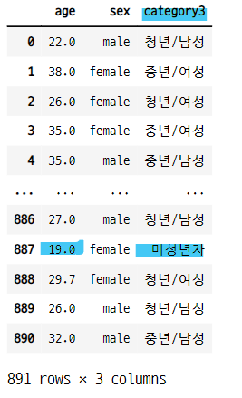

# 데이터프레임의 데이터 조작

## 1. 데이터 갯수 세기
- count 메서드 사용
- NaN 값은 세지 않음

### 1-1. 시리즈 데이터

```python
s = pd.Series(range(10))
s[3] = np.nan
s

>>> print

0    0.0
1    1.0
2    2.0
3    NaN
4    4.0
5    5.0
6    6.0
7    7.0
8    8.0
9    9.0
dtype: float64
```

- count() 메서드를 사용하여 데이터의 갯수를 계산
   - 결측값은 계산하지 않는다.

```python
s.count()

>>> print

9
```

### 1-2. 데이터 프레임
- 열 별로 갯수를 센다.
- **누락된 부분을 찾을 때 유용함**

```python
np.random.seed(2)
df = pd.DataFrame(np.random.randint(5, size=(4, 4)), dtype=float)
df.iloc[2, 3] = np.nan
df
```


- count() 메서드를 사용하면 데이터 프레임의 각 열의 데이터의 갯수를 계산해준다.
```python
df.count()

>>> print

0    4
1    4
2    4
3    3
dtype: int64
```

#### 타이타닉 승객 데이터 임포트

```python
titanic = sns.load_dataset("titanic")
titanic.head()
```


- count() 메서드를 사용하면 타이타닉 데이터의 각 컬럼의 데이터의 갯수를 계산한다.
```python
titanic.count()

>>> print

survived       891
pclass         891
sex            891
age            714
sibsp          891
parch          891
fare           891
embarked       889
class          891
who            891
adult_male     891
deck           203
embark_town    889
alive          891
alone          891
dtype: int64
```

## 2. 카테고리 값 세기
- 시리즈 값이 정수, 문자열, 카데고리 값인 경우
    - value_counts() 메서드로 계산
- 데이터프레임의 카테고리 값은 각 열마다 따로 계산 해야 함

- 시리즈 데이터 생성

```python
np.random.seed(1)
s2 = pd.Series(np.random.randint(6, size=100))
s2.tail()
```

```python
s2.value_counts()

>>> print

1    22
0    18
4    17
5    16
3    14
2    13
dtype: int64
```

## 3. 정렬
- 데이터 정렬
    - sort_index() 메서드 : 인덱스 값 기준 정렬
    - sort_values() 메서드 : 데이터 값 기준 정렬

#### 인덱스 기준으로 정렬

```python
s2.value_counts().sort_index()

>>> print

0    18
1    22
2    13
3    14
4    17
5    16
dtype: int64
```

#### 데이터 기준으로 정렬
- 데이터 값이 큰 순으로 또는 작은 순으로 정렬 가능

```python
s2.value_counts().sort_values()

>>> print

2    13
3    14
5    16
4    17
0    18
1    22
dtype: int64
```

### 3-1. NaN 값이 있으면 맨 마지막에 정렬

```python
s.sort_values()

>>> print

0    0.0
1    1.0
2    2.0
4    4.0
5    5.0
6    6.0
7    7.0
8    8.0
9    9.0
3    NaN
dtype: float64
```

### 3-2. 데이터의 내림차순 정렬
- sort_values(ascending=False) : False 내림차순
   - 내림차순으로 정렬을 한 경우도 NaN 값은 가장 밑에 온다.

```print
s.sort_values(ascending=False)

>>> print

9    9.0
8    8.0
7    7.0
6    6.0
5    5.0
4    4.0
2    2.0
1    1.0
0    0.0
3    NaN
dtype: float64
```

### 3-3. 데이터프레임에서 정렬
- sort_values(by=기준열의 라벨)
- 복수의 열 순서대로 정렬
    - sort_values(by=[2, 1]) : 2번째 열, 1번째 열 순서로 정렬

- 라벨값이 2인 열의 데이터를 기준으로 정렬

```python
df.sort_values(by=2)
```


- 내림차순으로 정렬

```python
df.sort_values(by=2, ascending=False)
```


- 복수의 열을 선택하여 정렬
   - 입력된 열의 순서대로 정렬 해준다.

```python
df.sort_values(by=[2, 1])
```


## 4. 연습문제
- 타이타닉 데이터에서 각 독립변수 별로 갯수 구하기
    - sort_values() 메서드 사용

- 데이터 임포트

```python
titanic = sns.load_dataset("titanic")
titanic.head()
```


### 4-1. 성별 인원수

```python
titanic.sex.value_counts()

>>> print

male      577
female    314
Name: sex, dtype: int64
```

- 성별이 female 인 데이터의 갯수만 조회

```python
titanic[titanic["sex"].sort_values() == "female"]["sex"].count()

>>> print

314
```

- 성별이 male 인 데이터의 갯수만 조회

```python
titanic[titanic["sex"].sort_values() == "male"]["sex"].count()

>>> print

577
```

### 3-2. 나이별 인원수

```python
titanic["age"].value_counts()

>>> print

24.00    30
22.00    27
18.00    26
19.00    25
28.00    25
         ..
36.50     1
55.50     1
0.92      1
23.50     1
74.00     1
Name: age, Length: 88, dtype: int64
```

- 인덱싱 값으로 리스트를 사용하지 않고 열의 라벨값을 직접 사용

```python
titanic.age.value_counts()

>>> print

24.00    30
22.00    27
18.00    26
19.00    25
28.00    25
         ..
36.50     1
55.50     1
0.92      1
23.50     1
74.00     1
Name: age, Length: 88, dtype: int64
```

- 나이가 23.00 인 데이터의 갯수 계산

```python
titanic[titanic["age"] == 23.00]["age"].count()

>>> print

15
```
### 3-3. 선실별 인원수

```python
titanic["class"].value_counts()

>>> print

Third     491
First     216
Second    184
Name: class, dtype: int64
```

- 인덱스를 기준으로 정렬

```python
titanic["class"].value_counts().sort_index()

>>> print

First     216
Second    184
Third     491
Name: class, dtype: int64
```

- 인덱스를 기준으로 내림차순으로 정렬

```python
titanic["class"].value_counts().sort_index(ascending=False)

>>> print

Third     491
Second    184
First     216
Name: class, dtype: int64
```

- second 선실인 데이터의 갯수 계산

```python
titanic[titanic["class"] == "Second"]["class"].count()

>>> print

184
```

### 3-4. 사망/생존자 인원수

```python
titanic.alive.value_counts()

>>> print

no     549
yes    342
Name: alive, dtype: int64
```

- 사망자 데이터 갯수 계산

```python
titanic[titanic["alive"] == "no"]["alive"].count()

>>> print

549
```

- 생존자 데이터 갯수 계산

```python
titanic[titanic["alive"] == "yes"]["alive"].count()

>>> print

342
```

## 4. 행/열 합계
- sum(axis=) 메서드 사용
- axis 는 합계로 인해 없어지는 방향축을 지정한다.
    - 0 : **행** : **열 단위 합계** : **행이 없어진다.**
    - 1 : **열** : **행 단위 합계** : **열이 없어진다.**

#### 데이터 프레임 생성
- np.random.randint(샘플 데이터의 범위값, size=(행, 열))
   - size() 인수를 사용하여 행렬의 모양을 설정할 수 있다.
   - 범위값이 오른쪽 한계값이 된다.

```python
np.random.seed(1)
df2 = pd.DataFrame(np.random.randint(10, size=(4, 8)))
df2
```


### 4-1. 행 방향 합계
- axis=1
    - 열이 없어진다.

```python
df2.sum(axis=1)

>>> print

0    35
1    34
2    41
3    42
dtype: int64
```

- 데이터프레임에 행별 합계 컬럼 생성

```python
df2["RowSum"] = df2.sum(axis=1)
df2
```


### 4-2. 열 방향 합계
- axis=0
    - 행이 없어진다.
    - 디폴트 값이 0 이므로 생략 가능

```python
df2.sum(axis=0)

>>> print

0          24
1          33
2          25
3          24
4          15
5          10
6           5
7          16
RowSum    152
dtype: int64
```

- 데이터프레임에 열별 합계 행 생성

```python
df2.loc["ColTotal", :] = df2.sum(axis=0)
df2
```


### 4-3. 평균
- sum과 방법이 같다.   

- 행별 평균

```python
df2["RowMean"] = df2[[0, 1, 2, 3, 4, 5, 6, 7]].mean(axis=1)
df2
```


- 열별 평균
```python
df2.loc["ColMean"] = df2.mean(axis=0)
df2
```


#### 특정 컬럼이나 행만 선택하여 평균이나 합을 구하는 방법
- loc 인덱서를 이용해서 열과 행을 함께 선택해준다.

```python
df["mean"] = df.loc[:, 0:5].mean(axis=0)
df
```


```python
df.loc["colmean", :] = df.loc[:2, :].mean(axis=1)
df
```


## 5. 연습문제

### 5-1. 타이타닉호 승객의 평균나이를 구하라.

```python
titanic.age.mean(axis=0)

>>> print

29.69911764705882
```

### 5-2. 타이타닉호 승객중 여성 승객의 평균 나이를 구하라.

```python
titanic[titanic.sex == "female"]["age"].mean(axis=0)

>>> print

27.915708812260537
```

### 5-3. 타이타닉호 승객중 1등실 선실의 여성 승객의 평균 나이를 구하라.
- 불리언 시리즈를 조회한 후 이것을 인덱싱 값으로 사용하여 계산한다.

```python
titanic[(titanic["class"] == "First") \
        & (titanic["sex"] == "female")]["age"].mean(axis=0)

>>> print

34.61176470588235
```

## 6. apply 변환
- `apply() 메서드` : 행, 열 단위로 더 복잡한 처리를 해준다.

#### 데이터 프레임 생성

```python
df3 = pd.DataFrame({
    "A" : [1, 3, 4, 3, 4],
    "B" : [2, 3, 1, 2, 3],
    "C" : [1, 5, 2, 4, 4]
})

df3
```


### 6-1. 람다함수를 사용하여 최대값 최소값의 차이
- apply(lambda x : x.max() - x.min(), axis=1)
    - 계산해서 없어지는 행이나 열을 axis 인수로 넣는다.
    - axis=1 : 열이 없어지므로 행별 계산
    - axis=0 : 행이 없어지므로 열별 계산
    - 람다함수에서 열 라벨을 인덱싱 값으로 사용할 경우 axis=1을 설정 해주어야 한다. 
    
- 행별 계산

```python
df3.apply(lambda x : x.max() - x.min(), axis=1)

>>> print

0    1
1    2
2    3
3    2
4    1
dtype: int64
```

- 열별 계산

```python
df3.apply(lambda x : x.max() - x.min(), axis=0)

>>> print

A    3
B    2
C    4
dtype: int64
```

### 6-2. 각 열별로 어떤값이 얼마나 사용 되었는지 계산
- apply(pd.value_counts)
    - 각 열의 값이 인덱스가 되고, 이 값이 열에서 몇번 사용되었는지 세어준다.
    - 1은 A열에서 1번 사용 되었다.
    - 3은 A열에서 2번 사용 되었다.

```python
df3.apply(pd.value_counts)
```


### 6-3. 타이타닉 데이터에서 20살을 기준으로 성인과 미성년자 구분
- 람다함수에 조건문을 추가한다.

```python
titanic = sns.load_dataset("titanic")
titanic.apply(lambda r : "adult" if r.age >= 20 else "child", axis=1)

>>> print

0      adult
1      adult
2      adult
3      adult
4      adult
       ...
886    adult
887    child
888    child
889    adult
890    adult
Length: 891, dtype: object
```

- 새로운 컬럼을 만든다.

```python
titanic["adult/child"] = titanic.apply(lambda r : \
                                       "adult" if r.age >= 20 else "child", axis=1)
titanic.head(3)
```


- value_counts() 명령어를 사용하여 adult와 child의 갯수 계산

```python
titanic["adult/child"].value_counts()

>>> print

adult    550
child    341
Name: adult/child, dtype: int64
```

## 7. 연습문제
- 타이타닉호의 승객에 대해 나이와 성별에 의한 카테고리인 category1 열 만들기
    - 20살이 넘으면 성별을 그대로 사용한다.
    - 20살 미만이면 성별에 상관없이 child 라고 한다.

#### age와 sex 컬럼 확인
- age 컬럼의 데이터에 결측 데이터가 있는 것을 알 수 있다.

```python
titanic[["age", "sex"]][:20]
```


#### 람다함수를 사용하여 나이 등급 만들기
- 조건문에 age 컬럼을 변수로 사용했으므로 age의 값이 결측값이면 반환되는 값도 결측값이 된다.

```python
titanic.apply(lambda r : r.sex if r.age >= 20 else "child", axis=1)

>>> print

0        male
1      female
2      female
3      female
4        male
        ...
886      male
887     child
888     child
889      male
890      male
Length: 891, dtype: object
```

### 7-1. NaN 처리
- age의 값이 NaN 이면 NaN 값을 넣는 코드 추가
- **age의 값이 NaN 인지 확인 하는 방법 알아 볼 것**
    - np.nan, "NaN", "nan" 인식을 못함
    - age/age != 1 로 대체 : 정수라면 자기 자신과 나눴을 때 1이 나와야 한다.

```python
titanic["category1"] = titanic.apply(
    lambda r : r.sex if r.age >= 20 else
    np.nan if (r.age/r.age) != 1 else "child",
    axis=1)

titanic[["age", "sex", "category1"]][:20]
```


### 7-2. np.nan 값은 세어지지 않는다.
- np.nan 값은 카운팅 되지 않는다.
    - 따라서 어떤 계산 이후에 전체 데이터 중에서 결측 데이터가 있는지 먼저 확인 해야 한다.

```python
titanic["category1"].value_counts().sort_values()

>>> print

child     164
female    186
male      364
Name: category1, dtype: int64

titanic["category1"].value_counts().sort_values().sum()

>>> print

714
```

## 8. fillna 메서드
- NaN 값은 fillna 메서드를 사용하여 원하는 값으로 변경가능

```python
df = pd.DataFrame(np.random.randint(5, size=[4, 3]), columns=["A", "B", "C"],
                 dtype=float)
df.apply(pd.value_counts)
```


#### NaN 값을 0.0으로 대체

```python
df.apply(pd.value_counts).fillna(0.0)
```


## 9. 연습문제
- 타이타닉호의 승객 중 나이를 명시하지 않은 고객은 나이를 명시한 고객의 평균 나이 값이 되도록 titanic 데이터 프레임을 고쳐라

```python
titanic["age"] = titanic["age"].fillna(round(titanic["age"].mean(), 1))
titanic["age"][:10]

>>> print

0    22.0
1    38.0
2    26.0
3    35.0
4    35.0
5    29.7
6    54.0
7     2.0
8    27.0
9    14.0
Name: age, dtype: float64
```

### 9-1. 데이터프레임에서 NaN 값만 골라내는 방법
- isnull() 명령으로 불리언 시리즈를 반환하여 데이터프레임의 인덱싱값으로 사용한다.

```python
df = pd.DataFrame(np.random.randint(10, size=[4, 4]),
                  columns=["x{}".format(i) for i in range(4)])
value_count_df = df.apply(pd.value_counts)
value_count_df		  
```


- x2 열에서 nan 값만 조회

```python
value_count_df[value_count_df["x2"].isnull()]["x2"]

>>> print

1   NaN
2   NaN
3   NaN
5   NaN
Name: x2, dtype: float64
```

## 10. astype 메서드
- 전체 데이터의 자료형을 바꿀 수 있다.
- 객체에 저장 되지 않는다.

```python
df
```


- 데이터를 int 자료형으로 변환

```python
df.astype(int)
```


## 11. 연습문제
- 새로운 열 만들기 : category2
    - 성별을 나타내는 문자열 male 또는 female 로 시작한다.
    - 성별을 나타내는 문자열 뒤에 나이를 나타내는 문자열이 온다.
    - 27살 남성은 male27

### 11-1. 결측데이터 확인
- `isnull()` : 결측데이터 위치 확인, 불리언으로 반환
- `isna()` : 결측데이터 위치 확인, 불리언으로 반환
- `msno.matrix(df)` : 결측데이터 흰색, 데이터 검은색
    - import missingno as msno
- `msno.bar(df)` : 각 열에 결측데이터 시각화    

```python
dff = df.apply(pd.value_counts)
dff
```


#### isnull()

```python
dff.isnull()
```


#### isna()

```python
dff.isna()
```


### 11-2. sex 컬럼의 결측데이터 갯수 확인

```python
titanic["sex"].isnull().sum()

>>> print

0
```

### 11-3. 성별과 나이를 합한 카테고리 생성
- 성별과 나이 값을 선택하고 str로 변환하여 합해준다.

```python
titanic.apply(lambda r : str(r.sex) + str(int(r.age)), axis=1)

>>> print

0        male22
1      female38
2      female26
3      female35
4        male35
         ...
886      male27
887    female19
888    female29
889      male26
890      male32
Length: 891, dtype: object
```

- 새로운 컬럼 만들기

```python
titanic["category2"] = titanic.apply(lambda r : str(r.sex) + str(int(r.age)), axis=1)
titanic[["age", "sex", "category2"]]
```


## 12. 실수 값을 카테고리 값으로 변환
- `pd.cut(data, bins, labels)` : 실수 값의 경계선을 지정하는 경우
    - bins : 인수, 카테고리를 나누는 기준값, 리스트
    - labels : 카테고리 값
    - **bins의 갯수는 labels의 갯수보다 1 많아야 함**
    - 영역을 넘어가면 NaN으로 처리된다. (경계를 만들기때문에 nan이 생긴다.)
    - categorical 클래스 객체 반환 : 문자열이 아니다.
        - astype(str)로 문자열 변환해서 사용 가능
        - cagegories 속성 : 라벨 문자열
        - codes 속성 : 정수로 인코딩한 카테고리 값
- `pd.qcut(data, bins, labels)` : 갯수가 똑같은 구간으로 나누는 경우
    - q : 인수, 구간의 갯수, int
    - 경계를 나누지 않으므로 nan으로 남는 데이터 없음
    - 구간별 갯수가 달라질 수 있다. 

- 나이 데이터 생성

```python
ages = [0, 2, 10, 21, 23, 37, 31, 61, 20, 41, 32, 101]
ages

>>> print

[0, 2, 10, 21, 23, 37, 31, 61, 20, 41, 32, 101]
```

- 구간과 카테고리값 생성하여 pd.cut() 함수에 넣는다. 

```python
bins = [1, 20, 30, 50, 70, 100]
labels = ["미성년자", "청년", "중년", "장년", "노년"]
cats = pd.cut(ages, bins=bins, labels=labels)
cats

>>> print

[NaN, '미성년자', '미성년자', '청년', '청년', ..., '장년', '미성년자', '중년', '중년', NaN]
Length: 12
Categories (5, object): ['미성년자' < '청년' < '중년' < '장년' < '노년']
```

#### categorical 클래스 객체

```python
type(cats)

>>> print

pandas.core.arrays.categorical.Categorical
```

#### codes 속성

```python
cats.codes

>>> print

array([-1,  0,  0,  1,  1,  2,  2,  3,  0,  2,  2, -1], dtype=int8)
```

#### categories 속성

```python
cats.categories

>>> print

Index(['미성년자', '청년', '중년', '장년', '노년'], dtype='object')
```

### 12-1. 데이터 프레임으로 만들기

```python
df3 = pd.DataFrame(ages, columns=["ages"])
df3["age_cat"] = pd.cut(df3.ages, bins=bins, labels=labels)
df3
```


### 12-2. 새로운 카테고리값 적용

```python
bins2 = [1, 10, 30, 50, 70]
labels2 = ["브론즈", "실버", "골드", "다이아몬드"]
cat2 = pd.cut(ages, bins=bins2, labels=labels2)
cat2

>>> print

[NaN, '브론즈', '브론즈', '실버', '실버', ..., '다이아몬드', '실버', '골드', '골드', NaN]
Length: 12
Categories (4, object): ['브론즈' < '실버' < '골드' < '다이아몬드']
```

- 데이터 프레임으로 만들기

```python
df_bsg = pd.DataFrame(ages, columns=["ages"])
df_bsg["bsg"] = cat2
df_bsg
```


### 12-3. 마지막 범위를 넘어서는 데이터 처리
- pd.cut() 함수의 bins는 경계를 만들기 때문에 처음과 끝보다 작거나 큰 데이터는 결측처리 된다.
   - fillna() 함수를 사용하면 nan 값을 동일한 값으로 처리 해준다.
   - 기준값에 따라 다른 값으로 처리하려면 람다함수를 사용하여 조건문으로 구분해서 처리한다.

```python
ages = [0, 2, 10, 21, 23, 37, 31, 61, 20, 41, 32, 101]
bins = [1, 10, 30, 50, 70]
labels = ["bronz", "silver", "gold", "diamond"]

df_customer = pd.DataFrame(ages, columns=["ages"])
df_customer["level"] = pd.cut(df_customer.ages, bins=bins, labels=labels)
df_customer
```


- 구분값의 마지막 경계값 보다 크면 diamond 카테고리 값으로 변환한다.

```python
df_customer["level2"] = df_customer.apply(lambda r : "diamond" if r.ages > bins[-1] else r.level, axis=1)

df_customer
```


### 12-4. 문자열로 변환
- pd.cut()의 결과는 categorical 클래스 객체이다. astype() 명령어를 사용하여 문자열로 변환시켜준다.
- 문자열로 변환하여 다른 컬럼의 값과 합칠 수 있다.

```python
df3.age_cat.astype(str) + df3.ages.astype(str)

>>> print

0       nan0
1      미성년자2
2     미성년자10
3       청년21
4       청년23
5       중년37
6       중년31
7       장년61
8     미성년자20
9       중년41
10      중년32
11    nan101
dtype: object
```

### 12-4. qcut()
- 경계를 만들지 않고 구간으로 나눈다.
- 모든 구간의 데이터 갯수가 동일하다.
   - 경계를 만들지 않으므로 결측 데이터가 없다.

```python
data = np.random.randn(1000)
cats = pd.qcut(data, 4, labels=["q1", "q2", "q3", "q4"])
cats

>>> print

['q3', 'q1', 'q4', 'q3', 'q2', ..., 'q4', 'q4', 'q3', 'q1', 'q1']
Length: 1000
Categories (4, object): ['q1' < 'q2' < 'q3' < 'q4']
```

- 각 구간 별 데이터의 갯수 확인

```python
pd.value_counts(cats)

>>> print

q1    250
q2    250
q3    250
q4    250
dtype: int64
```

## 13. 연습문제
- 타이타닉호 승객을 "미성년자", "청년", "중년", "장년", "노년" 그룹으로 나눈다.
- 각 나이 그룹의 승객 비율을 구한다. 비율의 전체합은 1이 되어야 한다.

```python
bins = [1, 20, 30, 50, 70, 100]
labels = ["미성년자", "청년", "중년", "장년", "노년"]
titanic["age_group"] = pd.cut(titanic.age, bins=bins, labels=labels)
titanic.head()
```


#### 나이 그룹별 데이터의 갯수를 나타내는 데이터 프레임 생성

```python
df_age_group = pd.DataFrame(titanic["age_group"].value_counts())
df_age_group
```


#### 비율 컬럼과 합계 행을 추가한다. 

```python
df_age_group["percent"] = df_age_group.apply(lambda r : round(r.age_group / len(titanic), 2), axis=1)
df_age_group.loc["ttl", :] = df_age_group.sum(axis=0)
df_age_group
```


## 14. 연습문제
- 새로운 열 만들기 : category3
    - 나이와 성별에 의한 카테고리 열
    - 20살 미만이면 성별에 관계없이 "미성년자"
    - 20살 이상이면 나이에 따라서 "청년", "중년", "장년", "노년"을 구분한다.
    - 그 뒤에 성별을 나타내는 "남성", "여성"을 붙인다.

```python
bins = [0, 20, 30, 50, 70, 100]
labels = ['미성년자', '청년', '중년', '장년', '노년']

titanic["category3"] = pd.cut(titanic["age"], bins=bins, labels=labels)
titanic["category3"] = titanic.apply(
    lambda r : r.category3 if r.category3 == "미성년자"
    else str(r.category3) + "/남성" if r.sex == "male"
    else str(r.category3) + "/여성", axis=1)

titanic[["age", "sex", "category3"]]
```


#### age 가 5 이하인 데이터 조회

```python
titanic[titanic["age"] <= 5][["age", "sex", "category3"]]
```


### 14-1. 다른 방법

#### 타이타닉 데이터 로드

```python
titanic = sns.load_dataset("titanic")
```

#### age2 열 만들고 결측데이터 평균나이로 변환

```python
titanic["age2"] = titanic["age"].fillna(round(titanic["age"].mean(), 1))
titanic["age2"][:20]

>>> print

0     22.0
1     38.0
2     26.0
3     35.0
4     35.0
5     29.7
6     54.0
7      2.0
8     27.0
9     14.0
10     4.0
11    58.0
12    20.0
13    39.0
14    14.0
15    55.0
16     2.0
17    29.7
18    31.0
19    29.7
Name: age2, dtype: float64
```

#### age_group 열 만들고 나이 그룹 지정

```python
bins = [0, 20, 30, 50, 70, 100]
labels = ["미성년자", "청년", "중년", "장년", "노년"]

titanic["age_group"] = pd.cut(titanic["age2"], bins=bins, labels=labels)
titanic[["age2", "age_group"]][:20]
```


#### 문제 해결
- 20살 미만은 성별 상관없이 "미성년자"
- 20살 이상은 나이 구분 + 성별

```python
titanic["age_group2"] = \
titanic.apply(lambda r : "미성년자" if r.age2 < 20
              else str(r.age_group) + "/남성" if r.sex == "male"
              else str(r.age_group) + "/여성", axis=1)

titanic[["age2", "age_group", "age_group2"]]	      
```


