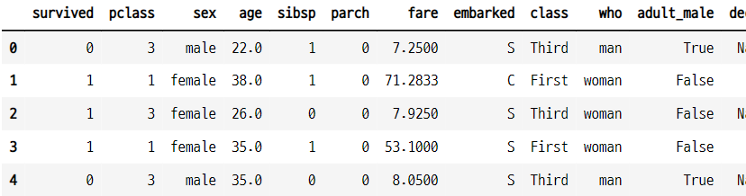

# 데이터프레임의 데이터 조작

## 1. 데이터 갯수 세기
- count 메서드 사용
- NaN 값은 세지 않음

### 1-1. 시리즈 데이터

```python
s = pd.Series(range(10))
s[3] = np.nan
s

>>> print

0    0.0
1    1.0
2    2.0
3    NaN
4    4.0
5    5.0
6    6.0
7    7.0
8    8.0
9    9.0
dtype: float64
```

- count() 메서드를 사용하여 데이터의 갯수를 계산
   - 결측값은 계산하지 않는다.

```python
s.count()

>>> print

9
```

### 1-2. 데이터 프레임
- 열 별로 갯수를 센다.
- **누락된 부분을 찾을 때 유용함**

```python
np.random.seed(2)
df = pd.DataFrame(np.random.randint(5, size=(4, 4)), dtype=float)
df.iloc[2, 3] = np.nan
df
```


- count() 메서드를 사용하면 데이터 프레임의 각 열의 데이터의 갯수를 계산해준다.
```python
df.count()

>>> print

0    4
1    4
2    4
3    3
dtype: int64
```

#### 타이타닉 승객 데이터 임포트

```python
titanic = sns.load_dataset("titanic")
titanic.head()
```


- count() 메서드를 사용하면 타이타닉 데이터의 각 컬럼의 데이터의 갯수를 계산한다.
```python
titanic.count()

>>> print

survived       891
pclass         891
sex            891
age            714
sibsp          891
parch          891
fare           891
embarked       889
class          891
who            891
adult_male     891
deck           203
embark_town    889
alive          891
alone          891
dtype: int64
```

## 2. 카테고리 값 세기
- 시리즈 값이 정수, 문자열, 카데고리 값인 경우
    - value_counts() 메서드로 계산
- 데이터프레임의 카테고리 값은 각 열마다 따로 계산 해야 함

- 시리즈 데이터 생성

```python
np.random.seed(1)
s2 = pd.Series(np.random.randint(6, size=100))
s2.tail()
```

```python
s2.value_counts()

>>> print

1    22
0    18
4    17
5    16
3    14
2    13
dtype: int64
```

## 3. 정렬
- 데이터 정렬
    - sort_index() 메서드 : 인덱스 값 기준 정렬
    - sort_values() 메서드 : 데이터 값 기준 정렬

#### 인덱스 기준으로 정렬

```python
s2.value_counts().sort_index()

>>> print

0    18
1    22
2    13
3    14
4    17
5    16
dtype: int64
```

#### 데이터 기준으로 정렬
- 데이터 값이 큰 순으로 또는 작은 순으로 정렬 가능

```python
s2.value_counts().sort_values()

>>> print

2    13
3    14
5    16
4    17
0    18
1    22
dtype: int64
```

### 3-1. NaN 값이 있으면 맨 마지막에 정렬

```python
s.sort_values()

>>> print

0    0.0
1    1.0
2    2.0
4    4.0
5    5.0
6    6.0
7    7.0
8    8.0
9    9.0
3    NaN
dtype: float64
```

### 3-2. 데이터의 내림차순 정렬
- sort_values(ascending=False) : False 내림차순
   - 내림차순으로 정렬을 한 경우도 NaN 값은 가장 밑에 온다.

```print
s.sort_values(ascending=False)

>>> print

9    9.0
8    8.0
7    7.0
6    6.0
5    5.0
4    4.0
2    2.0
1    1.0
0    0.0
3    NaN
dtype: float64
```

### 3-3. 데이터프레임에서 정렬
- sort_values(by=기준열의 라벨)
- 복수의 열 순서대로 정렬
    - sort_values(by=[2, 1]) : 2번째 열, 1번째 열 순서로 정렬

- 라벨값이 2인 열의 데이터를 기준으로 정렬

```python
df.sort_values(by=2)
```


- 내림차순으로 정렬

```python
df.sort_values(by=2, ascending=False)
```


- 복수의 열을 선택하여 정렬
   - 입력된 열의 순서대로 정렬 해준다.

```python
df.sort_values(by=[2, 1])
```


## 4. 연습문제
- 타이타닉 데이터에서 각 독립변수 별로 갯수 구하기
    - sort_values() 메서드 사용

- 데이터 임포트

```python
titanic = sns.load_dataset("titanic")
titanic.head()
```


### 4-1. 성별 인원수

```python
titanic.sex.value_counts()

>>> print

male      577
female    314
Name: sex, dtype: int64
```

- 성별이 female 인 데이터의 갯수만 조회

```python
titanic[titanic["sex"].sort_values() == "female"]["sex"].count()

>>> print

314
```

- 성별이 male 인 데이터의 갯수만 조회

```python
titanic[titanic["sex"].sort_values() == "male"]["sex"].count()

>>> print

577
```

### 3-2. 나이별 인원수

```python
titanic["age"].value_counts()

>>> print

24.00    30
22.00    27
18.00    26
19.00    25
28.00    25
         ..
36.50     1
55.50     1
0.92      1
23.50     1
74.00     1
Name: age, Length: 88, dtype: int64
```

- 인덱싱 값으로 리스트를 사용하지 않고 열의 라벨값을 직접 사용

```python
titanic.age.value_counts()

>>> print

24.00    30
22.00    27
18.00    26
19.00    25
28.00    25
         ..
36.50     1
55.50     1
0.92      1
23.50     1
74.00     1
Name: age, Length: 88, dtype: int64
```

- 나이가 23.00 인 데이터의 갯수 계산

```python
titanic[titanic["age"] == 23.00]["age"].count()

>>> print

15
```
### 3-3. 선실별 인원수

```python
titanic["class"].value_counts()

>>> print

Third     491
First     216
Second    184
Name: class, dtype: int64
```

- 인덱스를 기준으로 정렬

```python
titanic["class"].value_counts().sort_index()

>>> print

First     216
Second    184
Third     491
Name: class, dtype: int64
```

- 인덱스를 기준으로 내림차순으로 정렬

```python
titanic["class"].value_counts().sort_index(ascending=False)

>>> print

Third     491
Second    184
First     216
Name: class, dtype: int64
```

- second 선실인 데이터의 갯수 계산

```python
titanic[titanic["class"] == "Second"]["class"].count()

>>> print

184
```

### 3-4. 사망/생존자 인원수

```python
titanic.alive.value_counts()

>>> print

no     549
yes    342
Name: alive, dtype: int64
```

- 사망자 데이터 갯수 계산

```python
titanic[titanic["alive"] == "no"]["alive"].count()

>>> print

549
```

- 생존자 데이터 갯수 계산

```python
titanic[titanic["alive"] == "yes"]["alive"].count()

>>> print

342
```

## 4. 행/열 합계
- sum(axis=) 메서드 사용
- axis 는 합계로 인해 없어지는 방향축을 지정한다.
    - 0 : **행** : **열 단위 합계** : **행이 없어진다.**
    - 1 : **열** : **행 단위 합계** : **열이 없어진다.**

#### 데이터 프레임 생성
- np.random.randint(샘플 데이터의 범위값, size=(행, 열))
   - size() 인수를 사용하여 행렬의 모양을 설정할 수 있다.
   - 범위값이 오른쪽 한계값이 된다.

```python
np.random.seed(1)
df2 = pd.DataFrame(np.random.randint(10, size=(4, 8)))
df2
```


### 4-1. 행 방향 합계
- axis=1
    - 열이 없어진다.

```python
df2.sum(axis=1)

>>> print

0    35
1    34
2    41
3    42
dtype: int64
```

- 데이터프레임에 행별 합계 컬럼 생성

```python
df2["RowSum"] = df2.sum(axis=1)
df2
```


### 4-2. 열 방향 합계
- axis=0
    - 행이 없어진다.
    - 디폴트 값이 0 이므로 생략 가능

```python
df2.sum(axis=0)

>>> print

0          24
1          33
2          25
3          24
4          15
5          10
6           5
7          16
RowSum    152
dtype: int64
```

- 데이터프레임에 열별 합계 행 생성

```python
df2.loc["ColTotal", :] = df2.sum(axis=0)
df2
```


### 4-3. 평균
- sum과 방법이 같다.   

- 행별 평균

```python
df2["RowMean"] = df2[[0, 1, 2, 3, 4, 5, 6, 7]].mean(axis=1)
df2
```


- 열별 평균
```python
df2.loc["ColMean"] = df2.mean(axis=0)
df2
```


#### 특정 컬럼이나 행만 선택하여 평균이나 합을 구하는 방법
- loc 인덱서를 이용해서 열과 행을 함께 선택해준다.

```python
df["mean"] = df.loc[:, 0:5].mean(axis=0)
df
```


```python
df.loc["colmean", :] = df.loc[:2, :].mean(axis=1)
df
```


## 5. 연습문제

### 5-1. 타이타닉호 승객의 평균나이를 구하라.

```python
titanic.age.mean(axis=0)

>>> print

29.69911764705882
```

### 5-2. 타이타닉호 승객중 여성 승객의 평균 나이를 구하라.

```python
titanic[titanic.sex == "female"]["age"].mean(axis=0)

>>> print

27.915708812260537
```

### 5-3. 타이타닉호 승객중 1등실 선실의 여성 승객의 평균 나이를 구하라.
- 불리언 시리즈를 조회한 후 이것을 인덱싱 값으로 사용하여 계산한다.

```python
titanic[(titanic["class"] == "First") \
        & (titanic["sex"] == "female")]["age"].mean(axis=0)

>>> print

34.61176470588235
```


