# 데이터프레임 인덱스 조작

## 1. 데이터프레임 인덱스 설정 및 제거
- 데이터에 따라서 데이터 열이 인덱스로, 인덱스가 데이터 열로 된 경우가 있을 수 있다.
- 인덱스와 데이터 열을 교환
    - `set_index` : 기존의 행 인덱스를 제거하고, **데이터 열 중 하나를 인덱스로 설정**
    - `reset_index` : 기존에 행 인덱스를 제거하고, **인덱스를 데이터 열로 추가**

#### 데이터 프레임 생성
- 정규분포를 따르는 데이터 샘플을 3X5 행렬로 만든다.
- ABCDE 데이터로 이루어진 리스트와 np.vstack()으로 연결한다.
   - np.vstack()은 수직으로 이어 붙인다.
- 이 행렬의 전치행렬을 데이터 프레임으로 만든다. 5X3

```python
np.random.seed(0)
df1 = pd.DataFrame(np.vstack([list("ABCDE"), np.round(np.random.rand(3, 5), 2)]).T,
                  columns=["C1", "C2", "C3", "C4"])
df1
```
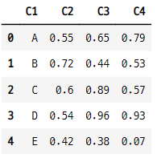

### 1-1. np.random.rand(3, 5)
- 3X5 사이즈의 행렬을 만들어 준다.
    - 숫자의 범위가 아님

```python
np.vstack([list("ABCDE"), np.round(np.random.rand(3, 5), 2)])

>>> print

array([['A', 'B', 'C', 'D', 'E'],
       ['0.09', '0.02', '0.83', '0.78', '0.87'],
       ['0.98', '0.8', '0.46', '0.78', '0.12'],
       ['0.64', '0.14', '0.94', '0.52', '0.41']], dtype='<U32')
```

- 전치행렬

```python
np.vstack([list("ABCDE"), np.round(np.random.rand(3, 5), 2)]).T

>>> print

array([['A', '0.26', '0.62', '0.36'],
       ['B', '0.77', '0.61', '0.44'],
       ['C', '0.46', '0.62', '0.7'],
       ['D', '0.57', '0.94', '0.06'],
       ['E', '0.02', '0.68', '0.67']], dtype='<U32')
```

### 1-2. set_index() 메서드
- 특정한 열을 인덱스로 설정할 수 있다.
- 기존의 인덱스는 사라진다.

```python
df1.set_index("C1")
```
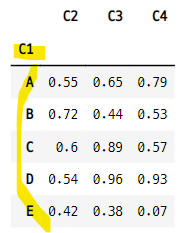

- 다른 열을 인덱스로 설정

```python
df1.set_index("C3")
```
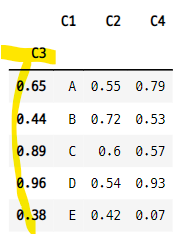

### 1-3. reset_index() 메서드
- 인덱스를 데이터 열로 바꿀 수 있다.
    - 인덱스가 가장 앞의 열로 바뀐다.
    - 정수로 된 디폴트 인덱스로 바뀐다.

```python
df2 = df1.set_index("C1")
df2
```
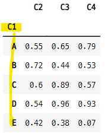


- 데이터 프레임의 현재 인덱스가 가장 처음의 열로 바뀌고, 정수 인덱스가 생긴다.

```python
df2.reset_index()
```
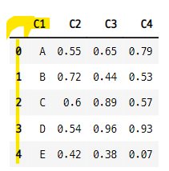


### 1-4. reset_index(drop=True)
- 인수 dorp을 True 설정하면 인덱스 라벨을 데이터프레임에서 아예 삭제한다.
    - 인덱스 라벨을 데이터 열로 바꿔주는 것이 아님.
    - 객체에 저장되는 것은 아님.

- "ABCDE" 값으로 되어 있던 인덱스가 아예 사라지고, 정수 인덱스로 바뀐다.

```python
df2.reset_index(drop=True)
```
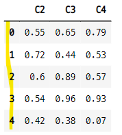


## 2. 연습문제
- 5명 학생의 국어, 영어, 수학 점수를 나타내는 데이터프레임 만들기

### 2-1. 문제1
- 학생 이름 열을 포함시키지 않고 데이터프레임 df_score1을 생성한다.
- df_score1.index 속성에 학생 이름을 나타내는 열을 지정하여 인덱스를 지정한다.
- reset_index 명령으로 이 인덱스 열을 명령으로 일반 데이터 열로 바꾸어 데이터프레임 df_score2를 만든다.

```python
df_score1 = pd.DataFrame(np.random.randint(100, size=(5, 3)),
                        columns=["국어", "영어", "수학"])
df_score1
```
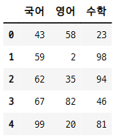

- 학생 이름으로 된 인덱스 생성
   - df.index = []

```python
df_score1.index = ["영희", "길동", "철수", "지연", "종현"]
df_score1
```
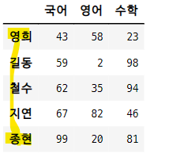

- 인덱스에 "이름"이라는 명칭을 설정해 준다.

```python
df_score1.index.name = "이름"
df_score1.index

>>> print

Index(['영희', '길동', '철수', '지연', '종현'], dtype='object', name='이름')
```

- 인덱스를 열로 바꿔준다.

```python
df_score2 = df_score1.reset_index()
df_score2
```
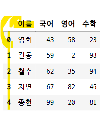

### 2-2. 문제2
- 학생 이름을 나타내는 열을 다시 set_index 명령을 적용하여 인덱스로 변경한다.

```python
df_score2.set_index("이름")
```
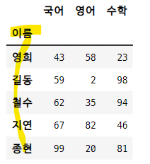

## 3. 다중인덱스
- `다중 인덱스 multi-index` : 여러 계층을 가지는 인덱스
    - 행이나 열에 다중 인덱스를 설정할 수 있다.
    - columns, index 인수에 리스트에 리스트(행렬) 형태로 인덱스를 넣는다.    
        - `columns=[[], []]`
        - `index = [[], []]`
- 이름을 지정할 수 있다.
    - `columns.names = ["인덱스 이름1", "인덱스 이름2"]`
    - `index.names = ["인덱스 이름1", "인덱스 이름2"]`

### 3-1. 열 라벨의 다중 인덱스

```python
np.random.seed(0)
df4 = pd.DataFrame(np.round(np.random.randn(5, 4), 2),
                  columns=[["A", "A", "B", "B"],
                           ["C1", "C2", "C1", "C2"]])
df4
```
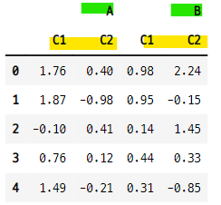

- 열의 그룹마다 이름 설정

```python
df4.columns.names = ["Cidx1", "Cidx2"]
df4
```
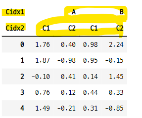

### 3-2. 인덱스 라벨의 다중 인덱스

```python
np.random.seed(1)
df5 = pd.DataFrame(np.round(np.random.randn(6, 4), 2),
                  columns=[["A", "A", "B", "B"],
                           ["C1", "C2", "C1", "C2"]],
                  index=[["M", "M", "M", "F", "F", "F"],
                         ["id_" + str(i + 1) for i in range(3)] * 2])
df5
```
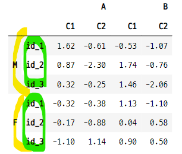

- 각 열과 각 행의 인덱스에 이름 설정

```python
df5.columns.names = ["Cidx1", "Cidx2"]
df5.index.names = ["Ridx1", "Ridx2"]
df5
```
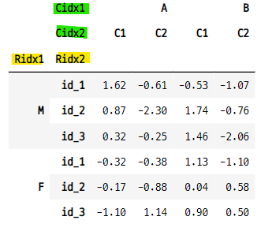

### 3-3. 다중 인덱스 선택하기

#### 인덱스 라벨로 선택
- 행 M 그룹 중에서 id_1 행을 선택

```python
df5.loc["M", "id_1"]

>>> print

Cidx1  Cidx2
A      C1       1.62
       C2      -0.61
B      C1      -0.53
       C2      -1.07
Name: (M, id_1), dtype: float64
```

#### 인덱스 라벨 선택 후 열 라벨 선택
- 행 M 그룹 중에서 id_1 행을 선택한다.
- 그 중에서 A 열의 C1 데이터를 선택한다.

```python
df5.loc["M", "id_1"]["A"]["C1"]

>>> print

1.62
```

- F 행의 id_2 행에서 B 열의 데이터 선택

```python
df5.loc["F", "id_2"]["B"]

>>> print

Cidx2
C1    0.04
C2    0.58
Name: (F, id_2), dtype: float64
```

#### 상위 인덱스 선택 후 슬라이싱
- 상위의 인덱스를 선택한 후 슬라이싱도 가능하다.

```python
df5.loc["M"][1:]
```
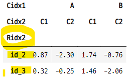

## 4. 행 인덱스와 열 인덱스의 교환
- 열 인덱스를 행 인덱스로 바꾸거나 반대로 행 인덱스를 열 인덱스로 바꿀 수 있다.
    - `stack()` : 열 인덱스 -> 행 인덱스, **열 인덱스가 반시계 방향으로 회전한 효과**
        - 열의 라벨이 아닌 이름 또는 열 이름의 인덱스 번호를 넣는다.
    - `unstack()` : 행 인덱스 -> 열 인덱스, **행 인덱스가 시계 방향으로 회전한 효과**

### 4-1. stack()
- 열의 라벨을 넣는다.

```python
df5.stack("Cidx1")
```
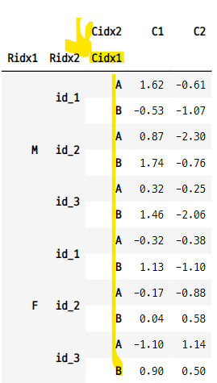

- 다른 열을 행으로 바꾸기

```python
df5.stack("Cidx2")
```
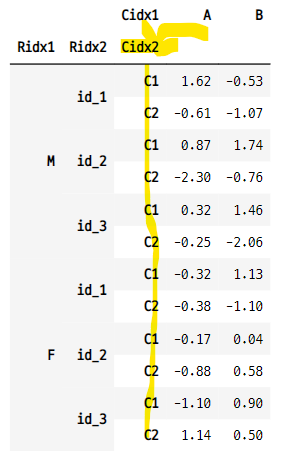

#### 열의 순서 인덱스 값을 넣어도 된다.

```python
df5.stack(0)
```
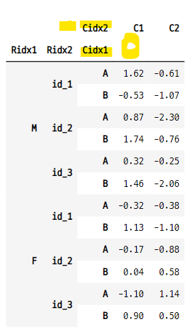

### 4-2. unstack()
- 행 인덱스를 열 인덱스로 바꿔 준다.
- 행 인덱스의 name을 넣어준다.

```python
df5.unstack("Ridx2")
```
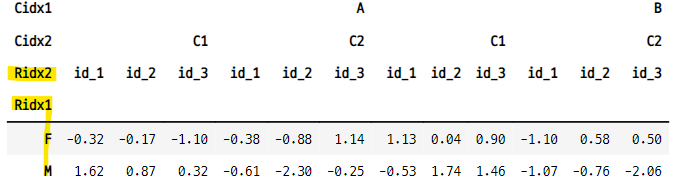

#### 행의 순서 인덱스 값을 넣어도 된다.

```python
df5.unstack(0)
```
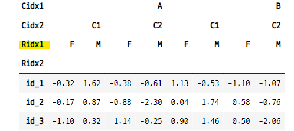

## 5. 다중 인덱스가 있는 경우의 인덱싱
- 인덱스 값이 튜플 () 이어야 한다. 
    - 라벨이나 숫자가 아님
- loc 인덱스를 사용할 때도 튜플 사용    

```python
np.random.seed(1)
df5 = pd.DataFrame(np.round(np.random.randn(6, 4), 2),
                  columns=[["A", "A", "B", "B"],
                           ["c1", "c2", "c1", "c2"]],
                  index=[["M", "M", "M", "F", "F", "F"],
                        ["id_" + str(i+1) for i in range(3)] * 2])
df5.columns.names = ["Cidx1", "Cidx2"]
df5.index.names = ["Ridx1", "Ridx2"]
df5
```
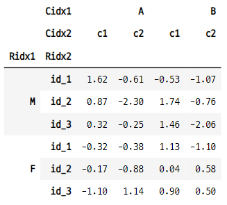

### 5-1. 리스트 안에 튜플 사용
- 기본 선택 방법

```python
df5[("A", "c1")]

>>> print

Ridx1  Ridx2
M      id_1     1.62
       id_2     0.87
       id_3     0.32
F      id_1    -0.32
       id_2    -0.17
       id_3    -1.10
Name: (A, c1), dtype: float64
```

### 5-2. loc 인덱서 사용
- loc[인덱스 라벨, ("열1", "열2")]
    - 인덱스 라벨은 정수, 문자열 사용 가능
    - 열은 문자열 라벨만 사용 가능

```python
df5.loc["M", ("B", "c1")]

>>> print

Ridx2
id_1   -0.53
id_2    1.74
id_3    1.46
Name: (B, c1), dtype: float64
```

- 하나의 값만 선택

```python
df5.loc[("M", "id_1"), ("A", "c1")]

>>> print

1.62
```

#### 다중 인덱스 데이터 프레임에서 값 갱신하기

```python
df5.loc[("M", "id_1"), ("A", "c1")] = 100
df5
```
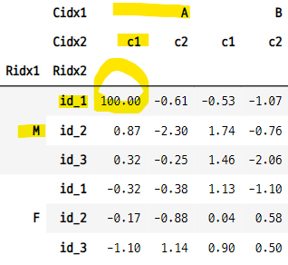

### 5-3. iloc 인덱서 사용
- 원래 방식데로 정수를 사용하여 선택
- 튜플 형태의 다중인덱스를 사용할 수 없다.
    - iloc[0, 1] : 0은 하위 인덱스의 넘버, 1은 열의 넘버    

- 라벨값을 튜플에 담아서 사용할 수 없다.

```python
df5.iloc[0, ("A", "c1")]

>>> print

IndexingError: Too many indexers
```

#### 하위 인덱스 넘버
- 0 : id_1
- 1 : id_2
- 2 : id_3

- 0 인덱스 값을 선택하면 M의 id_1 행이 선택된다.

```python
df5.iloc[0]

>>> print

Cidx1  Cidx2
A      c1       100.00
       c2        -0.61
B      c1        -0.53
       c2        -1.07
Name: (M, id_1), dtype: float64
```

#### 행과 열 선택
- 가장 첫번 째 행 id_1의 1번째 값 선택

```python
df5.iloc[0, 1]

>>> print

-0.61
```

### 5-4. 라벨 하나만 사용
- **라벨을 하나만 사용하면 상위 레벨의 열 라벨을 선택하는 것과 같다.**
- loc 인덱서를 사용하여 하나의 라벨만 설정하면 상위 레벨 인덱스를 선택하는 것과 같다.

```python
df5["A"]
```
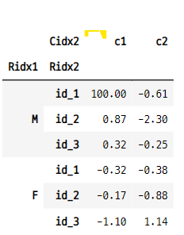

#### 같은 방식으로 행의 라벨값을 선택하는 것은 안된다.
- 라벨 값을 하나만 선택하는 것은 열에만 해당한다.

```python
df5["M"]

>>> print

KeyError: 'M'
```
#### 행의 라벨값을 사용하려면 loc 인덱서를 사용해야 한다.

```python
df5.loc["M"]
```
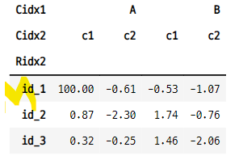


### 5-5. 기타 인덱싱 방법
- 슬라이싱 기호를 사용한 인덱싱

```python
df5.loc[:, "A"]
```
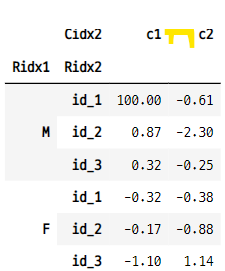

- 모든 행과 A-C1 열 선택

```python
df5.loc[:, ("A", "c1")]

>>> print

Ridx1  Ridx2
M      id_1     100.00
       id_2       0.87
       id_3       0.32
F      id_1      -0.32
       id_2      -0.17
       id_3      -1.10
Name: (A, c1), dtype: float64
```
- M-id_2와 모든 열 선택

```python
df5.loc[("M", "id_2"), :]

>>> print

Cidx1  Cidx2
A      c1       0.87
       c2      -2.30
B      c1       1.74
       c2      -0.76
Name: (M, id_2), dtype: float64
```
### 5-6. 새로운 행 추가
- loc 인덱서를 사용하여 새로 추가할 행의 라벨을 지정해준 후 값을 입력해준다.
- sum() 함수는 기본적으로 열 단위 합을 계산해준다.

```python
df5.loc[("All", "All"), :] = df5.sum()
df5
```
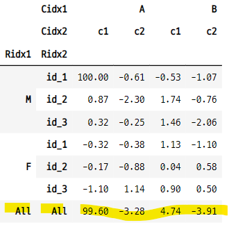

### 5-7. 슬라이싱
- `slice(None)` 값을 사용한다.
    - 다중 인덱스 튜플에서는 ":" 슬라이스 기호 사용 안된다.
    - 튜플을 사용하려면 slice(None) 기호를 사용해 주어야 한다.

- M 행의 모든 행 선택
   - ("M", slice(None)
   )
```python
df5.loc[("M", slice(None)), :]
```
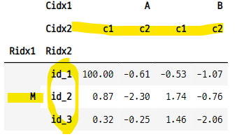

- M 행에서 A 열의 모든 열 선택
   - ("A", slice(None)

```python
df5.loc["M", ("A", slice(None))]
```
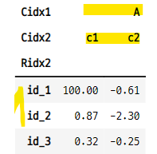


#### M과 F에서 "id_2"를 선택
- M, F 선택을 slice(None)으로 선택

```python
df5.loc[(slice(None), "id_2"), :]
```
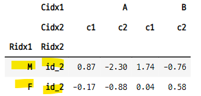


## 6. 다중 인덱스 순서교환
- `swaplevel(i, j, axis)` : 다중인덱스의 인덱스 순서를 바꿔준다.
    - i, j : 교환하려는 인덱스 라벨이나 인덱스 번호
    - axis : 0이면 행 인덱스에서 교환, 1이면 열 인덱스에서 교환
    - 행과 열의 라벨을 교환하는 것이 아님

#### axis의 디폴트 값 = 0 = 행
- swaplevel("", "", axis=0) : 행의 다중 인덱스 순서를 교환하겠다는 의미
   - 행의 라벨 또는 정수 입력 가능

```python
df6 = df5.swaplevel("Ridx1", "Ridx2") ### df5.swaplevel(0, 1)
df6
```
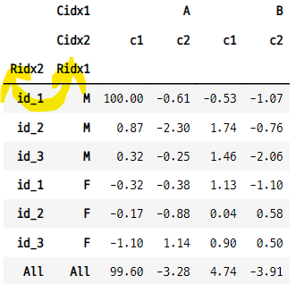

#### 열 라벨의 순서 교환
- axis=1 로 설정 해 주어야 한다.
   - 열의 라벨 또는 정수 입력 가능

```python
df5.swaplevel("Cidx1", "Cidx2", axis=1) ### df5.swaplevel(0, 1, axis=1)
```
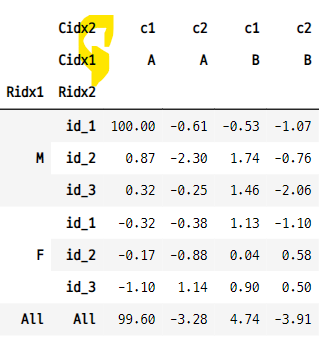

## 7. 정렬
- `sort_index(level=0)` : 정렬할 기준 인덱스를 설정 해준다.
- `sort_index(axis=1, level=1)` : axis=1 을 추가해주면 열 라벨에서 정렬하겠다는 의미.
    - 열 라벨에서 1번 열을 정렬하겠다.

### 7-1. 인덱스 라벨 정렬
- level=0 은 가장 상위의 행 인덱스

```python
df5.sort_index(level=0)
```
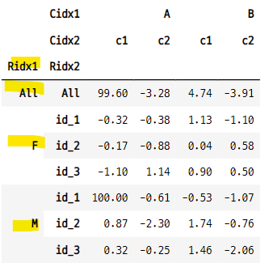

- level=1 은 다음 행 인덱스

```python
df5.sort_index(level=1)
```
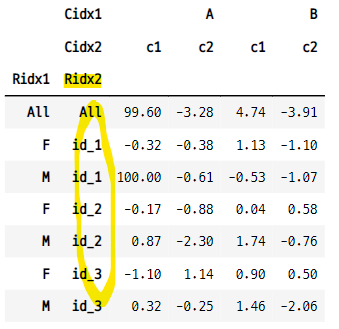

### 7-2. 열 라벨 정렬
- axis=1 을 설정 해주어야 열 인덱스를 정렬 하겠다는 것과 같다.
   - 상위 0, 하위 1

```python
df6.sort_index(axis=1, level=1)
```
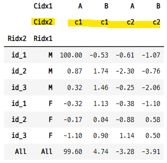

## 8. 연습문제
- A반 5명, B반 5명의 국어, 영어, 수학 점수를 나타내는 데이터 프레임을 만든다.

### 8-1. 문제1
- 반, 번호, 국어, 영어, 수학을 열로 가지는 데이터 프레임 df_score3을 만든다.

- 반 데이터 생성

```python
c = ["A" for _ in range(5)] + ["B" for _ in range(5)]
c

>>> print

['A', 'A', 'A', 'A', 'A', 'B', 'B', 'B', 'B', 'B']
```

- 학생 번호 데이터 생성

```python
s_id = ["s_id_" + str(i+1) for i in range(5)] * 2
s_id
```

- 시험 점수 데이터 생성

```python
score = np.random.randint(100, size=(10, 3))
score

>>> print

array([[ 0, 86, 16],
       [19,  9, 92],
       [51, 10, 68],
       [23, 14, 63],
       [21, 46,  3],
       [56, 88, 80],
       [46, 54, 79],
       [71, 14, 77],
       [15, 25, 53],
       [84, 58, 85]])
```

#### 데이터 프레임으로 만들기

```python
c_num = ["A" for _ in range(5)] + ["B" for _ in range(5)]
s_id = ["s_id_" + str(i+1) for i in range(5)] * 2
df1 = pd.DataFrame(np.vstack([c_num, s_id]).T, columns=["반", "번호"])
df2 = pd.DataFrame(np.random.randint(100, size=(10, 3)), columns=["국", "영", "수"])
df_score3 = pd.concat([df1, df2], axis=1)
df_score3
```
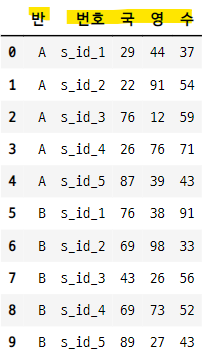

### 8-2. 문제2
- df_score3 을 변형하여 1차 행 인덱스로 반을 2차 행 인덱스로 번호를 가지는 데이터프레임 df_score4를 만든다.

```python
df_score4 = df_score3.set_index(["반","번호"])
df_score4
```
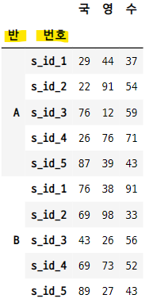

### 8-3. 문제3
- 데이터프레임 df_score4에 각 학생의 평균을 나타내는 행을 오른쪽에 추가한다.

```python
df_score4["평균"] = round(df_score4.mean(axis=1),2)
df_score4
```
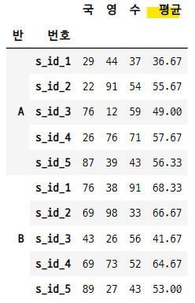

### 8-4. 문제4
- df_score3을 변형하여 행 인덱스로 번호를 1차 열 인덱스로 국, 영, 수를, 2차 열 인덱스로 반을 가지는 데이터 프레임 df_score5를 만든다.
- **열의 차원을 나누는 방법**
    - 나누고자 하는 열의 라벨 하나를 인덱스로 이동시킨다.
    - 인덱스로 이동한 라벨을 unstack()으로 다시 열로 이동시켜준다.
    - 상위, 하위 레벨의 열로 구분이 된다.

```python
df_score5 = df_score3.set_index(["번호", "반"]).unstack("반")
df_score5.columns.names = ["과목", "반"]
df_score5
```
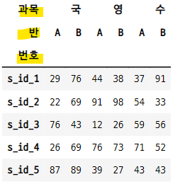

### 8-5. 문제5
- df_score5에 각 반별 각 과목의 평균을 나타내는 행을 아래에 추가한다.

```python
df_score5.loc[("평균"), :] = df_score5.mean(axis=0)
df_score5
```
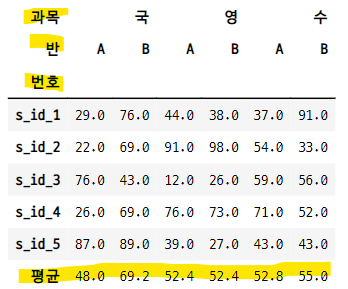


