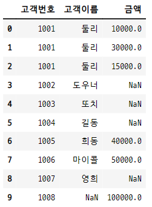
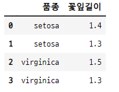
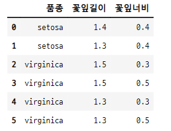

# 데이터프레임 합성
- 병합 merge
- 연결 concatenate

## 1. 데이터프레임 병합
- `pd.merge(df1, df2, how="방식")` 함수 사용
    - 두 데이터프레임의 공통 열 또는 인덱스를 기준으로 합친다.
    - 기준이 되는 열이나 행의 데이터를 키(key)라고 한다.
- **inner join 방식**
    - 양쪽 데이터프레임에 키가 존재하는 데이터만 보여준다.
- **outer join 방식**
    - 키 값이 한 쪽에만 있어도 데이터를 보여준다.
- **left 방식**
    - 왼쪽의 데이터프레임의 키 값을 모두 보여준다.
    - 인수로 입력 된 데이터프레임의 순서대로
- **right 방식**
    - 오른쪽 데이터프레임의 키 값을 모두 보여준다.
    - 인수로 입력 된 데이터프레임의 순서대로

#### 데이터프레임 생성

```python
df1 = pd.DataFrame({
    "고객번호" : [1001, 1002, 1003, 1004, 1005, 1006, 1007],
    "고객이름" : ["둘리", "도우너", "또치", "길동", "희동", "마이콜", "영희"]
}, columns=["고객번호", "고객이름"])

df1
```


```python
df2 = pd.DataFrame({
    "고객번호" : [1001, 1001, 1005, 1006, 1008, 1001],
    "금액" : [10000, 30000, 40000, 50000, 100000, 15000]
}, columns=["고객번호", "금액"])

df2
```


### 1-1. inner join 병합
- 키 값이 양쪽에 있는 데이터만 보여준다.
   - df1, df2의 키 값은 "고객번호" 열 라벨이다.

```python
pd.merge(df1, df2)
```


- df1과 df2의 value 확인하면 겹치는 값이 어떤 것인지 알 수 있다.

```python
df1["고객번호"].values, df2["고객번호"].values

>>> print

(array([1001, 1002, 1003, 1004, 1005, 1006, 1007], dtype=int64),
 array([1001, 1001, 1005, 1006, 1008, 1001], dtype=int64))
```

### 1-2. outer join 병합
- 키 값이 한쪽에만 있어도 데이터를 보여준다.
   - 키 값 "고객번호"를 기준으로 df1과 df2의 모든 값이 조회된다.
   - inner join은 키 값 중에서 공통인 값만 조회 됨.

```python
pd.merge(df1, df2, how="outer")
```


### 1-3. left, right 방식
- 왼쪽 또는 오른쪽 데이터프레임의 키 값을 모두 보여준다.
- 키 값에 해당하는 상대 데이터프레임의 값이 여러개이면 여러개가 나온다.

#### df1의 키 값을 다 보여준다.
- how="left"
   - 인수 입력 순서상 df1이 left에 해당한다.

```python
pd.merge(df1, df2, how="left")
```


#### df2의 키 값을 다 보여준다.
- how="right"
   - 인수 입력 순서상 df2가 right에 해당한다.

```python
pd.merge(df1, df2, how="right")
```


#### 데이터의 순서를 바꾼 경우
- how="left" 가 df2가 된다.
   - pd.merge(df1, df2, hos="right")와 같다.

```python
pd.merge(df2, df1, how="left")
```


### 1-4. 중복 키 값이 여러개 있는 경우
- 모든 경우의 수를 따져서 조합을 만든다.

#### 데이터프레임 만들기

```python
df1 = pd.DataFrame({
    "품종" : ["setosa", "setosa", "virginica", "virginica"],
    "꽃잎길이" : [1.4, 1.3, 1.5, 1.3]},
    columns=["품종", "꽃잎길이"])

df1
```


```python
df2 = pd.DataFrame({
    "품종" : ["setosa", "virginica", "virginica", "versicolor"],
    "꽃잎너비" : [0.4, 0.3, 0.5, 0.3]},
    columns=["품종", "꽃잎너비"])

df2
```


#### inner join 이므로 겹치는 키 값이 없는 데이터는 안 보인다.
- versicolor 는 겹치지 않으므로 안 보인다.
- 모든 경우의 수에 대해 조합을 만든다.

- inner join

```python
pd.merge(df1, df2)
```


- outer join
   - versicolor 도 조회된다.

```python
pd.merge(df1, df2, how="outer")
```


### 1-5. 기준 키 설정
- `on=열이름`
    - 병합을 하면 두 데이터프레임에서 열 이름이 같은 것은 모두 키가 된다. 
    - 키로 사용할 열이름을 on의 인수로 설정해준다.
    - 열 이름이 같지만 데이터의 의미가 다른 경우 이 열은 기준열에서 제외시킨다.

#### 데이터프레임 생성

```python
df1 = pd.DataFrame({
    "고객명" : ["춘향", "춘향", "몽룡"],
    "날짜" : ["2022-09-27", "2022-08-05", "2022-06-01"],
    "데이터" : ["2000", "4000", "5000"]})

df1
```


```python
df2 = pd.DataFrame({
    "고객명" : ["춘향", "몽룡"],
    "데이터" : ["여자", "남자"]})

df2
```


#### 데이터의 열이름이 같지만 데이터의 내용이 다르다.
- 키 값이 "고객명"과 "데이터" 이지만, "데이터"의 데이터 내용이 다르므로 조회되지 않는다.

```python
pd.merge(df1, df2)
```


#### 키 값으로 "고객명"만 설정
- on="고객명"
   - "데이터" 컬럼은 중복되는 데이터가 없으므로 키 값에서 제외시킨다.

```python
pd.merge(df1, df2, on="고객명")
```


### 1-6. 기준 키 설정 2
- `left_on=열이름, right_on=열이름`
    - 기준이 되는 열의 이름이 다른 경우
    - 양쪽 데이터 프레임에서 해당 열이름을 기준열로 설정 해 준다.

#### 데이터프레임 생성

```python
df1 = pd.DataFrame({
    "이름" : ["영희", "철수", "철수"],
    "성적" : [1, 2, 3]})

df1
```


```python
df2 = pd.DataFrame({
    "성명" : ["영희", "영희", "철수"],
    "성적2" : [4, 5, 6]
})

df2
```


#### df1과 df2에서 이름에 해당하는 열의 이름이 다르다.
- df1에서는 "이름", df2에서는 "성명" 이다.
   - left_on과 right_on을 설정하여 키 값의 이름이 다르지만 키 값으로 사용할 수 있다.

```python
pd.merge(df1, df2, left_on="이름", right_on="성명")
```


### 1-7. 기준을 인덱스로 설정하는 경우
- `left_index=True/False, right_index=True/False`
    - 병합의 기준을 데이터의 열이 아닌 인덱스로 하는 경우
    - True로 설정 해준다.

#### 데이터프레임 생성

```python
df1 = pd.DataFrame({
    "도시" : ["서울", "서울", "서울", "부산", "부산"],
    "연도" : [2000, 2005, 2010, 2000, 2004],
    "인구" : [9853972, 9762546, 9631482, 3655437, 3512547]
})

df1
```


- 다중 인덱스를 가진 데이터프레임 생성

```python
df2 = pd.DataFrame(np.arange(12).reshape((6, 2)),
                  index=[["부산", "부산", "서울", "서울", "서울", "서울"],
                         [2000, 2005, 2000, 2005, 2010, 2015]],
                  columns=["데이터1", "데이터2"])

df2
```


#### 열과 인덱스를 기준으로 설정
- 왼쪽 데이터프레임에서는 도시와 연도 열을 기준으로하고,
- 오른쪽 데이터프레임에서는 인덱스를 기준으로 한다.
    - 다중 인덱스에 도시와 연도가 들어 있다.

```python
pd.merge(df1, df2, left_on=["도시", "연도"], right_index=True)
```


#### 다른 예시
- 행 인덱스에 알파벳 라벨값을 갖는 두 데이터프레임 생성
   - 인덱스 merge 를 실행해 본다.

```python
df1 = pd.DataFrame([[1, 2], [3, 4], [5, 6]],
                  index=["a", "c", "e"],
                  columns=["서울", "부산"])
df1
```


```python
df2 = pd.DataFrame([[7, 8], [9, 10], [11, 12], [13, 14]],
                  index=["b", "c", "d", "e"],
                  columns=["대구", "광주"])
df2
```


- merge

```python
pd.merge(df1, df2, how="outer", left_index=True, right_index=True)
```


### 1-8. join 메서드
- merge 명령어 대신 join 메서드를 사용하여 병합 할 수도 있다.

```python
df1.join(df2, how="outer")
```


## 2. 연습문제
- merge를 사용하여 두 데이터 프레임을 합하기
- 데이터프레임은 5X5 이상의 크기를 갖는다.
- 공통열을 하나 이상 갖는다. 공통열의 이름은 서로 다르다.

#### 데이터프레임 생성

```python
df1 = pd.DataFrame({
    "가입고객" : ["kim", "june", "hong", "hong", "park", "june"],
    "가입날짜" : ["s_2002", "s_2002", "s_2001", "s_2003", "s_2003", "s_2001"],
    "가입비" : ["1000", "1000", "1000", "1500", "2000", "1500"]},
columns=["가입고객", "가입날짜", "가입비"])

df1
```


```python
df2 = pd.DataFrame({
    "성함" : ["lee", "kim", "lee", "hong", "kang", "june"],
    "결제금액" : ["10000", "15000", "25000", "30000", "35000", "100000"],
    "등록일" : ["s_2002", "s_2001", "s_2003", "s_2005", "s_2003", "s_2005"]},
columns=["성함", "결제금액", "등록일"])

df2
```


#### 가입고객과 성함을 키 값으로 설정한다.

```python
pd.merge(df1, df2, left_on="가입고객", right_on="성함", how="left")
```


#### 정렬하고 인덱스 초기화
- reset_index() 명령에서 drop=True 를 하지 않으면, 현재 인덱스가 데이터의 열로 이동한다.
    - 열 이름은 "index" 가 된다.
    - 인덱스는 정수로 갱신된다.

- 가입날짜와 등록일을 키 값으로 설정하고, 등록일을 기준으로 정렬시킨다.
- reset_index(drop=True)로 원래 인덱스를 삭제하고 새로운 정수 인덱스로 바꾼다.

```python
pd.merge(df1, df2, left_on="가입날짜", right_on="등록일", how="outer")\
.sort_values("등록일").reset_index(drop=True)
```


## 3. 연결 concatenate
- `pd.concat([데이터1, 데이터2], axis=0)` : 기준 열(key column)을 사용하지 않고 단순히 시리즈나 데이터프레임을 연결한다.
    - **리스트에 두 데이터 객체를 넣어준다.**
    - 위아래 연결 : axis=0, 디폴트
    - 옆으로 연결 : axis=1
- 기본적으로 두 시리즈나 데이터프레임을 위, 아래로 연결한다.
    - 인덱스 값이 중복 될 수 있다.
    - 위에 0, 1, 2, 3 아래에 0, 1, 2, 3 이런식으로 중복 될 수 있다.

### 3-1. 위 아래로 연결

```python
s1 = pd.Series([0, 1], index=["A", "B"])
s2=  pd.Series([2, 3, 4], index=["A", "B", "C"])

s1

>>> print

A    0
B    1
dtype: int64

s2

>>> print

A    2
B    3
C    4
dtype: int64
```
#### concat()은 리스트에 객체를 넣어 주어야 한다.

```python
pd.concat([s1, s2])

>>> print

A    0
B    1
A    2
B    3
C    4
dtype: int64
```

### 3-1. 옆으로 연결
- pd.concat([df1, df2], axis=1)

#### 데이터프레임 생성

```python
df1 = pd.DataFrame(np.arange(6).reshape((3, 2)),
                  index=["a", "b", "c"],
                  columns=["data1", "data2"])
df1
```


```python
df2 = pd.DataFrame(5 + np.arange(4).reshape((2, 2)),
                  index=["a", "c"],
                  columns=["data3", "data4"])
df2
```


#### 옆으로 연결
- 인덱스 기준으로 연결 된다.
    - 중복되는 인덱스가 없으면 결측 처리 된다.
    - df1의 인덱스 라벨 : a, b, c
    - df2의 인덱스 라벨 : a, c

```python
pd.concat([df1, df2], axis=1)
```


## 4. 연습문제
- 1월-6월 실적, 7월-12월 실적 데이터 프레임 만들고 합치기
- 매출, 비용, 이익으로 열을 만든다.
    - 이익 = 매출 - 비용
- 1년간 총 실적을 마지막 행에 붙인다.    

### 4-1. 상반기 매출, 비용 데이터 프레임 만들기
- 상반기 매출 데이터 

```python
np.random.seed(1)
q1_sales = np.random.randint(50, 100, size=(6, 1)) * 1000
q1_sales

>>> print

array([[87000],
       [93000],
       [62000],
       [58000],
       [59000],
       [61000]])
```

- 상반기 비용 데이터

```python
q1_cost = q1_sales * 0.37
q1_cost

>>> print

array([[32190.],
       [34410.],
       [22940.],
       [21460.],
       [21830.],
       [22570.]])
```
- 상반기 매출과 비용 데이터를 데이터프레임으로 만들기

```python
df_q1 = pd.DataFrame(np.hstack([q1_sales, q1_cost]), columns=["sales", "cost"]).astype(int)
df_q1
```


### 4-2. 하반기 매출, 비용 데이터 만들기

```python
np.random.seed(2)
q2_sales = np.random.randint(50, 100, size=(6, 1)) * 1000
q2_cost = q1_sales * 0.36
df_q2 = pd.DataFrame(np.hstack([q2_sales, q2_cost]), columns=["sales", "cost"]).astype(int)

df_q2
```


### 4-3. 상, 하반기 이익 컬럼 만들기

```python
df_q1["profit"] = df_q1["sales"] - df_q1["cost"]
df_q1
```


```python
df_q2["profit"] = df_q2["sales"] - df_q2["cost"]
df_q2
```


### 4-4. 상, 하반기 데이터 연결
- reset_index(drop=True) : 인덱스 갱신 : 0~11
- index 를 1~12로 변경

#### 월 인덱스 만들기

```python
[str(month) + "월" for month in np.arange(1, 13)]

>>> print

['1월', '2월', '3월', '4월', '5월', '6월', '7월', '8월', '9월', '10월', '11월', '12월']
```

#### 데이터프레임 연결
- pd.concat([, ])으로 세로 연결한다.
- 만들어진 데이터 프레임의 인덱스 라벨 값을 월로 바꿔준다.

```python
df_year = pd.concat([df_q1, df_q2]).reset_index(drop=True)
df_year.index = [str(month) + "월" for month in np.arange(1, 13)]
df_year
```


### 4-5. 총 합계 행 만들기

```python
df_year.loc["year_sum", :] = df_year.sum(axis=0)
df_year.astype(int)
```


### 4-6. 분기별 합계 행 추가
- reset_index() : 정수 라벨의 인덱스 만들기
   - drop=True 를 설정하지 않으면 원래 있던 인덱스가 열로 바뀐다.
- 새로 추가할 분기별 합계의 정수 라벨 확인 : 5.5, 12.5
- 각각 데이터 입력 후 기간별 합계 계산
   - half_sum_1 : 1월~6월
   - half_sum_2 : 7월~12월
- 데이터 생성후 재 정렬
- set_index("") : 월 인덱스로 변경

```python
## 정수 라벨 인덱스
df_year = df_year.reset_index()

## 실수형 라벨로 변경
df_year.index = df_year.index.astype(float)

## 상반기,하반기 합계 행 만들기
df_year.loc[5.5] = ["half_sum_1", 1, 1, 1]
df_year.loc[11.5] = ["half_sum_2", 1, 1, 1]

## 실수 순서데로 정렬
df_year_2 = df_year.sort_index()

## 원래 인덱스로 변경
df_year_2 = df_year_2.set_index("index")

## 상반기, 하반기 기간별 합계 계산
df_year_2.loc["half_sum_1"] = df_year_2.loc["1월":"6월"].sum()
df_year_2.loc["half_sum_2"] = df_year_2.loc["7월":"12월"].sum()

df_year_2
```


