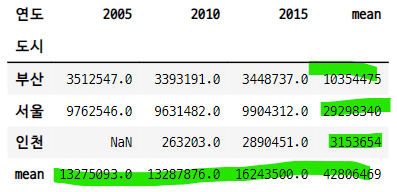
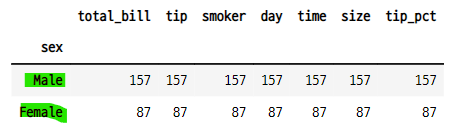
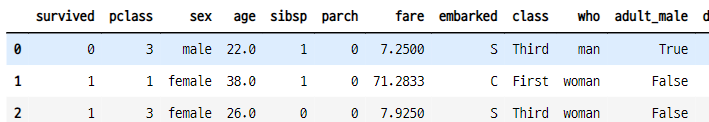

# 피봇테이블과 그룹분석

## 1. 피봇 pivot
- `피봇테이블 pivot table` : 데이터 열 중에서 두개의 열을 각각 행 인덱스, 열 인덱스로 사용하여 데이터를 조회하여 펼쳐 놓은 것
- `df.pivot("열이름1", "열이름2", "열이름3")` 매서드
    - 열이름1 : 행 인덱스
    - 열이름2 : 열 인덱스
    - 열이름3 : 데이터로 사용할 열
- 변형된 행 인덱스와 열 인덱스에 해당하는 데이터가 없으면 "NaN" 처리 된다.
- **pivot()과 pivot_table()은 다르다.**

#### 데이터프레임 만들기

```python
data = {
    "도시" : ["서울", "서울", "서울", "부산", "부산", "부산", "인천", "인천"],
    "연도" : ["2015", "2010", "2005", "2015", "2010", "2005", "2015", "2010"],
    "인구" : [9904312, 9631482, 9762546, 3448737, 3393191, 3512547, 2890451, 263203],
    "지역" : ["수도권", "수도권", "수도권", "경상권", "경상권", "경상권", "수도권", "수도권"]
}

columns = ["도시", "연도", "인구", "지역"]
df1 = pd.DataFrame(data, columns=columns)
df1
```


### 1-1. 피봇 만들기
- 도시 이름이 열 인덱스, 연도가 행 인덱스, 데이터는 인구 열 인덱스
    - 어떤 도시의 어떤 연도의 인구 수를 알 수 있다.

```python
df1.pivot("연도", "도시", "인구")
```


### 1-2. set_index + unstack 명령으로 피봇 만들기

```python
df1.set_index(["도시", "연도"])[["인구"]]
```


- unstack() 명령어를 사용하면 행 인덱스가 열 인덱스로 바뀐다.

```python
df1.set_index(["도시", "연도"])[["인구"]].unstack()
```


- 도시 행 인덱스를 열 인덱스로 unstack()

```python
df1.set_index(["도시", "연도"])[["인구"]].unstack("도시")
```


### 1-3. 다중 인덱스 피봇 테이블
- 열이나 행 인덱스를 리스트로 설정하면 다중 인덱스를 가진 피봇이 된다.

```python
df1.pivot(["지역", "도시"], "연도", "인구")
```


### 1-4. 조회 된 값이 2개 이상이면 에러 발생
- 지역(행)과 연도(열)로 pivot 테이블을 만들면 수도권/2015, 수도권/2010의 값이 2개 이상이므로 에러가 발생한다.

```python
try :
    df1.pivot("지역", "연도", "인구")
except ValueError as e :
    print("ValueError : ", e)

>>> print

ValueError :  Index contains duplicate entries, cannot reshape
```

## 2. 그룹분석
- `그룹분석 group analysis` : 키에 의해서 결정되는 데이터가 여러개 있을 경우 미리 지정한 연산을 통해서 그 그룹 데이터의 대표값을 계산한다.
    - pivot 은 행과 열의 키로 구한 값이 두개 이상이면 에러가 난다.
- 방법
    - **groupby 메서드** 사용
    - 시리즈나 데이터프레임에 groupby 메서드를 호출한다.
    - 그룹 객체에 대해 그룹연산 수행

### 2-1. gorupby 메서드
- `gorupby 메서드` : 데이터를 그룹별로 분류한다.
- 인수
    - 열 또는 열의 리스트
    - 행 인덱스
- 결과
    - GroupBy 클래스 객체 반환
    - 이 객체에 그룹 연산 메서드가 있다.

### 2-2. GroupBy 메서드
- gorupby의 결과인 GroupBy 객체 뒤에 붙일 수 있는 그룹연산 메서드
    - **size, count** : 그룹 데이터의 갯수
    - **mean, median, min, max** : 그룹데이터의 평균, 중앙값, 최소값, 최대값
    - **sum, prod, std, var, quantile** : 합계, 곱, 표준편차, 분산, 사분위수
    - **first, last** : 그룹데이터 중 첫번째 데이터와 나중 데이터
    - **agg, aggregate** : 원하는 연산이 없는 경우, 함수를 만들고 agg에 함수를 전달한다. 여러가지 그룹연산을 동시에 하고 싶은 경우 함수 이름 문자열의 리스트를 전달한다.
    - **describe** : 여러개의 값을 데이터프레임으로 구한다.
    - **apply** : describe 처럼 하나의 대표값이 아닌 데이터프레임을 출력한다. 원하는 그룹 연산이 없는 경우에 사용한다.
    - **transform** : 그룹에 대한 대표값을 만드는 것이 아니라 그룹별 계산을 통해 데이터 자체를 변형한다.

### 2-3. groupby 분석

```python
np.random.seed(0)
df2 = pd.DataFrame({
    "key1" : ["A", "A", "B", "B", "A"],
    "key2" : ["one", "two", "one", "two", "one"],
    "data1" : [1, 2, 3, 4, 5],
    "data2" : [10, 20, 30, 40, 50]
})

df2
```


#### GroupBy 객체 반환
- df2의 key1을 키 값으로 설정

```python
groups = df2.groupby(df2.key1)
groups

>>> print

<pandas.core.groupby.generic.DataFrameGroupBy object at 0x00000159C384A988>
```

### 2-4. GroupBy 객체의 groups 속성
- 각 그룹 데이터의 인덱스 값

```python
groups.groups

>>> print

{'A': [0, 1, 4], 'B': [2, 3]}
```

### 2-5. 그룹연산
- size, count
- mean, median, min, max
- sum, prod, std, var, quantile
- first, last

#### size

```python
groups.size()

>>> print

key1
A    3
B    2
dtype: int64
```

#### count

```python
groups.count()
```


#### mean

```python
groups.mean()
```


#### median

```python
groups.median()
```


#### min

```python
groups.min()
```


#### max

```python
groups.max()
```
![07_pandas_12.png]

#### sum

```python
groups.sum()
```


### prod

```python
groups.prod()
```


#### std

```python
groups.std()
```


#### var

```python
groups.var()
```


#### quantile

```python
groups.quantile()
```


#### first
- 그룹화 했을 때 각 열의 첫 번째 데이터

```python
groups.first()
```


#### last
- 그룹화 했을 때 각 열의 마지막 데이터

```python
groups.last()
```


### 2-6. GroupBy 객체 안 받고 groupby + 그룹연산
- df2.key1으로 그룹화하고 data1을 합 계산

```python
df2.data1.groupby(df2.key1).sum()

>>> print

key1
A    8
B    7
Name: data1, dtype: int64
```
- df2.key1으로 그룹화하고 data2를 합 계산

```python
df2.data2.groupby(df2.key1).sum()

>>> print

key1
A    80
B    70
Name: data2, dtype: int64
```

```python
df2[["data1", "data2"]].groupby(df2.key1).sum()
```


- df2.key1으로 그룹화하고 data1, data2 열의 평균 계산

```python
df2[["data1", "data2"]].groupby(df2.key1).mean()
```


### 2-7. GroupBy 객체 또는 그룹분석한 결과에서 data1만 뽑아도 된다.
- 그룹화를 먼저하고 계산할 열을 선택

```python
df2.groupby(df2.key1)["data1"].sum()

>>> print

key1
A    8
B    7
Name: data1, dtype: int64
```

```python
df2.groupby(df2.key1)[["data1", "data2"]].mean()
```


- 그룹연산 함수 뒤에 계산할 열을 입력해도 된다.

```python
df2.groupby(df2.key1).sum()["data1"]

>>> print

key1
A    8
B    7
Name: data1, dtype: int64
```

### 2-8. 연습문제
- key1의 값을 기준으로 data1의 값을 분류한다.
- 합계를 구하고 결과를 시리즈가 아닌 데이터 프레임으로 구한다.

```python
df2.groupby(df2.key1)[["data1"]].sum()
```


```python
df2[["data1"]].groupby(df2.key1).sum()
```


```python
df2.groupby(df2.key1).sum()[["data1"]]
```


### 2-9. 복합키 사용
- 행 인덱스를 두 개 적용
- df2.set_index([df2.key1, df2.key2])[["data1", "data2]]
    - set_index를 적용하여 다중 행 인덱스로 만들면 중복되는 값이 있어도 만들어 지긴 한다. 
    - 그룹별로 뭉쳐지지는 않는다.
    - 단순히 행 인덱스와 열 인덱스의 변형과 같다.
    - pivot 메서드를 사용하면 중복 값이 있는 경우 만들어 지지 않는다.

```python
df2.groupby([df2.key1, df2.key2]).sum()
```


#### unstack으로 피봇테이블 형태로 만들기
- pivot 메서드로 직접 만들면 에러난다. A, one 값이 2개 이다.
- groupby 메서드는 조회한 데이터의 연산을 통해 중복인 값을 없애주므로 가능하다.

```python
df2.data1.groupby([df2["key1"], df2["key2"]]).sum().unstack("key2")
```


### 2-10. 그룹바이 후 피봇테이블로 만들기
- 인구 데이터의 지역별 인구 합계
- groupby -> 그룹연산 -> unstack() = pivot table
- 직접 피봇 테이블로 만들면 에러난다.
    - 겹치는 데이터가 있으므로

```python
df1["인구"].groupby([df1["지역"], df1["연도"]]).sum().unstack("연도")
```


### 2-11. agg 그룹연산 메서드
- `df.groupby().agg(func)`
    - 원하는 그룹연산이 없는 경우 함수를 만들어서 agg에 전달해준다.
- **데이터의 값을 연산하는 새로운 함수를 적용하는 경우** 
- 여러가지 그룹연산을 동시에 하고 싶은 경우 함수의 이름을 리스트로 전달해 준다.
- 최대값과 최소값의 비율 구하기
    - 함수를 만든다.
    - agg 메서드에 전달해준다.

#### iris 데이터 임포트

```python
import seaborn as sns
iris = sns.load_dataset("iris")
iris
```


- 최대값과 최소값의 비율을 계산하는 함수를 만들고 agg() 그룹연산 메서드 사용
   - 함수의 파라미터인 x는 열 라벨이 된다.

```python
def peak_to_peak_ratio(x) :
    return x.max() / x.min()

iris.groupby(iris.species).agg(peak_to_peak_ratio)    
```


### 2-12. describe 메서드
- 기술통계값을 구해준다.
- groupby와 함께 사용하면 그룹별 기술통계 값을 구해준다.

```python
iris.groupby(iris.species).describe()
```


- 기술통계값 데이터프레임 전치

```python
iris.groupby(iris["species"]).describe().T
```


### 2-13. apply 메서드
- 대표값을 데이터프레임으로 만들어 준다.
- 종별로 꽃잎의 길이(petal length)가 가장 큰 3개씩 조회하기
- **어떤 특정한 규칙으로 새로 정렬 된 데이터프레임을 만들 때 사용**

```python
def top3_petal_length(df) :
    return df.sort_values(by="petal_length", ascending=False)[:3]

iris.groupby(iris.species).apply(top3_petal_length)    
```


## 2-14. transform 메서드
- 그룹별 대표값이 아닌 그룹별 계산으로 데이터프레임 자체를 변화시킨다.
    - 새로운 열을 만들고 데이터 각각에 카테고리 값을 넣을 수 있다. 
- 결과로 반환된 데이터프레임의 크기는 원래 데이터프레임과 같다.
- **pd.qcut()을 함수로 적용 할 수 있다.**

```python
def q3cut(s) :
    return pd.qcut(s, 3, labels=["소", "중", "대"]).astype(str)

iris["petal_length_class"] = iris.groupby(iris.species).petal_length.transform(q3cut)
iris[["petal_length", "petal_length_class"]].tail(10)
```


#### pd.qcut()을 직접 사용
- 종의 그룹별이 아니라 지정한 열(종) 데이터 전체가 된다.

```python
pd.qcut(iris.petal_length, 3, labels=["소", "중", "대"]).astype(str)[:10]

>>> print

0    소
1    소
2    소
3    소
4    소
5    소
6    소
7    소
8    소
9    소
Name: petal_length, dtype: object
```

## 2-15. 연습문제
- 종 별로 sepal_length, sepal_width의 평균을 구하라
- 종이 표시 되지 않았을 때 이 수치들을 이용하여 붓꽃종을 찾아낼 수 있을지 생각하라.

```python
iris.groupby(iris.species)[["sepal_length", "sepal_width"]].mean()
```


#### 꽃잎 평균값 만으로 종을 구분할 수 있을까?
- 위에서 구한 평균값 데이터상으로는 종별 차이가 어느정도 나타나긴 한다.
- 그러나 기술 통계값으로서의 평균값의 신뢰성이 어느정도 인지 알 수 없다.
- 꽃잎의 길이와 폭 만으로는 종을 구분하기에 충분하지 않다.
   - 추가적인 특징 데이터가 필요하다. 

## 3. 피봇테이블 pivot_table
- `pivot_table` : pivot 메서드와 groupby 메서드의 중간 성격의 명령어
    - groupby 처럼 그룹분석을 한다.
    - 또한 최종적으로 피봇테이블을 만들어 준다.
    - groupby의 결과에 unstack()을 자동 적용한 것과 같은 기능. 2차원 형태로 변형한다.

### 3-1. 사용방법
- pivot_table(data, values-None, index=None, columns=None, aggfunc="mean",
fill_value=None, margins=False, margins_name="All")
    - **data** : 분석할 데이터 프레임
    - **values** : 분석할 데이터프레임에서 분석할 열
    - **index** : 행 인덱스로 들어갈 키 열 또는 키 열의 리스트
    - **columns** : 열 인덱스로 들어갈 키 열 또는 키 열의 리스트
    - **aggfunc** : 분석 메서드, 디폴트 값은 평균.
    - **fill_value** : NaN 대체 값
    - **margins** : 모든 데이터를 분석한 결과를 오른쪽과 아래에 붙일지 여부
    - **margins_name** : 마진 열(또는 행)의 이름
- df.pivot()과 입력하는 열의 순서가 다르다.
    - df.pivot()은 행 인덱스 열의 이름, 열 인덱스 열의 이름, 분석할 데이터 열 이름

#### 데이터프레임 생성

```python
data = {
    "도시": ["서울", "서울", "서울", "부산", "부산", "부산", "인천", "인천"],
    "연도": ["2015", "2010", "2005", "2015", "2010", "2005", "2015", "2010"],
    "인구": [9904312, 9631482, 9762546, 3448737, 3393191, 3512547, 2890451, 263203],
    "지역": ["수도권", "수도권", "수도권", "경상권", "경상권", "경상권", "수도권", "수도권"]
}
columns = ["도시", "연도", "인구", "지역"]
df1 = pd.DataFrame(data, columns=columns)
df1
```


### 3-2. pivot_table 만들기
- pivot과 pivot_table은 입력 방식이 다르다.

```python
df1.pivot_table("인구", "도시", "연도")

## df1.pivot("도시", "연도", "인구") : pivot
```


### 3-3. margins=True
- aggfunc에 설정한 분석방법을 행과 열, 전체 데이터에 적용한 결과를 보여준다.
    - 각 행의 마지막, 열의 마지막에 각각 분석 결과값을 추가해준다.
    - 새로운 행과 열이 생긴다.
    - aggfunc의 디폴트 값은 mean()

```python
df1.pivot_table("인구", "도시", "연도", margins=True, margins_name="평균")
```


- aggfunc="sum" : 행, 열 단위 합계산

```python
df1.pivot_table("인구", "도시", "연도", margins=True, margins_name="mean", aggfunc="sum")
```


### 3-4. 피봇 테이블로 다중인덱스 테이블 만들기
- 행, 열 인덱스에 리스트로 넣어준다.

```python
df1.pivot_table("인구", index=["연도", "도시"])
```


- set_index()를 사용해서 다중인덱스 테이블 만들기

```python
df1.set_index(["연도", "도시"])[["인구"]].sort_index()
```


## 4. 팁 데이터 분석해보기
- 식사 대금 대비 팁의 비율이 어떤 경우에 가장 높아지는지 찾아본다.
- 컬럼
    - total_bill : 식사대금
    - tip : 팁
    - sex : 성별
    - smoker : 흡연/금연 여부
    - day : 요일
    - time : 시간
    - size : 인원

### 4-1. 데이터 로드

```python
tips = sns.load_dataset("tips")
tips.tail()
```


- 데이터 info()

```python
tips.info()

>>> print

<class 'pandas.core.frame.DataFrame'>
RangeIndex: 244 entries, 0 to 243
Data columns (total 7 columns):
 #   Column      Non-Null Count  Dtype
---  ------      --------------  -----
 0   total_bill  244 non-null    float64
 1   tip         244 non-null    float64
 2   sex         244 non-null    category
 3   smoker      244 non-null    category
 4   day         244 non-null    category
 5   time        244 non-null    category
 6   size        244 non-null    int64
dtypes: category(4), float64(2), int64(1)
memory usage: 7.4 KB
```

- 데이터 기술통계값 describe()

```python
tips.describe()
```


### 4-2. 식사대금과 팁의 비율 컬럼 추가
- tip_pct 컬럼 추가

```python
tips["tip_pct"] = tips["tip"] / tips["total_bill"]
tips.tail()
```


### 4-4. 성별로 나누어 데이터 갯수 계산
- 결측 데이터 NaN이 없으면 같은 값이 나온다. 
    - NaN이 있으면 빼고 세어준다.
- 그룹연산의 **size() 메서드**는 NaN이 있어도 세어준다.
    - 시리즈로 결과를 반환해준다.

```python
tips.groupby("sex").count()
```


```python
tips.groupby("sex").size()

>>> print

sex
Male      157
Female     87
dtype: int64
```

### 4-5. 성별과 흡연유무로 나누어 데이터 갯수 계산
- pivot_table 의 첫 번쨰 인수는 연산할 데이터 열이다.

```python
tips.groupby(["sex", "smoker"]).size()

>>> print

sex     smoker
Male    Yes       60
        No        97
Female  Yes       33
        No        54
dtype: int64
```

- aggfunc="count" 이므로 계산할 열 라벨로 어떤것을 선택해도 된다.

```python
tips.pivot_table("tip_pct", "sex", "smoker", aggfunc="count", margins=True)
```


### 4-6. 성별과 흡연 여부에 따른 평균 팁의 비율
- 성별에 따른 평균 팁의 비율

```python
tips.groupby("sex")[["tip_pct"]].mean()

## tips.pivot_table("tip_pct", "sex", aggfunc="mean") : pivot_table
```


- 흡연여부에 따른 평균 팁의 비율

```python
tips.groupby("smoker")[["tip_pct"]].mean()

## tips.pivot_table("tip_pct", "smoker") : pivot_table
```


- 성별과 흡연여부별 밥값에 대한 팁의 비율의 평균값

```python
tips.pivot_table("tip_pct", "sex", "smoker")
```


### 4-8. 연습문제
- 팁의 비율이 요일과 점심/저녁 여부, 인원수에 어떤 영향을 받는지 확인
- 어떤 요인이 가장 크게 작용하는지 판단할 수 있는 방법은?

#### 요일별 팁의 비율 평균값
- 금요일이 가장 값이 크다.
- 목요일보다 토요일다 값이 크다.

```python
tips.groupby("day")[["tip_pct"]].mean().sort_values("tip_pct", ascending=False)
```


#### 점심/저녁 별 팁의 비율 평균값
- 저녁보다 점심의 값이 더 크다.

```python
tips.groupby("time")[["tip_pct"]].mean().sort_values("tip_pct", ascending=False)
```


#### 인원수별 팁의 비율의 평균값
- 1명 일때 값이 가장 크다
- 인원수가 많아질 수록 값이 작아진다.

```python
tips.groupby("size")[["tip_pct"]].mean().sort_values("tip_pct", ascending=False)
```


#### 시간대별, 요일별, 인원수별 팁의 비율 값의 평균
- 토요일/저녁/1명일 때 값이 가장 크다.
- 금요일/점심/1,2,3 명일 떄 값이 크다.

```python
tips.groupby(["day", "time", "size"])[["tip_pct"]].mean().sort_values(
"tip_pct", ascending=False)
```


### 4-9. 그룹별 가장 많은 팁과 가장 적은 팁의 차이
- agg 메서드를 이용하여 함수를 넣어준다.

```python
def peak_to_peak(x) :
    return x.max() - x.min()

tips.groupby(["sex", "smoker"])[["tip"]].agg(peak_to_peak)    
```


### 4-10. 여러가지 그룹연산을 동시에 적용
- 연산 명령어와 함수를 리스트로 만들어 agg에 넣어준다.
- 성별/흡연여부별 밥값의 평균과 최대값, 최소값의 차이

```python
tips.groupby(["sex", "smoker"]).agg(["mean", peak_to_peak])[["total_bill"]]

## tips.groupby(["sex", "smoker"])[["total_bill"]].agg(["mean", peak_to_peak])
```


### 4-11. 열마다 다른 연산 적용
- 열 라벨과 연산의 이름 또는 함수 이름을 agg() 그룹연산 메서드에 딕셔너리 형태로 넣어준다.

```python
tips.groupby(["sex", "smoker"]).agg({
    "tip_pct" : "mean",
    "total_bill" : peak_to_peak,
})
```


### 4-12. pivot_table을 사용한 다중 분석
- aggfunc 인수의 디폴트 값은 mean() 연산이다.
- 성별-요일별 흡연여부에 대한 인원과 팁비율의 평균값 계산

```python
## 계산할 열 라벨, 행 라벨, 열 라벨
tips.pivot_table(["tip_pct", "size"], ["sex", "day"], "smoker")
```


#### 시간대별/성별/흡연여부별 요일마다의 인원수 계산
- fill_value=0 : 결측데이터에 대한 값 지정

```python
tips.pivot_table("size", ["time", "sex", "smoker"], "day", aggfunc="sum", fill_value=0)
```


## 5. 연습문제
- 타이타닉 승객 데이터로 분석하기
- qcut 명령으로 세 개의 나이 그룹 만들기
- 성별, 선실, 나이 그룹에 의한 생존율을 데이터프레임으로 계산한다.
    - 행에는 성별 및 나이 그룹에 대한 다중 인덱스를 사용한다.
    - 열에는 선실 인덱스를 사용한다.
    - 생존률은 해당 그룹의 생존 인원수를 전체 인원수로 나눈 값이다.
- 성별 및 선실에 의한 생존율을 피봇 데이터 형태로 만든다.

#### 데이터 임포트

```python
titanic = sns.load_dataset("titanic")
titanic.head(3)
```


### 5-1. age 컬럼의 결측 데이터 확인

#### 전체 데이터 819개, age 데이터 714개
- 결측 데이터가 177개 있다.

```python
titanic.loc[titanic["age"].isnull()]
```


```python
len(titanic.loc[titanic["age"].isnull()])

>>> print

177
```
### 5-2. age 컬럼의 결측데이터를 평균값으로 채우기
- 남자 평균 나이와 여자 평균 나이를 구분해서 채워 넣어도 좋을 것 같다.

```python
titanic["age"] = titanic["age"].fillna(np.round(np.mean(titanic["age"]), 2))
titanic.head()
```


- agg 컬럼의 결측데이터가 없어진 것을 알 수 있다.

```python
len(titanic.loc[titanic["age"].isnull()])

>>> print

0
```

### 5-3. qcut() 명령을 사용하여 나이 그룹 컬럼 생성하기

```python
titanic["age_class"] = pd.qcut(titanic["age"], 3, labels=["어린이", "청년", "어른"]).astype(str)
titanic.head()
```


- groupby()

```python
titanic.groupby("age_class")[["survived"]].count().sort_values(by="survived",
                                                              ascending=False)
```


### 5-4. 생존률 데이터 프레임 만들기
- 행 인덱스 : 성별, 나이 그룹
- 열 인덱스 : 선실 

#### 행, 열 인덱스를 재설정하여 다중 인덱스 피봇테이블 만들기

```python
temp_df = titanic.pivot_table("survived", ["sex", "age_class"], "pclass",\
                              aggfunc="count")
temp_df
```


#### 계산 검증
- 성별 그룹화의 계산값과 다중인덱스 테이블에서의 계산값이 같다.

```python
titanic.groupby("sex")[["survived"]].count()
```


- 다중 인덱스 테이블에서 여성 생존자의 합

```python
temp_df.loc["female", :].sum().sum()

## np.sum(temp.loc["female", :].values)
## temp.loc["female", :].values.sum()

>>> print

314
```
#### 각 데이터를 전체 인원수로 나누어 주면 생존률을 구할 수 있다.

```python
live_pct_df = temp_df.apply(lambda r : np.round(((r / len(titanic)) * 100), 2))
live_pct_df
```


#### groupby를 사용한 생존률 데이터 프레임 만들기

```python
## 생존률 계산 함수
def pct_live(x) :
    return np.round(x / len(titanic), 2)

titanic.groupby(["sex", "age_class"])[["pclass"]].count().agg(pct_live)    
```


#### groupby -> unstack 으로 pivot_table로 만든 후 함수 적용

```python
titanic["survived"].groupby([titanic.sex, titanic.pclass]).count().unstack("pclass")
```


```python
titanic["survived"].groupby([titanic.sex, titanic.age_class])\
.count().unstack("age_class").agg(pct_live)
```


#### 결과값 검증 하기
- 나이대별 합을 sum 컬럼으로 만든다.
- 전체 인원수로 나누어준다.

```python
temp_df["sum"] = temp_df[1] + temp_df[2] + temp_df[3]
temp_df["pct"] = np.round(temp_df["sum"] / len(titanic), 2)
temp_df
```


#### 성별과 선실 그룹에 의한 생존율 구하기
- pivot_table() 로 구하기

```python
titanic.pivot_table("survived", "sex", "pclass", aggfunc="count").agg(pct_live)
```


- groupby()로 구하기

```python
titanic["survived"].groupby([titanic.sex, titanic.pclass]).count().unstack()\
.agg(pct_live)
```


