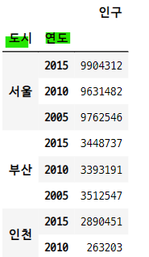

# 피봇테이블과 그룹분석

## 1. 피봇 pivot
- `피봇테이블 pivot table` : 데이터 열 중에서 두개의 열을 각각 행 인덱스, 열 인덱스로 사용하여 데이터를 조회하여 펼쳐 놓은 것
- `df.pivot("열이름1", "열이름2", "열이름3")` 매서드
    - 열이름1 : 행 인덱스
    - 열이름2 : 열 인덱스
    - 열이름3 : 데이터로 사용할 열
- 변형된 행 인덱스와 열 인덱스에 해당하는 데이터가 없으면 "NaN" 처리 된다.
- **pivot()과 pivot_table()은 다르다.**

#### 데이터프레임 만들기

```python
data = {
    "도시" : ["서울", "서울", "서울", "부산", "부산", "부산", "인천", "인천"],
    "연도" : ["2015", "2010", "2005", "2015", "2010", "2005", "2015", "2010"],
    "인구" : [9904312, 9631482, 9762546, 3448737, 3393191, 3512547, 2890451, 263203],
    "지역" : ["수도권", "수도권", "수도권", "경상권", "경상권", "경상권", "수도권", "수도권"]
}

columns = ["도시", "연도", "인구", "지역"]
df1 = pd.DataFrame(data, columns=columns)
df1
```


### 1-1. 피봇 만들기
- 도시 이름이 열 인덱스, 연도가 행 인덱스, 데이터는 인구 열 인덱스
    - 어떤 도시의 어떤 연도의 인구 수를 알 수 있다.

```python
df1.pivot("연도", "도시", "인구")
```


### 1-2. set_index + unstack 명령으로 피봇 만들기

```python
df1.set_index(["도시", "연도"])[["인구"]]
```


- unstack() 명령어를 사용하면 행 인덱스가 열 인덱스로 바뀐다.

```python
df1.set_index(["도시", "연도"])[["인구"]].unstack()
```


- 도시 행 인덱스를 열 인덱스로 unstack()

```python
df1.set_index(["도시", "연도"])[["인구"]].unstack("도시")
```


### 1-3. 다중 인덱스 피봇 테이블
- 열이나 행 인덱스를 리스트로 설정하면 다중 인덱스를 가진 피봇이 된다.

```python
df1.pivot(["지역", "도시"], "연도", "인구")
```


### 1-4. 조회 된 값이 2개 이상이면 에러 발생
- 지역(행)과 연도(열)로 pivot 테이블을 만들면 수도권/2015, 수도권/2010의 값이 2개 이상이므로 에러가 발생한다.

```python
try :
    df1.pivot("지역", "연도", "인구")
except ValueError as e :
    print("ValueError : ", e)

>>> print

ValueError :  Index contains duplicate entries, cannot reshape
```

## 2. 그룹분석
- `그룹분석 group analysis` : 키에 의해서 결정되는 데이터가 여러개 있을 경우 미리 지정한 연산을 통해서 그 그룹 데이터의 대표값을 계산한다.
    - pivot 은 행과 열의 키로 구한 값이 두개 이상이면 에러가 난다.
- 방법
    - **groupby 메서드** 사용
    - 시리즈나 데이터프레임에 groupby 메서드를 호출한다.
    - 그룹 객체에 대해 그룹연산 수행

### 2-1. gorupby 메서드
- `gorupby 메서드` : 데이터를 그룹별로 분류한다.
- 인수
    - 열 또는 열의 리스트
    - 행 인덱스
- 결과
    - GroupBy 클래스 객체 반환
    - 이 객체에 그룹 연산 메서드가 있다.

### 2-2. GroupBy 메서드
- gorupby의 결과인 GroupBy 객체 뒤에 붙일 수 있는 그룹연산 메서드
    - **size, count** : 그룹 데이터의 갯수
    - **mean, median, min, max** : 그룹데이터의 평균, 중앙값, 최소값, 최대값
    - **sum, prod, std, var, quantile** : 합계, 곱, 표준편차, 분산, 사분위수
    - **first, last** : 그룹데이터 중 첫번째 데이터와 나중 데이터
    - **agg, aggregate** : 원하는 연산이 없는 경우, 함수를 만들고 agg에 함수를 전달한다. 여러가지 그룹연산을 동시에 하고 싶은 경우 함수 이름 문자열의 리스트를 전달한다.
    - **describe** : 여러개의 값을 데이터프레임으로 구한다.
    - **apply** : describe 처럼 하나의 대표값이 아닌 데이터프레임을 출력한다. 원하는 그룹 연산이 없는 경우에 사용한다.
    - **transform** : 그룹에 대한 대표값을 만드는 것이 아니라 그룹별 계산을 통해 데이터 자체를 변형한다.

### 2-3. groupby 분석

```python
np.random.seed(0)
df2 = pd.DataFrame({
    "key1" : ["A", "A", "B", "B", "A"],
    "key2" : ["one", "two", "one", "two", "one"],
    "data1" : [1, 2, 3, 4, 5],
    "data2" : [10, 20, 30, 40, 50]
})

df2
```


#### GroupBy 객체 반환
- df2의 key1을 키 값으로 설정

```python
groups = df2.groupby(df2.key1)
groups

>>> print

<pandas.core.groupby.generic.DataFrameGroupBy object at 0x00000159C384A988>
```

### 2-4. GroupBy 객체의 groups 속성
- 각 그룹 데이터의 인덱스 값

```python
groups.groups

>>> print

{'A': [0, 1, 4], 'B': [2, 3]}
```

### 2-5. 그룹연산
- size, count
- mean, median, min, max
- sum, prod, std, var, quantile
- first, last

#### size

```python
groups.size()

>>> print

key1
A    3
B    2
dtype: int64
```

#### count

```python
groups.count()
```


#### mean

```python
groups.mean()
```


#### median

```python
groups.median()
```


#### min

```python
groups.min()
```


#### max

```python
groups.max()
```
![07_pandas_12.png]

#### sum

```python
groups.sum()
```


### prod

```python
groups.prod()
```


#### std

```python
groups.std()
```


#### var

```python
groups.var()
```


#### quantile

```python
groups.quantile()
```


#### first
- 그룹화 했을 때 각 열의 첫 번째 데이터

```python
groups.first()
```


#### last
- 그룹화 했을 때 각 열의 마지막 데이터

```python
groups.last()
```


