# 시계열 자료 다루기
- `시계열 자료` : 인덱스가 날짜 또는 시간인 데이터

## 1. DatetimeIndex 인덱스
- `DatatimeIndex` : 특정 순간에 기록된 타임스탬프 형식의 시계열 자료를 다루기 위한 인덱스
- 시계열 자료 만드는 방법
    - 인덱스를 DatetimeIndex 자료형으로 만든다.
    - 인덱스의 라벨값이 일정한 간격일 필요는 없다.
- DatatimeIndex의 보조함수
    - **pd.to_datetime 함수** : 날짜/시간을 나타내는 문자열을 자동으로 datetime 자료형으로 바꾼 후 DatemtimeIndex 자료형 인덱스를 생성해준다.
    - **pd.date_range 함수** : 모든 날짜/시간을 일일히 입력할 필요없이 시작일과 종료일 또는 시작일과 기간을 입력하면 범위 내의 인덱스를 생성해준다.
- **pd.date_range(start="", periods=int, freq="")**
    - periods 는 freq의 규칙을 따른다.
    - freq가 "T"(분)인 경우 periods가 60이면 "60분"에 해당하는 데이터가 생성된다.
    - freq가 "D"(날)인 경우 periods가 60이면 "60일"에 해당하는 데이터가 생성된다.

### 1-1. pd.to_datetime() 함수
- **시계열 인덱스를 생성해주는 함수**
- str로 만들어진 날짜 데이터를 함수에 넣어준다.

```python
date_str = ["2022, 10, 6", "2022, 10, 5", "2022, 10, 4", "2022, 10, 3"]
date_str

>>> print

['2022, 10, 6', '2022, 10, 5', '2022, 10, 4', '2022, 10, 3']
```

- 시계열 인덱스로 변환

```python
idx = pd.to_datetime(date_str)
idx

>>> print

DatetimeIndex(['2022-10-06', '2022-10-05', '2022-10-04', '2022-10-03'], dtype='datetime64[ns]', freq=None)
```

#### 시리즈의 인덱스로 사용하면 시계열 데이터가 만들어진다.
- 위에서 만든 시계열 인덱스를 사용

```python
np.random.seed(0)
s = pd.Series(np.random.randn(4), index=idx)
s

>>> print

2022-10-06    1.764052
2022-10-05    0.400157
2022-10-04    0.978738
2022-10-03    2.240893
dtype: float64
```

### 1-2. pd.date_range() 함수
- **시계열 인덱스를 생성해주는 함수**
- 시작일과 종료일 또는 시작과 기간을 입력하면 범위내의 시계열 인덱스를 생성해준다.
    - periods 인수는 "월"에 해당한다.
    - 1이면 1달, 2면 2달

```python
pd.date_range("2022-10-01", "2022-10-10")

>>> print

DatetimeIndex(['2022-10-01', '2022-10-02', '2022-10-03', '2022-10-04',
               '2022-10-05', '2022-10-06', '2022-10-07', '2022-10-08',
               '2022-10-09', '2022-10-10'],
              dtype='datetime64[ns]', freq='D')
```

- periods의 단위는 시계열 데이터의 단위에 따라서 달라진다.

```python
pd.date_range(start="2022-10-01", periods=30)

>>> print

DatetimeIndex(['2022-10-01', '2022-10-02', '2022-10-03', '2022-10-04',
               '2022-10-05', '2022-10-06', '2022-10-07', '2022-10-08',
               '2022-10-09', '2022-10-10', '2022-10-11', '2022-10-12',
               '2022-10-13', '2022-10-14', '2022-10-15', '2022-10-16',
               '2022-10-17', '2022-10-18', '2022-10-19', '2022-10-20',
               '2022-10-21', '2022-10-22', '2022-10-23', '2022-10-24',
               '2022-10-25', '2022-10-26', '2022-10-27', '2022-10-28',
               '2022-10-29', '2022-10-30'],
              dtype='datetime64[ns]', freq='D')
```

### 1-3. freq 인수
- pd.date_range(freq="인수")
- **s** : 초
- **T** : 분
- **H** : 시간
- **D** : 일 (day)
- **B** : 주말이 아닌 평일
- **W** : 주 (일요일)
- **W-MON** : 주 단위 월요일 (요일 바꿔서 사용 가능)
    - W-TUE : 주 단위 화요일 
- **M** : 각 달 (month)의 마지막 날
- **MS** : 각 달의 첫날
- **BM** : 주말이 아닌 평일 중에서 각 달의 마지막 날
- **BMS** : 주말이 아닌 평일 중에서 각 달의 첫날
- **WOM-2THU** : 각 달의 두번째 목요일 
    - 순번 + 요일 : 모든 요일의 순번을 정할 수 있음
- **Q-JAN** : 각 분기의 첫달의 마지막 날
- **Q-DEC** : 각 분기의 마지막 달의 마지막 날
    - Q-JAN : 1,4,7,10 월
    - Q-FEB : 2,5,8,11 월
    - Q-MAR : 3,6,9,12 월
    - Q-DEC : 3,6,9,12 월
    - Q-APR : 1,4,7,10 월
    - JAN, FEB, MAR 그룹에 속하는 월이 반복된다.
- 이 외에도 종류가 매우 많다.
    - https://pandas.pydata.org/pandas-docs/stable/user_guide/timeseries.html#dateoffset-objects

#### 평일 시계열 만들기 
- freq="B"

```python
pd.date_range("2022-09-01", "2022-09-30", freq="B")

>>> print

DatetimeIndex(['2022-09-01', '2022-09-02', '2022-09-05', '2022-09-06',
               '2022-09-07', '2022-09-08', '2022-09-09', '2022-09-12',
               '2022-09-13', '2022-09-14', '2022-09-15', '2022-09-16',
               '2022-09-19', '2022-09-20', '2022-09-21', '2022-09-22',
               '2022-09-23', '2022-09-26', '2022-09-27', '2022-09-28',
               '2022-09-29', '2022-09-30'],
              dtype='datetime64[ns]', freq='B')
```

#### 1초씩 증가하는 시계열 만들기
- freq="S"

```python
pd.date_range("2022-10-01", "2022-10-31", freq="S")

>>> print

DatetimeIndex(['2022-10-01 00:00:00', '2022-10-01 00:00:01',
               '2022-10-01 00:00:02', '2022-10-01 00:00:03',
               '2022-10-01 00:00:04', '2022-10-01 00:00:05',
               '2022-10-01 00:00:06', '2022-10-01 00:00:07',
               '2022-10-01 00:00:08', '2022-10-01 00:00:09',
               ...
               '2022-10-30 23:59:51', '2022-10-30 23:59:52',
               '2022-10-30 23:59:53', '2022-10-30 23:59:54',
               '2022-10-30 23:59:55', '2022-10-30 23:59:56',
               '2022-10-30 23:59:57', '2022-10-30 23:59:58',
               '2022-10-30 23:59:59', '2022-10-31 00:00:00'],
              dtype='datetime64[ns]', length=2592001, freq='S')
```

#### 일요일 시계열 만들기
- freq="W"

```python
pd.date_range("2022-09-01", "2022-10-31", freq="W")

>>> print

DatetimeIndex(['2022-09-04', '2022-09-11', '2022-09-18', '2022-09-25',
               '2022-10-02', '2022-10-09', '2022-10-16', '2022-10-23',
               '2022-10-30'],
              dtype='datetime64[ns]', freq='W-SUN')
```

#### 월요일 시계열 만들기
- freq="W-MON"

```print
pd.date_range("2022-09-01", "2022-10-31", freq="W-MON")

>>> print

DatetimeIndex(['2022-09-05', '2022-09-12', '2022-09-19', '2022-09-26',
               '2022-10-03', '2022-10-10', '2022-10-17', '2022-10-24',
               '2022-10-31'],
              dtype='datetime64[ns]', freq='W-MON')
```

#### 각 달의 첫날 시계열 만들기
- freq="MS"

```print
pd.date_range(start="2022-01-01", periods=12, freq="MS")

>>> print

DatetimeIndex(['2022-01-01', '2022-02-01', '2022-03-01', '2022-04-01',
               '2022-05-01', '2022-06-01', '2022-07-01', '2022-08-01',
               '2022-09-01', '2022-10-01', '2022-11-01', '2022-12-01'],
              dtype='datetime64[ns]', freq='MS')
```

#### 각 달의 마지막 날 시계열 만들기
- freq="M"

```python
pd.date_range("2021-01-01", "2021-12-31", freq="M")

>>> print

DatetimeIndex(['2021-01-31', '2021-02-28', '2021-03-31', '2021-04-30',
               '2021-05-31', '2021-06-30', '2021-07-31', '2021-08-31',
               '2021-09-30', '2021-10-31', '2021-11-30', '2021-12-31'],
              dtype='datetime64[ns]', freq='M')
```

#### 각 달의 주말이 아닌 평일 중에서 첫날
- freq="BMS"

```python
pd.date_range("2022-01-01", "2022-10-31", freq="BMS")

>>> print

DatetimeIndex(['2022-01-03', '2022-02-01', '2022-03-01', '2022-04-01',
               '2022-05-02', '2022-06-01', '2022-07-01', '2022-08-01',
               '2022-09-01', '2022-10-03'],
              dtype='datetime64[ns]', freq='BMS')
```

#### 각 달의 주말이 아닌 평일 중에서 마지막날

```python
pd.date_range("2022-01-01", "2022-12-31", freq="BM")

>>> print

DatetimeIndex(['2022-01-31', '2022-02-28', '2022-03-31', '2022-04-29',
               '2022-05-31', '2022-06-30', '2022-07-29', '2022-08-31',
               '2022-09-30', '2022-10-31', '2022-11-30', '2022-12-30'],
              dtype='datetime64[ns]', freq='BM')
```

#### 각 달의 2번째 목요일
- 숫자에 따라서 몇번째 요일을 선택할 수 있다.
   - WOM-숫자요일

```python
pd.date_range("2022-01-01", "2022-12-31", freq="WOM-2THU")

>>> print

DatetimeIndex(['2022-01-13', '2022-02-10', '2022-03-10', '2022-04-14',
               '2022-05-12', '2022-06-09', '2022-07-14', '2022-08-11',
               '2022-09-08', '2022-10-13', '2022-11-10', '2022-12-08'],
              dtype='datetime64[ns]', freq='WOM-2THU')
```

- 각 달의 2번째 금요일

```python
pd.date_range("2022-01-01", "2022-12-31", freq="WOM-2FRI")

>>> print

DatetimeIndex(['2022-01-14', '2022-02-11', '2022-03-11', '2022-04-08',
               '2022-05-13', '2022-06-10', '2022-07-08', '2022-08-12',
               '2022-09-09', '2022-10-14', '2022-11-11', '2022-12-09'],
              dtype='datetime64[ns]', freq='WOM-2FRI')
```

#### 각 분기의 첫달의 마지막 날
- freq="Q-JAN"
    - 1, 4, 7, 10 월의 마지막 날

```python
pd.date_range("2022-01-01", "2022-12-31", freq="Q-JAN")

>>> print

DatetimeIndex(['2022-01-31', '2022-04-30', '2022-07-31', '2022-10-31'], dtype='datetime64[ns]', freq='Q-JAN')
```

#### 각 분기의 마지막 달의 마지막 날
- freq="Q-DEC"
    - 3, 6, 9, 12 월의 마지막 날

```python
pd.date_range("2022-01-01", "2022-12-31", freq="Q-DEC")

>>> print

DatetimeIndex(['2022-03-31', '2022-06-30', '2022-09-30', '2022-12-31'], dtype='datetime64[ns]', freq='Q-DEC')
```

#### DatetimeIndex 보조 함수
- pd.to_datetime(str)
- pd.date_range(start="", periods=12, freq="")
- pd.date_range("", "", freq="")

## 2. shift 연산
- `shift()` : 시간, 날짜 이동 연산 명령어
    - 인덱스는 그대로 두고 데이터만 이동할 수 있다.
    - **전일대비, 전주대비, 전월대비 등의 계산이 필요할 때 사용할 수 있다.**

### 2-1. 1월~4월 기간 중 마지막 날짜 데이터 생성

```python
np.random.seed(0)
ts = pd.Series(np.random.randn(4),
               index=pd.date_range("2022-01-01", periods=4, freq="M"))
ts

>>> print

2022-01-31    1.764052
2022-02-28    0.400157
2022-03-31    0.978738
2022-04-30    2.240893
Freq: M, dtype: float64
```

### 2-2. shift(1)
- 데이터가 한칸씩 뒤로 밀려난다.

```python
ts.shift(1)
```

### 2-3. shift(-1)
- 데이터가 한칸씩 앞으로 당겨진다.

```python
ts.shift(-1)

>>> print

2022-01-31    0.400157
2022-02-28    0.978738
2022-03-31    2.240893
2022-04-30         NaN
Freq: M, dtype: float64
```

### 2-3. shift(1, freq="M")
- 시계열 인덱스의 기간이 이동한다.
    - 1 : 전체 기간이 뒤로 밀려난다. 즉 시작과 끝의 날짜가 커진다.
    - -1 : 전체 기간이 앞으로 당겨진다. 즉 시작과 끝의 날짜가 작아진다.
    - freq : 날짜 데이터 규칙, 기간의 범위는 그대로이고 규칙이 바뀐다.

#### 월의 마지막 날

```python
ts.shift(1, freq="M")
```
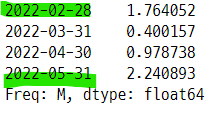

```python
ts.shift(-1, freq="M")
```
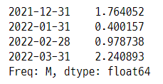

#### 월의 마지막 일요일

```python
ts.shift(1, freq="W")
```
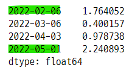

### 2-4. resample()
- `resample` : 시간 간격을 재조정하는 리샘플링 명령어
    - `up-sampling` : 시간 구간이 작아지면 데이터양이 증가한다.
    - `down-sampling` : 시간 구간이 커지면 데이터양이 감소한다.

- freq="D"이므로 100일 간의 데이터가 생성된다.

```python
ts = pd.Series(np.random.randn(100),
               index=pd.date_range("2022-01-01", periods=100, freq="D"))
ts

>>> print

2022-01-01    1.867558
2022-01-02   -0.977278
2022-01-03    0.950088
2022-01-04   -0.151357
2022-01-05   -0.103219
                ...
2022-04-06    0.401989
2022-04-07    1.883151
2022-04-08   -1.347759
2022-04-09   -1.270485
2022-04-10    0.969397
Freq: D, Length: 100, dtype: float64
```

```python
ts.size

>>> print

100

len(ts)

>>> print

100
```

### 2-5. down-sampling
- groupby 메서드의 원리와 같다.
- 데이터가 그룹으로 묶인다. 
   - **따라서 그룹으로 묶기 위해서 그룹연산을 해주어야 한다.**

#### freq="W" : 일요일 날짜, 평균값
- 이전~현재날짜까지의 그룹의 평균값이 채워진다.
    - 1일~2일, 3일~9일

```python
ts.resample("W").mean()

>>> print

2022-01-02    0.445140
2022-01-09    0.495067
2022-01-16    0.235301
2022-01-23   -0.130850
2022-01-30    0.068497
2022-02-06    0.071846
2022-02-13   -0.371221
2022-02-20   -0.579260
2022-02-27   -0.175965
2022-03-06   -0.691214
2022-03-13    0.076018
2022-03-20   -0.214814
2022-03-27    0.404350
2022-04-03    0.439660
2022-04-10    0.364154
Freq: W-SUN, dtype: float64
```

- pd.date_range() 로 만들기

```python
pd.date_range("2022-01-01", periods=15, freq="W")

>>> print

DatetimeIndex(['2022-01-02', '2022-01-09', '2022-01-16', '2022-01-23',
               '2022-01-30', '2022-02-06', '2022-02-13', '2022-02-20',
               '2022-02-27', '2022-03-06', '2022-03-13', '2022-03-20',
               '2022-03-27', '2022-04-03', '2022-04-10'],
              dtype='datetime64[ns]', freq='W-SUN')
```

#### 1~2의 평균값
- 2022-01-01 ~ 2022-01-02 의 평균값

```python
ts[:2]

>>> print

2022-01-01    1.867558
2022-01-02   -0.977278
Freq: D, dtype: float64

ts[:2].mean()

>>> print

0.44514005513677823
```

#### 3~9의 평균값

```python
ts[2:9]

>>> print

2022-01-03    0.950088
2022-01-04   -0.151357
2022-01-05   -0.103219
2022-01-06    0.410599
2022-01-07    0.144044
2022-01-08    1.454274
2022-01-09    0.761038
Freq: D, dtype: float64

ts[2:9].mean()

>>> print

0.4950665232347933
```

### 2-6. resample()로 시/분 단위 구간 만들기
- 구간의 왼쪽 한계값(가장 빠른값)은 포함 되고 오른쪽 한계값(가장 늦은 값)은 포함되지 않는다.
    - 다음 구간의 시작으로 포함된다.
    - left, right 로 인수를 설정한다.
- 10분 간격으로 구간을 만들면 10의 배수는 다음 구간의 시작이 된다.    

#### 시계열 데이터 생성

```python
ts = pd.Series(np.random.randn(60), index=pd.date_range(
"2022-01-01", periods=60, freq="T"))
ts.head(20)

>>> print

2022-01-01 00:00:00   -1.173123
2022-01-01 00:01:00    1.943621
2022-01-01 00:02:00   -0.413619
2022-01-01 00:03:00   -0.747455
2022-01-01 00:04:00    1.922942
2022-01-01 00:05:00    1.480515
2022-01-01 00:06:00    1.867559
2022-01-01 00:07:00    0.906045
2022-01-01 00:08:00   -0.861226
2022-01-01 00:09:00    1.910065
2022-01-01 00:10:00   -0.268003
2022-01-01 00:11:00    0.802456
2022-01-01 00:12:00    0.947252
2022-01-01 00:13:00   -0.155010
2022-01-01 00:14:00    0.614079
2022-01-01 00:15:00    0.922207
2022-01-01 00:16:00    0.376426
2022-01-01 00:17:00   -1.099401
2022-01-01 00:18:00    0.298238
2022-01-01 00:19:00    1.326386
Freq: T, dtype: float64
```

```python
ts.resample("10T").sum()

>>> print

2022-01-01 00:00:00    6.835324
2022-01-01 00:10:00    3.764630
2022-01-01 00:20:00    0.776495
2022-01-01 00:30:00   -0.538336
2022-01-01 00:40:00    1.828234
2022-01-01 00:50:00    0.167957
Freq: 10T, dtype: float64
```

#### 오른쪽 한계값을 구간에 포함시키는 방법
- closed="right" 인수를 사용한다.
- 10의 배수가 앞 구간에 포함된다.

```python
ts.resample("10T", closed="right").sum()

>>> print

2021-12-31 23:50:00   -1.173123
2022-01-01 00:00:00    7.740444
2022-01-01 00:10:00    3.338065
2022-01-01 00:20:00    0.835217
2022-01-01 00:30:00    2.480654
2022-01-01 00:40:00   -0.653363
2022-01-01 00:50:00    0.266409
Freq: 10T, dtype: float64
```

- 인덱싱으로 계산하여 검증

```python
ts[0], ts[1:11].sum(), ts[11:21].sum()

>>> print

(-1.17312340511416, 7.740443727158503, 3.3380652641250723)
```

### 2-7. ohlc() 메서드
- 구간의 시작, 고값, 저값, 끝(시고저종) 값을 구해준다.
    - open, high, low, close

```python
ts.resample("5T").ohlc()
```
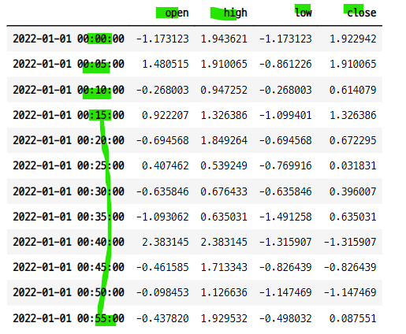


#### 10일간의 데이터 생성

```python
ts2 = pd.Series(np.random.randn(10), index=pd.date_range(
"2022-10-01", periods=10, freq="D"))
ts2

>>> print

2022-10-01   -1.034243
2022-10-02    0.681595
2022-10-03   -0.803410
2022-10-04   -0.689550
2022-10-05   -0.455533
2022-10-06    0.017479
2022-10-07   -0.353994
2022-10-08   -1.374951
2022-10-09   -0.643618
2022-10-10   -2.223403
Freq: D, dtype: float64
```

- 2일 간경의 날짜와 ohlc 값

```python
ts2.resample("2D").ohlc()
```
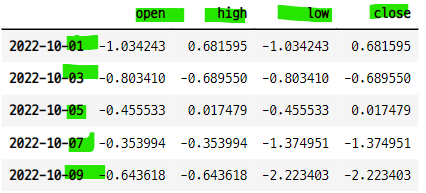

## 3. up-sampling
- 없는 데이터를 만들어야 한다.
    - down-sampling은 기존 데이터를 그룹화
- `forward filling` : 앞에서 나온 데이터를 뒤에서 그대로 쓰는 방식
    - **ffill() 메서드**
- `backward filling` : 뒤에서 나올 데이터를 앞에서 미리 쓰는 방식
    - **bfill() 메서드**


#### 1분 구간으로 만들어진 데이터에 30s의 데이터를 새로 만들기
- forward filling 방식으로 만들면 바로 앞의 데이터를 사용한다.
- backward filling 방식으로 만들면 바로 뒤의 데이터를 사용한다.

- 30초마다 새로운 데이터 생기고, 앞의 값으로 채워진다.

```python
ts.resample("30s").ffill().head(20)

>>> print

2022-01-01 00:00:00   -1.173123
2022-01-01 00:00:30   -1.173123
2022-01-01 00:01:00    1.943621
2022-01-01 00:01:30    1.943621
2022-01-01 00:02:00   -0.413619
2022-01-01 00:02:30   -0.413619
2022-01-01 00:03:00   -0.747455
2022-01-01 00:03:30   -0.747455
2022-01-01 00:04:00    1.922942
2022-01-01 00:04:30    1.922942
2022-01-01 00:05:00    1.480515
2022-01-01 00:05:30    1.480515
2022-01-01 00:06:00    1.867559
2022-01-01 00:06:30    1.867559
2022-01-01 00:07:00    0.906045
2022-01-01 00:07:30    0.906045
2022-01-01 00:08:00   -0.861226
2022-01-01 00:08:30   -0.861226
2022-01-01 00:09:00    1.910065
2022-01-01 00:09:30    1.910065
Freq: 30S, dtype: float64
```

- 30초마다 새로운 데이터가 생기고, 뒤에오는 데이터의 값으로 채워진다.

```python
ts.resample("30s").bfill().head(20)

>>> print

2022-01-01 00:00:00   -1.173123
2022-01-01 00:00:30    1.943621
2022-01-01 00:01:00    1.943621
2022-01-01 00:01:30   -0.413619
2022-01-01 00:02:00   -0.413619
2022-01-01 00:02:30   -0.747455
2022-01-01 00:03:00   -0.747455
2022-01-01 00:03:30    1.922942
2022-01-01 00:04:00    1.922942
2022-01-01 00:04:30    1.480515
2022-01-01 00:05:00    1.480515
2022-01-01 00:05:30    1.867559
2022-01-01 00:06:00    1.867559
2022-01-01 00:06:30    0.906045
2022-01-01 00:07:00    0.906045
2022-01-01 00:07:30   -0.861226
2022-01-01 00:08:00   -0.861226
2022-01-01 00:08:30    1.910065
2022-01-01 00:09:00    1.910065
2022-01-01 00:09:30   -0.268003
Freq: 30S, dtype: float64
```

## 4. dt 접근자
- `dt 접근자` : datetime 자료형이 가진 유용한 속성과 메서드를 사용할 수 있다.
    - 연, 월, 일, 주간 등의 속성을 반환할 수 있다.

#### 20일 간의 데이터 생성
- periods=20, freq="D"

```python
s = pd.Series(pd.date_range("2022-10-01", periods=20, freq="D"))
s

>>> print

0    2022-10-01
1    2022-10-02
2    2022-10-03
3    2022-10-04
4    2022-10-05
5    2022-10-06
6    2022-10-07
7    2022-10-08
8    2022-10-09
9    2022-10-10
10   2022-10-11
11   2022-10-12
12   2022-10-13
13   2022-10-14
14   2022-10-15
15   2022-10-16
16   2022-10-17
17   2022-10-18
18   2022-10-19
19   2022-10-20
dtype: datetime64[ns]
```

#### dt.year
- 시계열에서 년도 값만 따로 선택한다.

```python
s.dt.year

>>> print

0     2022
1     2022
2     2022
3     2022
4     2022
5     2022
6     2022
7     2022
8     2022
9     2022
10    2022
11    2022
12    2022
13    2022
14    2022
15    2022
16    2022
17    2022
18    2022
19    2022
dtype: int64
```

- month 데이터 조회

```python
s.dt.month

>>> print

0     10
1     10
2     10
3     10
4     10
5     10
6     10
7     10
8     10
9     10
10    10
11    10
12    10
13    10
14    10
15    10
16    10
17    10
18    10
19    10
dtype: int64
```

### 4-1. strftime() 메서드
- 문자열 만들기

```python
s.dt.strftime("%Y-%m-%d")

>>> print

0     2022-10-01
1     2022-10-02
2     2022-10-03
3     2022-10-04
4     2022-10-05
5     2022-10-06
6     2022-10-07
7     2022-10-08
8     2022-10-09
9     2022-10-10
10    2022-10-11
11    2022-10-12
12    2022-10-13
13    2022-10-14
14    2022-10-15
15    2022-10-16
16    2022-10-17
17    2022-10-18
18    2022-10-19
19    2022-10-20
dtype: object
```

#### 다른 명령어 사용

```python
s.dt.strftime("%B %b %A %a %Y %m %d %week")

>>> print

0      October Oct Saturday Sat 2022 10 01 6eek
1        October Oct Sunday Sun 2022 10 02 0eek
2        October Oct Monday Mon 2022 10 03 1eek
3       October Oct Tuesday Tue 2022 10 04 2eek
4     October Oct Wednesday Wed 2022 10 05 3eek
5      October Oct Thursday Thu 2022 10 06 4eek
6        October Oct Friday Fri 2022 10 07 5eek
7      October Oct Saturday Sat 2022 10 08 6eek
8        October Oct Sunday Sun 2022 10 09 0eek
9        October Oct Monday Mon 2022 10 10 1eek
10      October Oct Tuesday Tue 2022 10 11 2eek
11    October Oct Wednesday Wed 2022 10 12 3eek
12     October Oct Thursday Thu 2022 10 13 4eek
13       October Oct Friday Fri 2022 10 14 5eek
14     October Oct Saturday Sat 2022 10 15 6eek
15       October Oct Sunday Sun 2022 10 16 0eek
16       October Oct Monday Mon 2022 10 17 1eek
17      October Oct Tuesday Tue 2022 10 18 2eek
18    October Oct Wednesday Wed 2022 10 19 3eek
19     October Oct Thursday Thu 2022 10 20 4eek
dtype: object
```

#### 데이터프레임으로 만들기

```python
test_df = pd.DataFrame(s, columns=["date"])
test_df["month_name"] = test_df["date"].dt.strftime("%B")
test_df["month_short"] = test_df["date"].dt.strftime("%b")
test_df["week_name"] = test_df["date"].dt.strftime("%A")
test_df["week_short"] = test_df["date"].dt.strftime("%a")
test_df["year"] = test_df["date"].dt.strftime("%Y")
test_df["month"] = test_df["date"].dt.strftime("%m")
test_df["day"] = test_df["date"].dt.strftime("%d")
test_df
```
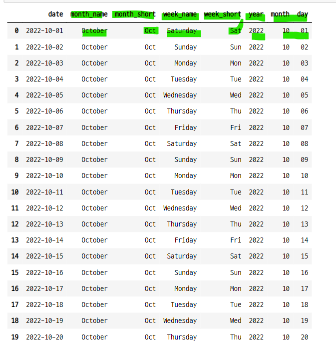

### 4-2. dt 접근자에서 strftime 사용하지 않고 바로 추출

```python
new_ts_df = pd.DataFrame(test_df["date"], columns=["date"])
new_ts_df.head()
```
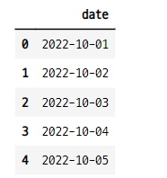

#### dt 접근자의 날짜 연산

```python
new_ts_df["year"] = new_ts_df.date.dt.year
new_ts_df["month"] = new_ts_df.date.dt.month
new_ts_df["dayofyear"] = new_ts_df.date.dt.dayofyear
new_ts_df["dayofmonth"] = new_ts_df.date.dt.daysinmonth
new_ts_df["dayofweek"] = new_ts_df.date.dt.dayofweek
new_ts_df["weekofyear"] = new_ts_df.date.dt.weekofyear
new_ts_df["weekday"] = new_ts_df.date.dt.weekday
new_ts_df["ismonthstart"] = new_ts_df.date.dt.is_month_start
new_ts_df["ismonthend"] = new_ts_df.date.dt.is_month_end
new_ts_df.tail()
```
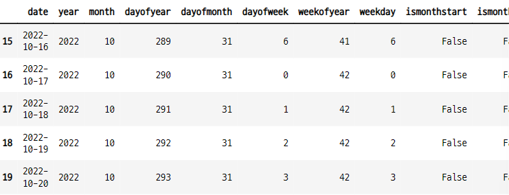

#### 특정한 날짜에 대해 1년중 몇번쨰 날인지 계산
- 시리즈 타입의 시계열 데이터로 만든다.
   - 타입은 datetime64[ns]
- dt 접근자를 사용하여 dayofyear 값을 계산한다.   

```python
pd.Series("2020-10-17", dtype="datetime64[ns]").dt.dayofyear

>>> print

0    291
dtype: int64
```

## 5. 연습문제
- 다음 데이터의 월별 value 합계를 구하라

```python
np.random.seed(0)
df = pd.DataFrame({
    "date" : pd.date_range("2020-12-25", periods=100, freq="D"),
    "value" : np.random.randint(100, size=(100, ))
})

df.tail()
```
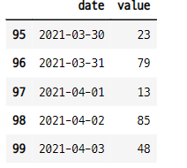


### 5-1. 시계열 데이터에서 월만 떼어내 새로운 컬럼을 만들기

```python
df["month"] = df["date"].dt.strftime("%m")
df.head()
```
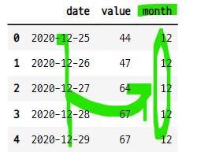

#### groupby로 월별 합 구하기

```python
df.groupby(df.month).sum()
```
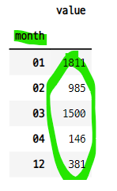


#### 연 컬럼 만들기

```python
df["year"] = df["date"].dt.strftime("%Y")
df.head()
```
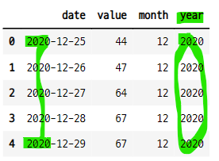


#### groupby로 연별 합 구하기

```python
df.groupby(df.year).sum()
```
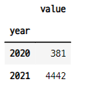

#### 피봇테이블을 사용하여 연-월별 합 구하기

```python
df.pivot_table("value", ["year", "month"], aggfunc="sum")
```
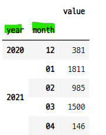

#### 피봇테이블을 사용하여 연-월별 합, 총합 구하기
- margins=True, margins_name="sum"

```python
df.pivot_table("value", ["year", "month"], aggfunc="sum",
              margins=True, margins_name="sum")	     
```
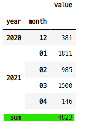

#### groupby를 사용하여 연-월별 합 구하기

```python
df.groupby([df.year, df.month])[["value"]].sum()
```
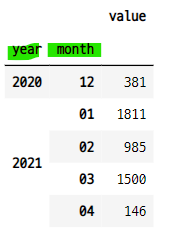

### 5-2. 새로운 컬럼을 만들지 않고 바로 계산하기
- groupby로 그룹화 할때 dt 작업자를 사용하여 월로 그룹화한다. 

```python
df.groupby(df["date"].dt.month).sum()
```
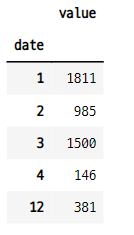

```python
df.groupby(df["date"].dt.year).sum()
```
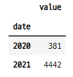

```python
df.groupby([df["date"].dt.year, df["date"].dt.month]).sum()
```
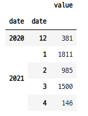

