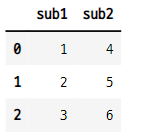
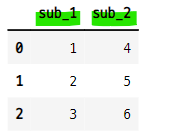
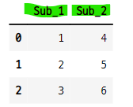
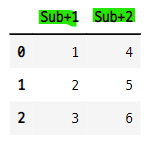
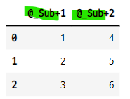
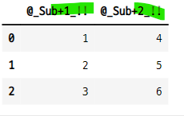

# 컬럼명 변경 5가지
- 1) 컬럼명 일대일로 변경하기 
    - df = df.rename({"x1" : "X1", "x2" : "X2"}, axis="columns")
- 2) 컬럼명 한번에 변경하기
    - df.columns = ["바꿀이름1", "바꿀이름2", "바꿀이름3"]
    - 컬럼 갯수 만큼 있어야 함
    - 리스트 컴프리핸션으로 규칙을 만들어 적용할 수 있음
- 3) 컬럼명의 특정 문자 변경하기
    - df.columns = df.columns.str.replace("-", "@")
- 4) 전체 컬럼명의 앞에 특정 문자 추가하기
    - df = df.add_prefix("#-")
    - 객체에 자동저장 되는 것은 아니다.
- 5) 전체 컬럼명의 뒤에 특정 문자 추가하기
    - df = df.add_suffix("!")
    - 객체에 자동저장 되는 것은 아니다.

#### 데이터 생성 

```python
df = pd.DataFrame({
    "sub1" : [1, 2, 3],
    "sub2" : [4, 5, 6]
})

df
```


### 1. 열 이름별 일대일로 이름 바꾸기
- df.rename({}, axis="columns")
- 밑줄 추가하기

```python
df = df.rename({"sub1" : "sub_1", "sub2" : "sub_2"}, axis="columns")
df
```



### 2. 전체 열이름 한번에 바꾸기
- 리스트에 넣은 순서데로 이름이 바뀐다.
    - 컬럼 갯수 만큼 이름이 있어야 함.
- 대문자 S로 변경하기

```python
df.columns = ["Sub_1", "Sub_2"]
df
```


### 3. 열 라벨의 특정 문자 바꾸기
- df.columns.str.replace("대상 문자", "바꿀 문자")
- 밑줄을 덧셈기호로 바꾸기

```python
df.columns = df.columns.str.replace("_", "+")
df
```


### 4. 열 라벨의 앞, 뒤에 특정 문자 추가하기
- 데이터프레임 객체에 자동 저장 되지 않는다.
    - df.add_prefix("추가할 문자") : 라벨의 앞
    - df.add_suffix("추가할 문자") : 라벨의 뒤

- 앞에 추가

```python
df = df.add_prefix("@_")
df
```


- 뒤에 추가

```python
df = df.add_suffix("_!!")
df
```


### 5. 전체 열 라벨의 첫 문자를 대문자로 바꾸기
- 타이타닉 데이터에서 모든 열 라벨의 첫 문자를 대문자로 바꾸기
   - 열 라벨 한번에 바꾸기 사용
   - 리스트 컴프리헨션 사용

```python
titanic = sns.load_dataset("titanic")
titanic.columns = [col[0].upper() + col[1:] for col in titanic.columns]
titanic.columns

>>> print

Index(['Survived_survived', 'Pclass', 'Sex', 'Age', 'Sibsp', 'Parch', 'Fare',
       'Embarked', 'Class', 'Who', 'Adult_male', 'Deck', 'Embark_town',
       'Alive', 'Alone'],
      dtype='object')
```
