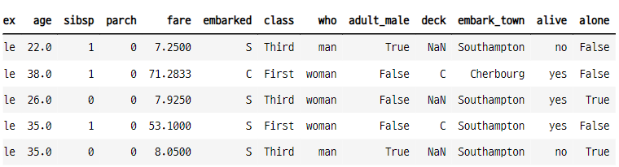
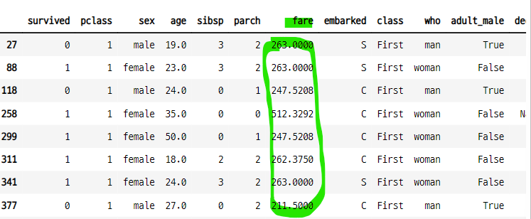
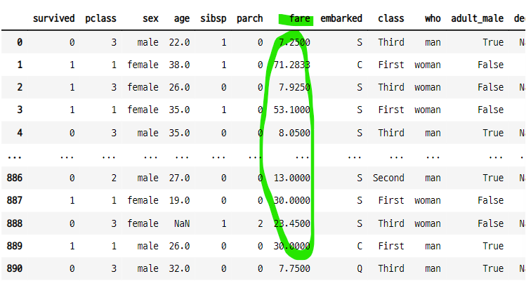

# isin()
- 컬럼에서 여러개의 값을 조회하는 방법
- 어떤 조건으로부터 나온 값을 특정 컬럼에서 조회할 때 유용하다.
    - **인덱스가 다를때 조회 된 값만으로 다시 조회가 가능하다.**
    - "==" 연산자로 여러가지 데이터를 조회할 수 없다.
- isin(lst) : lst에 해당하는 데이터 조회
- ~isin(lst) : lst에 해당하지 않는 데이터 조회

### 데이터 임포트

```python
titanic = sns.load_dataset("titanic")
titanic.head()
```


### fare 값이 200보다 큰 데이터 조회

```python
temp = titanic[titanic["fare"] >= 200]["fare"]
temp

>>> print

27     263.0000
88     263.0000
118    247.5208
258    512.3292
299    247.5208
311    262.3750
341    263.0000
377    211.5000
380    227.5250
438    263.0000
527    221.7792
557    227.5250
679    512.3292
689    211.3375
700    227.5250
716    227.5250
730    211.3375
737    512.3292
742    262.3750
779    211.3375
Name: fare, dtype: float64
```

### isin()
- T, F로 반환, 이 값을 인덱스 값을 사용할 수 있다.

```python
titanic[titanic["fare"].isin(temp)]
```


### ~isin()
- isin()이 아닌 값을 조회 할 수 있다.

```python
titanic[~titanic["fare"].isin(temp)]
```


