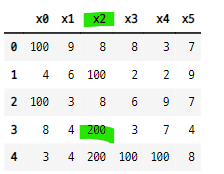

# 데이터 프레임에서 특정한 값의 갯수 세기
- (df==1).astype(int).sum()

### 데이터 생성

```python
datas = np.random.randint(1, 10, 30)
datas

>>> print

array([1, 9, 8, 8, 3, 7, 4, 6, 1, 2, 2, 9, 1, 3, 8, 6, 9, 7, 8, 4, 5, 3,
       7, 4, 3, 4, 5, 1, 1, 8])
```

### 데이터 프레임으로 변환

```python
datas = datas.reshape(5, 6)
df = pd.DataFrame(datas, columns=["x" + str(i) for i in range(6)])
df
```


### 값이 1인 것만 확인
- 불리언 값으로 반환된다.
    - 1이면 True, 아니면 False

```python
df==1
```


### astype() 함수를 사용하여 불리언 값을 숫자로 변환한다.
- True=1, False=0

```python
(df==1).astype(int)
```


### sum() 함수를 사용하여 열별로 합해준다.
- sum() 함수는 기본적으로 axis=0으로 설정되어 있다.
- axis=0은 행별로 계산한다는 것이 아니라 계산해서 없어지는 방향이라는 의미이다.
- 따라서 axis=0은 열별로 계산한다는 의미이다.

```python
(df==1).astype(int).sum()
```


### 1을 다른 값으로 바꾼다.
- 1이 있는 컬럼을 인덱싱 값으로 사용
- replace() 함수를 사용하여 1을 다른 값으로 바꾼다.

```python
temp_cols = ["x0", "x2", "x3", "x4"]
df[temp_cols]
```


- 1을 100으로 바꾸기

```python
df[temp_cols] = df[temp_cols].replace(1, 100)
df
```


### 열별 5의 갯수를 세고 5를 200으로 바꾸기

```python
(df==5).astype(int).sum().sort_values(ascending=False)
df["x2"] = df["x2"].replace(5, 200)
df
```


### 인디언 당뇨병 데이터로 테스트

#### 데이터 임포트

```python
df = pd.read_csv("../../04_machine_learning/ML_tutorial-master/ML_tutorial-master/dataset/diabetes.csv")
df.head()
```


#### 데이터 타입 변환
- float으로 바꾸기

```python
df.astype(float)
```


### 열별로 0 값의 갯수 계산

```python
(df==0).astype(int).sum()
```


### 0값을 각 열의 평균값으로 변환
- 열별 평균값 확인

```python
temp_cols = ["Glucose", "BloodPressure", "SkinThickness", "BMI"]
df[temp_cols].mean()
```


- 0을 평균값으로 변환 후 열별 0의 갯수 계산

```python
df[temp_cols] = df[temp_cols].replace(0, df[temp_cols].mean())
(df==0).astype(int).sum()
```


