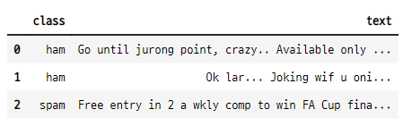
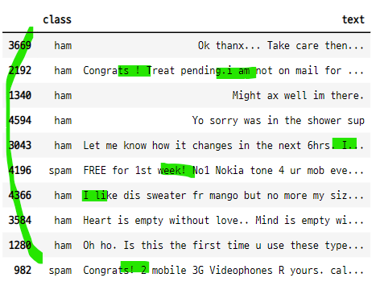
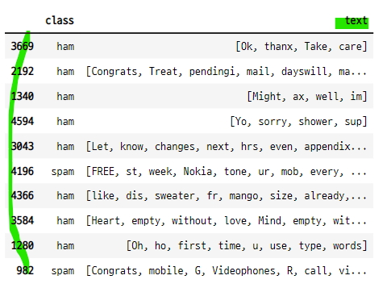

# 데이터 프레임의 불필요한 단어 정리하기
- 자연어 분석에 사용하는 CountVectorizer() 클래스에 사용할 수 있는 양식으로 만들어 준다.
    - [Let, know, changes, ...] 
- string, stopwords 패키지를 사용하여 제거할 문자열을 불러 올 수 있다.

### 1. 클래스 사용
- `stopword.words("english")` : 영어 대명사
- `string`
    - whitespace : 공백 문자열
    - ascii_lowercase : 알파벳 소문자
    - ascii_uppercase : 알파벳 대문자
    - ascii_letters : 알파벳 소문자 대문자
    - digits : 십진수 숫자
    - hexdigits : 16진수 숫자, 문자
    - octdigits : 8진수 숫자
    - punctuation : 특수기호
    - printable : 모든 문자기호

## 2. string 클래스 사용

```python
import string
```
### 공백 기호

```python
string.whitespace

>>> print

' \t\n\r\x0b\x0c'
```

### 알파벳 소문자

```python
string.ascii_lowercase

>>> print

'abcdefghijklmnopqrstuvwxyz'
```

### 알파벳 대문자

```python
string.ascii_uppercase

>>> print

'ABCDEFGHIJKLMNOPQRSTUVWXYZ'
```

### 알파벳 소문자 대문자

```python
string.ascii_letters

>>> print

'abcdefghijklmnopqrstuvwxyzABCDEFGHIJKLMNOPQRSTUVWXYZ'
```

### 십진수 숫자

```python
string.digits

>>> print

'0123456789'
```

### 16진수 숫자, 문자

```python
string.hexdigits

>>> print

'0123456789abcdefABCDEF'
```

### 8진수 숫자, 문자

```python
string.octdigits

>>> print

'01234567'
```
### 특수기호

```python
string.punctuation

>>> print

'!"#$%&\'()*+,-./:;<=>?@[\\]^_`{|}~'
```

### 모든 문자와 기호

```python
string.printable

>>> print

'0123456789abcdefghijklmnopqrstuvwxyzABCDEFGHIJKLMNOPQRSTUVWXYZ!"#$%&\'()*+,-./:;<=>?@[\\]^_`{|}~ \t\n\r\x0b\x0c'
```

## 3. stopwords

```python
from nltk.corpus import stopwords
```

### 영어 대명사

```python
stopwords.words("english")[:20]

>>> print

['i',
 'me',
 'my',
 'myself',
 'we',
 'our',
 'ours',
 'ourselves',
 'you',
 "you're",
 "you've",
 "you'll",
 "you'd",
 'your',
 'yours',
 'yourself',
 'yourselves',
 'he',
 'him',
 'his']
```

### 다른 언어 대명사
- stopwords.words("french")[:20]
- stopwords.words("spanish")[:20]

## 3. 단어정리기
- 대명사(pronoun)을 제거 하려면 바로 전에 문장을 하나의 문장으로 만들어 주어야 한다.
    - 문자가 따로 떨어진 상태이면 모든 a, i 등이 다 제거된다.

### 함수 생성

```python
def text_cleaner(text) :
    ## 특수기호 제거
    non_punc = [char for char in text if char not in string.punctuation]
    print("=== non_punc : ", non_punc)

    ## 숫자 제거
    non_digits = [char for char in non_punc if char not in string.digits]
    print("=== non_digits : ", non_digits)

    # 문자를 문장으로 합하기
    non_digits = "".join(non_digits)
    print("===non_digits : ", non_digits)

    # 대명사 제거
    non_pronoun = [word for word in non_digits.split()
                  if word.lower() not in stopwords.words("english")]
    print("===non_pronoun", non_pronoun)

    return non_pronoun
```

### 테스트 데이터로 단어정리기 테스트
- 테스트 데이터 생성

```python
test_text = 'A gram usually runs like  &lt;#&gt 0-apple 2234 $'
test_text

>>> print

'A gram usually runs like  &lt;#&gt 0-apple 2234 $'
```

- 함수 실행

```python
text_cleaner(test_text)

>>> print

=== non_punc :  ['A', ' ', 'g', 'r', 'a', 'm', ' ', 'u', 's', 'u', 'a', 'l', 'l', 'y', ' ', 'r', 'u', 'n', 's', ' ', 'l', 'i', 'k', 'e', ' ', ' ', 'l', 't', 'g', 't', ' ', '0', 'a', 'p', 'p', 'l', 'e', ' ', '2', '2', '3', '4', ' ']
=== non_digits :  ['A', ' ', 'g', 'r', 'a', 'm', ' ', 'u', 's', 'u', 'a', 'l', 'l', 'y', ' ', 'r', 'u', 'n', 's', ' ', 'l', 'i', 'k', 'e', ' ', ' ', 'l', 't', 'g', 't', ' ', 'a', 'p', 'p', 'l', 'e', ' ', ' ']
===non_digits :  A gram usually runs like  ltgt apple
===non_pronoun ['gram', 'usually', 'runs', 'like', 'ltgt', 'apple']
['gram', 'usually', 'runs', 'like', 'ltgt', 'apple']
```

## 4. 데이터 프레임에 사용
- 스펨 메일 분류 데이터
- df["text"].apply(text_cleaner)

### 데이터 임포트

```python
mail_data = pd.read_csv("../../04_machine_learning/sms-spam-collection-dataset/spam.csv", encoding="latin-1")
mail_data.drop([str(col) for col in mail_data.columns[2:]], axis=1, inplace=True)
mail_data = mail_data.rename(columns={"v1":"class", "v2":"text"})
mail_data.head(3)
```


### 데이터 프레임에서 샘플 데이터 생성
- df.sample(k)
    - 랜덤으로 k개의 데이터를 반환해줌

```python
sample = mail_data.sample(10)
sample
```


### 단어정리기 적용

```python
sample["text"] = sample["text"].apply(text_cleaner)
sample

>>> print

=== non_punc :  ['O', 'k', ' ', 't', 'h', 'a', 'n', 'x', ' ', 'T', 'a', 'k', 'e', ' ', 'c', 'a', 'r', 'e', ' ', 't', 'h', 'e', 'n']
=== non_digits :  ['O', 'k', ' ', 't', 'h', 'a', 'n', 'x', ' ', 'T', 'a', 'k', 'e', ' ', 'c', 'a', 'r', 'e', ' ', 't', 'h', 'e', 'n']
===non_digits :  Ok thanx Take care then
===non_pronoun ['Ok', 'thanx', 'Take', 'care']
=== non_punc :  ['C', 'o', 'n', 'g', 'r', 'a', 't', 's', ' ', ' ', 'T', 'r', 'e', 'a', 't', ' ', 'p', 'e', 'n', 'd', 'i', 'n', 'g', 'i', ' ', 'a', 'm', ' ', 'n', 'o', 't', ' ', 'o', 'n', ' ', 'm', 'a', 'i', 'l', ' ', 'f', 'o', 'r', ' ', '2', ' ', 'd', 'a', 'y', 's', 'w', 'i', 'l', 'l', ' ', 'm', 'a', 'i', 'l', ' ', 'o', 'n', 'c', 'e', ' ', 't', 'h', 'r', 'u', 'R', 'e', 's', 'p', 'e', 'c', 't', ' ', 'm', 'o', 't', 'h', 'e', 'r', ' ', 'a', 't', ' ', 'h', 'o', 'm', 'e', 'c', 'h', 'e', 'c', 'k', ' ', 'm', 'a', 'i', 'l', 's']
=== non_digits :  ['C', 'o', 'n', 'g', 'r', 'a', 't', 's', ' ', ' ', 'T', 'r', 'e', 'a', 't', ' ', 'p', 'e', 'n', 'd', 'i', 'n', 'g', 'i', ' ', 'a', 'm', ' ', 'n', 'o', 't', ' ', 'o', 'n', ' ', 'm', 'a', 'i', 'l', ' ', 'f', 'o', 'r', ' ', ' ', 'd', 'a', 'y', 's', 'w', 'i', 'l', 'l', ' ', 'm', 'a', 'i', 'l', ' ', 'o', 'n', 'c', 'e', ' ', 't', 'h', 'r', 'u', 'R', 'e', 's', 'p', 'e', 'c', 't', ' ', 'm', 'o', 't', 'h', 'e', 'r', ' ', 'a', 't', ' ', 'h', 'o', 'm', 'e', 'c', 'h', 'e', 'c', 'k', ' ', 'm', 'a', 'i', 'l', 's']
===non_digits :  Congrats  Treat pendingi am not on mail for  dayswill mail once thruRespect mother at homecheck mails
===non_pronoun ['Congrats', 'Treat', 'pendingi', 'mail', 'dayswill', 'mail', 'thruRespect', 'mother', 'homecheck', 'mails']

...
```

### 데이터 프레임 확인
- 단어정리기에서 제거하려고 했던 대명사와 특수기호가 사라진 것을 볼 수 있다.
- 리스트 안에 각 단어 별로 저장 되어 있다.
    - CountVectorizer() 에 사용할 수 있다.

```python
sample
```

