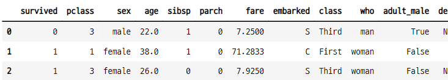
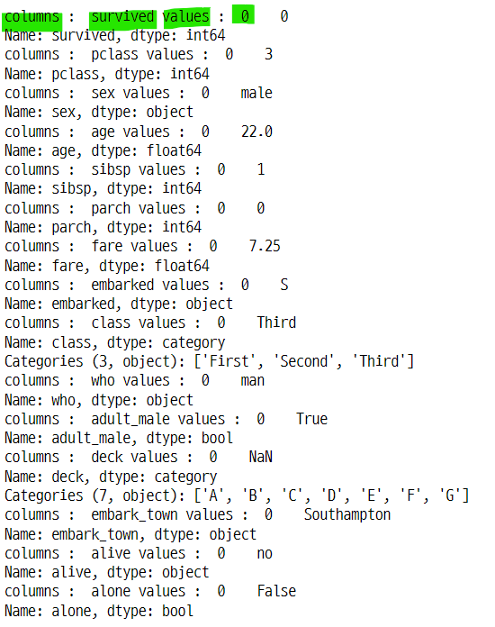

# items()
- 반복문에서 시리즈 데이터의 인덱스와 값을 구분하여 불러 올 수 있다.
- 데이터 프레임에서 items()를 사용하면 각 열의 이름과 한 행의 데이터를 불러 올 수 있다.

### 1. 데이터 임포트
- 타이타닉 데이터 임포트

```python
titanic = sns.load_dataset("titanic")
titanic.head(3)
```


### 2. 시리즈 데이터 타입에서 items() 사용

### 2-1. 시리즈 데이터 조회
- class의 종류별 갯수

```python
titanic["class"].value_counts()

>>> print

Third     491
First     216
Second    184
Name: class, dtype: int64
```

### 2-2. items() 함수를 사용하여 데이터 추출
- 시리즈 데이터의 인덱스와 값을 각각 level과 count 변수에 저장 할 수 있다.

```python
[(level, count) for level, count in titanic["class"].value_counts().items()]

>>> print

[('Third', 491), ('First', 216), ('Second', 184)]
```

### 2-3. 다른 컬럼에 items() 사용

```python
titanic["embark_town"].value_counts()

>>> print

Southampton    644
Cherbourg      168
Queenstown      77
Name: embark_town, dtype: int64

```

```python
[k for k, v in titanic["embark_town"].value_counts().items() if v > 100]

>>> print

['Southampton', 'Cherbourg']
```

### 3. 데이터 프레임에서 사용
- 데이터 프레임에서 items()를 사용하면 컬럼의 이름과 행의 데이터를 구분하여 반환해준다.
    - 첫 번째 행의 데이터만 가져오기

```python
for col, val in titanic[:1].items() :
    print("columns : ", col, "values : ", val)
```



### 3-1. 특정 컬럼의 값만 불러오기
- 조건문을 사용하여 특정 컬럼의 값만 조회 할 수 있다.

```python
for col, val in titanic.items() :
    if col == "alive" :
        print(val)

>>> print

0       no
1      yes
2      yes
3      yes
4       no
      ...
886     no
887    yes
888     no
889    yes
890     no
Name: alive, Length: 891, dtype: object
```
